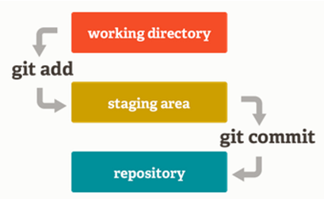
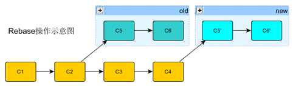
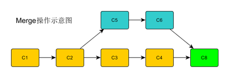

# 1. 版本控制

## 1.1. 前世今生

- 暗黑的史前时代（diff 、patch）
- CVS——开启了版本控制大爆发
- SVN——集中式版本控制集大成者
- Git ——linus的第二个伟大作品

## 1.2. Git介绍  

开源免费的分布式版本控制系统（DVCS），分布式版本控制，和集中式的最大区别在于开发者可以本地提交，离线工作。
每个开发者机器上都有一个服务器的数据库。开发者可以在自己的机器上创建分支，修改代码。
可以跨平台的运行在所有主流的操作系统上（linux 、OS、windows）

Git的主要特点:
- 支持离线工作，多点同步
- 速度快
- 使用40位哈希值标示版本号
- 本地库、缓冲区、中心库三层结构
- 主要基于命令行，难上手
- 占用空间大

repo是google为了方便批量管理android项目中几百个git仓库而提供的一套基于python编写的脚本
gerrit是一个基于web的代码评审和项目管理工具

## 1.3. Gerrit
   一种免费、开源的代码审查软件。利用网页浏览器，同一个团队的软件程序员，可以相互走读代码，决定能否提交，回退或者继续修改。它使用Git作为底层版本控制系统。
特点：进行权限控制和代码走读。

# 2. Git术语

三种文件状态

- 已修改（modified）:表示修改了某个文件，但还没有提交保存
- 已暂存（staged）:也叫索引，表示把已修改的文件放在下次提交时要保存的清单中
- 已提交（committed）:表示该文件已经被版本化保存在本地数据库中了

三个区域：

- 工作目录
- 暂存区
- 本地数据目录

本地库：中心库的完整镜像（.git目录）
缓冲区：用于存放和整理待提交改动的空间，支持选择性提交（.git/index）
中心库：gerrit服务器管理下的git库


commit-id: 40位的哈希值，全球唯一的标示一次提交的完整镜像，相当于一个快照如：b40046cf6704caa21aff88873276a1321c6e5c1c，实际取开头7-8位就OK
HEAD:指代当前checkout状态的commit，后续commit都基于它完成，类似链表
change-id:  gerrit系统用于管理patch，不同的patch可以拥有相同的change-id，对应gerrit上的一个review页面

commit-id是git生成的，用于版本历史管理的哈希值
change-id是放到.git/hooks/目录下面的commit-msg生成的，被gerrit用于识别修改变更

Refs: 分支管理的命名空间，如：refs/heads/*, refs/for/refs/heads/*, refs/tags/*

# 3. Git环境配置

执行如下命令配置个人的git环境，这个会生成~/.gitconfig文件。
```
$git config --global user.name <username>
$git config --global user.email <useremail>
$git config --global color.ui auto
$git config --global core.edit vim
```

生成公钥  ssh-keygen –t rsa -> 回车 -> 回车->回车

Linux 公钥存放位置：/home/用户/.ssh/id_rsa.pub
Windows pub文件位置： C:\Documents and Settings\本机用户\.ssh\ id_rsa.pub

测试公钥是否生效
ssh -p 29418 【hostname】

# 4. Git常用命令

## 4.1. Git clone

克隆服务器上的代码库到本地

git clone ssh://gerrit.XXX.com:29418/m0/tools/repo && scp -p -P 29418 gerrit.XXX.com:hooks/commit-msg repo/.git/hooks/

scp -p 29418 gerrit.XXX.com:hooks/commit-msg repo/.git/hooks/ 

这个表示会复制服务器上面的一个commit-msg 的hook文件,如果要提交代码就必须这样复制这个文件

## 4.2. 更新本地版本库

有时push到远程版本库时会报non-fast-forward的错误，说明此时的本地版本库不是最新状态，需要将当前分支代码进行更新
git fetch origin （git remote update）
git rebase origin/XXX_Int
或git pull --rebase origin XXX_Int

## 4.3. 解决冲突

git fetch origin
git rebase origin/XXX_Int
修改冲突文件
git add .
git rebase --continue
git push origin HEAD:refs/for/XXX_Int

冲突难以避免，只好正面面对，解决问题三部曲：

```
git status
vi $(conflict file)      搜索“<<<<<”号找到冲突部分
git add .
git commit or git rebase --continue
```

git checkout -m -- filename 找回冲突现场

## 4.4. 回退操作

git reset --soft commit-id   //回退到某一个版本，保留工作区和暂存区的内容
git reset --hard commit-id   //回退到某一个版本，工作区和暂存区的改动都会丢失


## 4.5. Git add

所有新增修改文件
-u 所有修改删除文件
-A 所有新增修改删除文件

git status看到的红色颜色标识文件,，在执行了git add之后会变成绿色的。

## 4.6. Commit：本地提交

-m 编辑注释； -s 添加用户签名信息； --amend 修改上次提交

## 4.7. Fetch和Pull：获取服务器更新

Fetch可以把服务器上的全部更新存在本地库中，不会影响当前目录中的代码；
Pull命令不仅包含fetch的功能，同时会将修改合入当前目录；

### 4.7.1. git fetch
相当于是从远程获取最新版本到本地，不会自动merge

```bash
git fetch origin master
git log -p master..origin/master
git merge origin/master
```

- 首先从远程的origin的master主分支下载最新的版本到origin/master分支上
- 然后比较本地的master分支和origin/master分支的差别
- 最后进行合并

### 4.7.2. git pull

相当于是从远程获取最新版本并merge到本地
```
git pull origin master
```

上述命令其实相当于git fetch 和 git merge
在实际使用中，git fetch更安全一些因为在merge前，我们可以查看更新情况，然后再决定是否合并

## 4.8. git log

--oneline：单行显示； -数字：显示最近几条记录；
-- 文件名：查看指定文件的修改记录；
-p 显示代码变动；--stat：显示文件变动概要（文件名，修改行数等）

## 4.9. git branch/checkout

Branch：查看、建立、删除分支

- git branch ：-r 远程分支，-a 所有分支
- git branch 新分支名 基准分支/标签/commit  ：新建本地分支
- git branch –D 分支名  ：删除本地分支

Checkout：检出分支
- git checkout 分支名 ：检出到指定分支
- git checkout -b 新分支名 ：新建并检出分支

## 4.10. git push

一般这样push 到gerrit上面
```
  git push origin HEAD：refs/for/远程分支名
```

git remote -v 可以看到如下
  origin  ssh://gerrit-sz.XXX.com:29418/git/android/platform/manifest

也可以这样push到gerrit上面
 git push  origin  ssh://gerrit-sz.XXX.com:29418/git/android/platform/manifest  HEAD：refs/for/远程分支名 

## 4.11. Reset和Revert：两种回退方式

 原则：Gerrit merge之前用reset，merge之后用revert
 git reset commit-id --hard ：回退到指定commit，不留任何痕迹
 git revert commit-id -s ：回退一次提交，并自动生成一个相反的patch，需审核入库才能生效，类似gerrit上的revert按钮功能

Clean和Checkout：清理本地工作目录
 git clean -fd ：删除所有未跟踪的文件和目录（暂存区以外的），清理临时文件利器
 git checkout -- 文件名 ：把一个文件回退到原始未修改的状态（暂存区以外的）

# 5. Rebase和Merge，分支合并哪家强

Rebase：把指定范围的commit批量提交到新分支上
Merge：将两条分支的历史记录合并到一起
我们原则上采用rebase的方式升级基线，服务器会禁止merge提交

Q：rebase和merge的区别？
rebase会改变历史记录，而merge不会改变
rebase会把原始提交以patch形式打到新分支上，而merge仅生成一个merge提交
rebase可以选择性修改提交内容，merge全盘保留




git中的commit结构类似链表，每个commit都有且只有一个parent，这样的强依赖关系形成了历史记录（git log），如果两个人基于同一个parent进行修改，先merge进主线的提交会导致另一个人的提交失去依赖关系。

# 6. Gerrit上传代码
Push with bypassing Code Review(不走review流程)
$ git commit
$ git push origin HEAD:master
this is the same as:
       $ git commit
       $ git push origin HEAD:refs/heads/master

Push for Code Review（走review流程）
    $ git commit
    $ git push origin HEAD:refs/for/master


Repo常用命令

repo init：初始化本地库 (下载清单库manifest.xml)
repo sync：同步服务器代码（类似git fetch+rebase）

## 6.1. init：初始化本地库

repo init -u ssh://gerrit-sz.XXX.com:29418/git/android/platform/manifest -b zs_master -m XXX/MSM8953_3701A_20170224.xml  --repo-url ssh://gerrit-sz.XXX.com:29418/git/android/tools/repo --repo-branch stable --no-repo-verify --reference /home/mirror 

-b  zs_master ：manifest库所在的分支
- XXX/MSM8953_3701A_20170224.xml ：不同代码标签（重要），可以通过变更这个参数，快速更新本地代码
--reference   /home/XXX-mirror 这里用到了本地镜像。这样速度会快，节省磁盘空间。10分钟下载完所有代码。
--repo-url 这个就是repo的地址，没有repo的可以clone这个仓库，然后复制里面的repo文件出来

## 6.2. sync：同步服务器代码
只下载部分代码：repo sync kernel  只更新kernel项目
只更新当前修改库：在cd kernel里面然后 repo sync .  <- 注意有个点
常用的：repo sync –cdj 4 –no-tags
1. -c, --current-branch  fetch only current branch from server
2.-j JOBS, --jobs=JOBS  projects to fetch simultaneously (default 4) 
这个默认就像，多了也没用，复制有限制的。
3.d, --detach            会将HEAD强制指向manifest的库，而忽略本地的改动。
4.--no-tags             don't fetch tags  不下载tag

## 6.3. 一些好用的工具
Beyond compare：比较代码工具
gitk：图形化看log工具
opengrok：还是看代码工具

