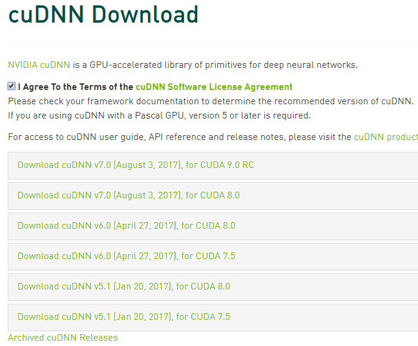

<!-- toc -->
<!-- more -->

# cuDNN是cuda的深度神经网络包

1.官方下载链接网址 [NVIDIA cuDNN https://developer.nvidia.com/cudnn](https://developer.nvidia.com/cudnn)

2.这个软件需要注册成为用户后才能下载。点击“Download”后，点击“Join now”，完成注册。登录后下载。

3.阅读软件许可协议后，如果同意，点击同意软件许可协议。



4.选择“Download cuDNN v6.0 (April 27, 2017), for CUDA 8.0”具体版本要查看谷歌的文档 https://www.tensorflow.org/install/install_linux#the_url_of_the_tensorflow_python_package

```
CUDA® Toolkit 8.0. For details, see NVIDIA's documentation. Ensure that you append the relevant Cuda pathnames to the LD_LIBRARY_PATH environment variable as described in the NVIDIA documentation.
The NVIDIA drivers associated with CUDA Toolkit 8.0.
cuDNN v6. For details, see NVIDIA's documentation. Ensure that you create the CUDA_HOME environment variable as described in the NVIDIA documentation.
GPU card with CUDA Compute Capability 3.0 or higher. See NVIDIA documentation for a list of supported GPU cards.
The libcupti-dev library, which is the NVIDIA CUDA Profile Tools Interface. This library provides advanced profiling support. To install this library, issue the following command:
```

5.点击cuDNN Install Guide查看安装指南。发现只需要下载Library这个文件，然后放在一个目录里面，再添加环境变量就好了。不需要编译等步骤。

6.点击cuDNN v6.0 Library for Linux下载。需要登录,所以我们可以先在本地下载好了之后scp上传到服务器。它有很多下载链接，记得选择“Linux”这个。

7.登录到服务器，找到文件，解压缩。查看文件内容

```bash
# 找到文件
mark@mashangxue123.com:~/TF/cuDNN$ ls
cudnn-8.0-linux-x64-v5.1.tgz  cudnn-8.0-linux-x64-v6.0.tgz  libcudnn6_6.0.21-1+cuda8.0_amd64.deb  libcudnn6-doc_6.0.21-1+cuda8.0_amd64.deb

# 解压缩
mark@mashangxue123.com:~/TF/cuDNN$ tar -xf cudnn-8.0-linux-x64-v6.0.tgz
# 解压缩之后的 cuda 这个文件夹就是cuDNN了
mark@mashangxue123.com:~/TF/cuDNN$ ls
cuda  cudnn-8.0-linux-x64-v5.1.tgz  cudnn-8.0-linux-x64-v6.0.tgz  libcudnn6_6.0.21-1+cuda8.0_amd64.deb  libcudnn6-doc_6.0.21-1+cuda8.0_amd64.deb
mark@mashangxue123.com:~/TF/cuDNN$ ls cuda/
include  lib64
mark@mashangxue123.com:~/TF/cuDNN$

```

8.放到安装目录
因为这和之前安装的CUDA 工具名字相同，所以我们最好重命名成cuDNN，然后放到一个目录，这个目录可以随便定，不过要和后面设置环境变量的时候保持一致。我这里设置到/usr/local/目录下，因为第一步的cuda是默认安装到这里的。

```bash
# 重命名文件夹，即把cuda改为cuDNN
mark@mashangxue123.com:~/TF/cuDNN$ mv cuda cuDNN
mark@mashangxue123.com:~/TF/cuDNN$ ls
cuDNN  cudnn-8.0-linux-x64-v5.1.tgz  cudnn-8.0-linux-x64-v6.0.tgz  libcudnn6_6.0.21-1+cuda8.0_amd64.deb  libcudnn6-doc_6.0.21-1+cuda8.0_amd64.deb

# 确认要安装的目标文件夹下没有同名cuDNN文件夹，避免覆盖了重要数据。
mark@mashangxue123.com:~/TF/cuDNN$ ls /usr/local/
bin  cuda  cuda-8.0  etc  games  include  lib  man  sbin  share  src

# 把cuDNN转移过去。/usr/local/是系统文件夹，需要使用sudo才能写入文件。
mark@mashangxue123.com:~/TF/cuDNN$ sudo mv cuDNN/ /usr/local/
[sudo] password for mark:  # 输入密码

# 查看是否成功转移文件
bin  cuda  cuda-8.0  cuDNN  etc  games  include  lib  man  sbin  share  src
mark@mashangxue123.com:~/TF/cuDNN$ ls /usr/local/
bin  cuda  cuda-8.0  cuDNN  etc  games  include  lib  man  sbin  share  src

```

9.添加几个环境变量。
把下面这段代码放到~/.bashrc这个文件里面，随便哪一行都行，一般放在开头。
```bash
# 打开`~/.bashrc`,编辑文件 
mark@mashangxue123.com:~/TF/cuDNN$ vi ~/.bashrc 
```
添加下面的内容:
```
PATH=$PATH:/usr/local/cuda-8.0/bin
LD_LIBRARY_PATH=/usr/local/cuda-8.0/lib64
export LD_LIBRARY_PATH="$LD_LIBRARY_PATH:/usr/local/cuda/lib64:/usr/local/cuda/extras/CUPTI/lib64"
export CUDA_HOME=/usr/local/cuda
LD_LIBRARY_PATH=$LD_LIBRARY_PATH:/usr/local/cuDNN/lib64
LD_LIBRARY_PATH=$LD_LIBRARY_PATH:/usr/local/cuDNN/include
```

10.使得上面的环境变量在当前这个ssh连接中生效。或者也可以断开连接再次登录服务器。
```bash
mark@mashangxue123.com:~/TF/cuDNN$ source ~/.bashrc
```

11.安装libcupti-dev
```bash
mark@mashangxue123.com:~/TF/cuDNN$ sudo apt-get install libcupti-dev
```
这样我们的cuda, cuDNN, 和libcupti-dev 就安装好了。也就是完成了一些前提条件，接下来正式安装支持GPU的TensorFlow

[亚马逊云教程7：安装支持GPU的TensorFlow](http://aws.cn.riverlight.blog/aws/2017/06/12/AWS_tutorial_7.html)