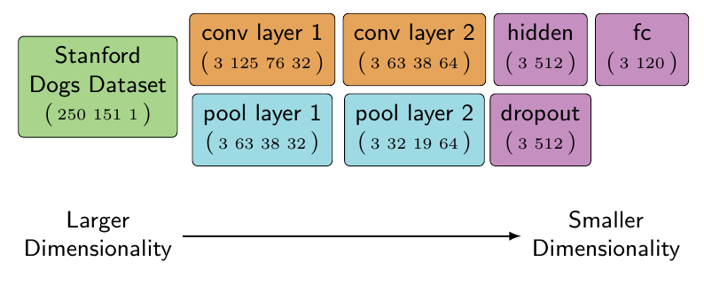
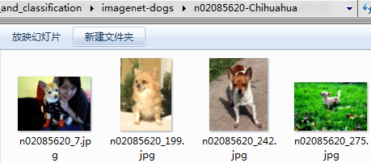

<!-- toc -->
<!-- more -->
# 1. 项目需求

利用TensorFlow实现目标识别与分类要求对卷积、常见层（非线性、池化、全连接等）、图像加载、图像操作和颜色空间相关的基础知识有所了解。

当掌握了这些内容后，便有可能利用TensorFlow构建一个用于图像识别与分类的CNN模型。
本文的训练数据来自于Stanford的一个包含了许多狗及其品种标签的数据集。我们需要依据这些图像训练一个网络，然后再评估它对狗的品种的预测准确性。

# 2. 要实现的CNN网络

我们的网络架构采取了Alex Krizhevsky的AlexNet的简化版本，但并未使用AlexNet的所有层。（AlexNet是ILSVRC2012挑战赛的冠军）



从上图可以看出，网络包含每层之后的输出TensorShape。这些层按照自左向右、自上向下的顺序被依次读取，且存在关联的层被分为一组。当输入经过网络时，其高度和宽度都会减小，而其深度会增加。**深度值的增加减少**了使用该网络所需的**计算量**。

# 3. Stanford Dogs数据集

## 3.1. 数据集下载
用于训练该模型的数据集可从Stanford的计算机视觉站点http://vision.stanford.edu/aditya86/ImageNetDogs/ 下载。训练模型时需要事先下载相关的数据。下载完包含所有图像的压缩文件后，需要将其解压至一个新的名为imagenet-dogs的目录下，该目录应当与用于构建模型的代码位于同一路径下。

## 3.2. 数据集介绍
由Stanford提供的压缩文件包含120个不同品种狗的图像。该模型的目标是将这个数据集中80%的图像用于训练，而用其余20%做测试。

如果这是一个产品模型，则还应预留一些原始数据做交叉验证。为验证模型的准确性，交叉验证是一个有用的步骤，但该模型的设计初衷只是为说明这个过程，而非出于完整性的考虑。



这个数据压缩包遵循了ImageNet的实践原则。每个狗品种都对应一个类似于n02085620-Chihuahua的文件夹，其中目录名称的后一半对应于狗品种的英语表述（Chihuahua）。在每个目录中，都有大量属于该品种的狗的图像，每幅图像都为JPEG格式（RGB）且尺寸各异。各图像尺寸不一是一种挑战，因为TensorFlow希望各张量都具有相同的维数。

# 4. 将图像转为TFRecord文件

因为这些图像尺寸不一，且相应的品种标签也不在图像文件中，所以这些原始图像无法直接用于训练，

## 好处
- 加速训练，并简化与图像标签的匹配。
- 与训练和测试有关的图像可以事先分离，这样当训练开始时，就可利用检查点文件对模型进行不间断的测试。

转换图像数据格式时需要将它们的颜色空间变为灰度空间，将图像尺寸修改为统一尺寸，并将标签依附于每幅图像。在训练开始前，这种转换应当仅进行一次，通常它会花费较长的时间。

## 4.2. 代码：展示文档的结构

```python

import tensorflow as tf
sess = tf.InteractiveSession()

import glob # 文件名操作模块glob
# glob 方法返回所有匹配的文件路径列表
image_filenames = glob.glob("./imagenet-dogs/n02*/*.jpg")

image_filenames[0:2]

```

输出：
```
['./imagenet-dogs/n02085620-Chihuahua/n02085620_10074.jpg',
 './imagenet-dogs/n02085620-Chihuahua/n02085620_10131.jpg']
```

Windows系统运行的输出：
```
['./imagenet-dogs\\n02085620-Chihuahua\\n02085620_10074.jpg',
 './imagenet-dogs\\n02085620-Chihuahua\\n02085620_10131.jpg']
```
利用glob模块可枚举指定路径下的目录，从而显示出数据集中的文件结构。

文件名中的8个数字对应于ImageNet中每个类别的WordNet ID。ImageNet网站拥有一个可依据WordNet ID查询图像细节的浏览器。例如，要查看Chihuahua（吉娃娃）品种的样本，可通过下列网址访问
http://www.image-net.org/synset?wnid=n02085620

## 4.3. 代码：生成train 和test 字典

```python

from itertools import groupby
from collections import defaultdict

training_dataset = defaultdict(list)
testing_dataset = defaultdict(list)

# 将文件名分解为品种和相应的文件名，品种对应于文件夹名称
image_filename_with_breed = map(lambda filename: (filename.split("/")[2], filename), image_filenames)

# 依据品种（上述返回的元组的第0个分量）对图像分组
for dog_breed, breed_images in groupby(image_filename_with_breed, lambda x: x[0]):
    # 枚举每个品种的图像，并将大致20% 的图像划入测试集
    for i, breed_image in enumerate(breed_images):
        if i % 5 == 0:
            testing_dataset[dog_breed].append(breed_image[1])
        else:
            training_dataset[dog_breed].append(breed_image[1])

    # 检查每个品种的测试图像是否至少有全部图像的18%
    breed_training_count = len(training_dataset[dog_breed])
    breed_testing_count = len(testing_dataset[dog_breed])

    assert round(breed_testing_count / (breed_training_count + breed_testing_count), 2) > 0.18, "Not enough testing images."
```


这段示例代码将目录和图像（'./imagenet-dogs/n02085620-Chihuahua/n02085620_10131.jpg'）组织到了两个与每个品种相关的字典中，这些字典中包含了属于各品种的所有图像。现在，每个字典就按照下列格式包含了所有的Chihuahua（吉娃娃）图像：
```
training_dataset["n02085620-Chihuahua"] = ["n02085620_10131.jpg", ...]
```

将各品种的狗的图像组织到这些字典中能够简化选择每种类型的图像并对其归类的过程。在预处理阶段，所有品种的狗的图像都会被依次遍历，并依据列表中的文件名被打开。

## 4.4. 代码：

```python
def write_records_file(dataset, record_location):
    """
    用dataset 中的图像填充一个TFRecord文件，并将其类别包含进来

    参数
    ----------
    dataset : dict(list)
     这个字典的键对应于其值中文件名列表对应的标签
    record_location : str
     存储TFRecord输出的路径
    """
    writer = None

    # 枚举dataset，因为当前索引用于对文件进行划分，每隔100幅图像，
    # 训练样本的信息就被写入到一个新的TFRecord文件中，以加快写操作的进程
    current_index = 0

    for breed, images_filenames in dataset.items():
        for image_filename in images_filenames:
            if current_index % 100 == 0:
                if writer:
                    writer.close()

                record_filename = "{record_location}-{current_index}.tfrecords".format(
                    record_location=record_location,
                    current_index=current_index)

                writer = tf.python_io.TFRecordWriter(record_filename)
            current_index += 1

            image_file = tf.read_file(image_filename)

            # 在ImageNet的狗的图像中，有少量无法被TensorFlow识别为JPEG 的图像，
            # 利用try/catch可将这些图像忽略
            try:
                image = tf.image.decode_jpeg(image_file)
            except:
                print(image_filename)
                continue

            # 转换为灰皮图可减少处理的计算量和内存占用， 但这并不是必需的
            grayscale_image = tf.image.rgb_to_grayscale(image)
            resized_image = tf.image.resize_images(grayscale_image, 250, 151)

            # tf.cast 这里之所以使用tf.cast，是因为虽然尺寸更改后的图像的数据类型是浮点型，
            # 但RGB值尚未转换到［0, 1） 区问内
            image_bytes = sess.run(tf.cast(resized_image, tf.uint8)).tobytes()

            # 将标签按字符串存储较高效，推荐的做法是将其转换为整数索引或读热编码的秩1张量
            # https://en.wikipedia.org/wiki/One-hot
            image_label = breed.encode("utf-8")

            example = tf.train.Example(features=tf.train.Features(feature={
                'label': tf.train.Feature(bytes_list=tf.train.BytesList(value=[image_label])),
                'image': tf.train.Feature(bytes_list=tf.train.BytesList(value=[image_bytes]))
            }))

            writer.write(example.SerializeToString())
    writer.close()

write_records_file(testing_dataset, "./output/testing-images/testing-image")
write_records_file(training_dataset, "./output/training-images/training-image")
```

这段示例代码完成的任务包括：
打开每幅图像，将其转换为灰度图，调整其尺寸，然后将其添加到一个TFRecord文件中。

这个逻辑与之前的例子基本一致，唯一的区别是这里使用了tf.image.resize_images函数。这个尺寸调整方法会将所有图像变为相同的尺寸，即便会有扭曲发生。
>例如，假设有一幅纵向的图像和一幅横向的图像，若用这段代码调整两者的尺寸，则横向图像的输出将会产生扭曲。

这种扭曲之所以发生，是因为tf.image.resize_images并不考虑图像的长宽比（宽度与高度的比值）。为了对一组图像进行恰当的尺寸调整，裁剪或边界填充是一种推荐的方法，因为这些方式能够保持图像的纵横比，不至于使图像产生扭曲。

# 5. 加载图像

一旦测试集和训练集被转换为TFRecord格式，便可按照TFRecord文件而非JPEG文件进行读取。我们的目标是每次加载少量图像及相应的标签。

```python

filename_queue = tf.train.string_input_producer(
    tf.train.match_filenames_once("./output/training-images/*.tfrecords"))
reader = tf.TFRecordReader()
_, serialized = reader.read(filename_queue)

features = tf.parse_single_example(
    serialized,
    features={
        'label': tf.FixedLenFeature([], tf.string),
        'image': tf.FixedLenFeature([], tf.string),
    })

record_image = tf.decode_raw(features['image'], tf.uint8)

# 修改图像的形状有助于训练和输出的可视化
image = tf.reshape(record_image, [250, 151, 1])

label = tf.cast(features['label'], tf.string)

min_after_dequeue = 10
batch_size = 3
capacity = min_after_dequeue + 3 * batch_size
image_batch, label_batch = tf.train.shuffle_batch(
    [image, label], batch_size=batch_size, capacity=capacity, min_after_dequeue=min_after_dequeue)

```

这段示例代码通过匹配所有在训练集所在目录下找到的TFRecord文件而加载训练图像。每个TFRecord文件中都包含了多幅图像，但`tf.parse_single_example`将只从该文件中提取单个样本。

之前讨论过的批运算可用于同时训练多幅图像。对多幅图像进行批处理非常有用，因为这些运算既可对多幅图像进行处理，也可对单幅图像进行处理。批处理时，必须要满足的条件是系统拥有足够的内存。
当可用的图像都加载到内存中后，接下来的步骤便是创建用于训练和测试的模型。

## 5.1. 模型


## 5.2. 模型第1层代码：

```python

# 将图像转换为灰度值位于［0,1 ） 的浮点类型， 以与convolution2d期望的输入匹配
float_image_batch = tf.image.convert_image_dtype(image_batch, tf.float32)

conv2d_layer_one = tf.contrib.layers.convolution2d(
    float_image_batch,
    num_outputs=32,     # 要生成的滤波器数量
    kernel_size=(5,5),          # 滤波器的宽度和高度
    activation_fn=tf.nn.relu,
    weights_initializer=tf.random_normal,
    stride=(2, 2),
    trainable=True)
pool_layer_one = tf.nn.max_pool(conv2d_layer_one,
    ksize=[1, 2, 2, 1],
    strides=[1, 2, 2, 1],
    padding='SAME')

# 注意，卷积输出的第1维和最后一维未发生改变，但中间的两维发生了变化
conv2d_layer_one.get_shape(), pool_layer_one.get_shape()

```

输出：

```
(TensorShape([Dimension(3), Dimension(63), Dimension(38), Dimension(64)]),
 TensorShape([Dimension(3), Dimension(32), Dimension(19), Dimension(64)]))
```

该模型的第1层是利用`tf.contrib.layers.convolution2d`创建的。值得注意的是`weights_initializer`被设置为正态随机值，这意味着第一组滤波器填充了服从正态分布的随机数。这些滤波器被设置为trainable，以便当将信息输入给网络时，这些权值能够调整，以提高模型的准确率。

当将卷积运用于图像之后，利用一个max_pool运算将输出降采样。该运算之后，由于在池化运算中使用的ksize和strides，卷积的输出形状减半。这里输出形状的减小，并不改变滤波器的数量（输出通道）或图像批数据的尺寸。减少的分量与图像（滤波器）的高度和宽度有关。

## 5.3. 模型第2层代码：

```python

conv2d_layer_two = tf.contrib.layers.convolution2d(
    pool_layer_one,
    num_outputs=64,        # 更多的输出通道意味着滤波器数量的增加
    kernel_size=(5,5),
    activation_fn=tf.nn.relu,
    weights_initializer=tf.random_normal,
    stride=(1, 1),
    trainable=True)

pool_layer_two = tf.nn.max_pool(conv2d_layer_two,
    ksize=[1, 2, 2, 1],
    strides=[1, 2, 2, 1],
    padding='SAME')

conv2d_layer_two.get_shape(), pool_layer_two.get_shape()

```

输出：
```
(TensorShape([Dimension(3), Dimension(63), Dimension(38), Dimension(64)]),
 TensorShape([Dimension(3), Dimension(32), Dimension(19), Dimension(64)]))
```

第2层改动很小，唯一的区别在于滤波器的深度。现在滤波器的数量变为第一层的2倍，同时减小了图像的高度和宽度。多个卷积和池化层连续地减少了输入的高度和宽度，同时进一步增加了深度。

此时，可进一步增加卷积和池化步骤。在许多架构中，卷积层和池化层都超过5层。最复杂的架构需要的训练和调试时间也更长，但它们能够匹配更多更复杂的模式。在本例中，为解释卷积网络的基本原理，使用两个卷积层和池化已经足够了。

## 5.4. 与输出神经元建立全连接

被处理的张量仍然相当复杂，接下来的步骤是将图像中的每个点都与输出神经元建立全连接。由于在本例中，后面要使用softmax，因此全连接层需要修改为二阶张量。张量的第1维将用于区分每幅图像，而第2维对应于每个输入张量的秩1张量。

修改为二阶张量代码：

```python

flattened_layer_two = tf.reshape(
    pool_layer_two,
    [
        batch_size,  # image_batch 中的每幅图像
        -1           # 输入的其他所有维
    ])

flattened_layer_two.get_shape()
```

输出：
```
TensorShape([Dimension(3), Dimension(38912)])
```

tf.reshape拥有一个特殊值，其可用于指示和使用其余所有维。在这段示例代码中，-1用于将最后一个池化层调整为一个巨大的秩1张量。

池化层展开后，便可与将网络当前状态与所预测的狗的品种关联的两个全连接层进行整合。

最后一个全连接层代码：

```python

# weights_initializer参数也可接收一个可调用参数，这里使用一个lambda表达式返回了一个截断的正态分布
# 并指定了该分布的标准差
hidden_layer_three = tf.contrib.layers.fully_connected(
    flattened_layer_two,
    512,
    weights_initializer=lambda i, dtype: tf.truncated_normal([38912, 512], stddev=0.1),
    activation_fn=tf.nn.relu
)

# 对－些神经元进行dropout处理，削减它们在模型中的重要性
hidden_layer_three = tf.nn.dropout(hidden_layer_three, 0.1)

# 输出是前面的层与训练中可用的120个不同的狗的品种的全连接
final_fully_connected = tf.contrib.layers.fully_connected(
    hidden_layer_three,
    120,  # ImageNet Dogs数据集中狗的品种数
    weights_initializer=lambda i, dtype: tf.truncated_normal([512, 120], stddev=0.1)
)

```

这段示例代码创建了网络的最后一个全连接层，其中的每个像素都与每个狗的品种关联着。该网络的每一步都会通过将输入图像转化为滤波器来减小它们的尺寸，这些滤波器之后又会与一个品种的狗（标签）进行匹配。这项技术减少了训练和测试一个网络所需的计算量，同时使输出更具一般性。

# 6. 训练

依据模型对输入到训练优化器（作用是优化每层的权值）的训练数据的真实标签和模型的预测结果计算模型的损失。这个优化过程会经历数次迭代，每次迭代时都试图提升模型的准确率。

对于该模型，有一点需要注意，那就是在训练过程中，大部分分类函数（tf.nn.softmax）都要求标签为数值类型。在本例中，每个标签都是一个类似于n02085620-Chihuahua的字符串。由于tf.nn.softmax无法直接使用这些字符串，所以需要将每个标签转换为一个独一无二的数字。将这些标签转换为整数表示应当在预处理阶段进行。

对于本数据集，每个标签都被转换为一个代表包含所有狗的品种的列表中名称索引的整数。完成该任务有多种方法。在本例中，将使用一个新的TensorFlow工具运算tf.map_fn。

标签转整数代码：

```python

import glob

# 找到位于imagenet-dogs路径下的所有目录名（ n02085620-Chihuahua, ... )
# labels = list(map(lambda c: c.split("/")[-1], glob.glob("./imagenet-dogs/*")))
image_labels = glob.glob("./imagenet-dogs/*")
image_labels = [ w.replace('\\', '/') for w in image_labels]
labels = list(map(lambda c: c.split("/")[-1], image_labels))

# 匹配每个来自label_batch 的标签并返回它们在类别列表中的索引
train_labels = tf.map_fn(lambda l: tf.where(tf.equal(labels, l))[0, 0:1][0], label_batch, dtype=tf.int64)


```

这段示例代码使用了两种不同形式的map运算。
第一种形式的map用于依据一个目录列表创建一个仅包含狗的品种名的列表。
第二种形式的map是tf.map_fn，它是一个TensorFlow运算，可用指定的函数对数据流图中的张量进行映射。tf.map_fn用于生成一个仅包含每个标签在所有类标签构成的列表中的索引的秩1张量。这样，tf.nn.softmax便可利用这些独一无二的整数对狗的品种进行预测。

# 7. 用TensorBoard调试滤波器

CNN拥有多个可调整的部分，它们在训练阶段可能会引发一些问题，从而导致模型的准确率较差。在调试CNN中的问题时，通常可从观察滤波器（卷积核）在每轮迭代后的变化入手。当网络试图依据训练方法学习最精确的一组权重时，滤波器中的每个权值都会持续不断地发生改变。

在一个设计良好的CNN中，当第一个卷积层开始工作时，输入权值被随机初始化（在本例中使用了weight_init=tf.random_normal）。这些权值通过一幅图像激活，且激活函数的输出（特征图）也是随机的。可将特征图作为图像可视化，输出的外观与原始图像类似，并被施加了静力（static）。静力是由所有权值的随机激发所导致的。经过多轮迭代之后，权值不断地被调整以拟合训练反馈，每个滤波器都趋于一致。当网络收敛时，各个滤波器都与从图像中能够找到的不同的细小模式非常类似。

下图展示的是一幅作为训练数据的尚未经过第一个卷积层的原始灰度图像。

下面再给出一个由第1个卷积层输出的特征图，它突出了输出的随机性。


卷积神经网络是一种非常有用的神经网络架构，在TensorFlow中实现这种架构只需要编写极少量的代码。虽然在设计时它们对图像给予了关注，但CNN并不局限于图像这一种输入。卷积可运用于从音乐到医药的多个行业，且在不同行业中应用CNN的方式都是类似的。目前，TensorFlow是为2D卷积设计的，但利用TensorFlow对高维输入进行卷积也是有可能的。

虽然CNN理论上可以运用于自然语言数据（文本），但它却并不是为这种类型的输入设计的。文本输入通常存储在SparseTensor中，其中输入的大部分分量均为0。CNN是为使用稠密的输入设计的，其中的每个值都是重要的，且输入的大部分分量都非0。使用文本数据非常有挑战性，而这正是下一章所要解决的问题。
