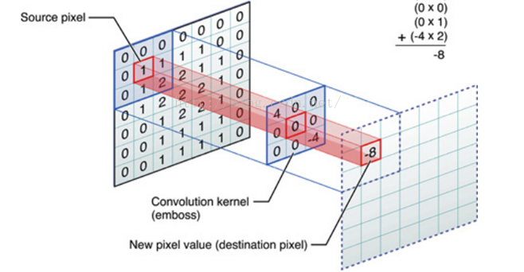
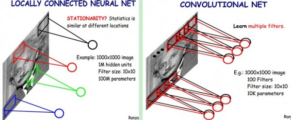

<!-- toc -->
<!-- more -->

# 1. CNN “看懂”世界

- 特征工程在传统机器学习中占有至关重要的地位。由于特征工程依赖于人类对问题本身的理解，所以很难将程序推广到其他类似的实际应用中。
例如，在图像分类问题中，传统的机器学习对于不同颜色和不同形状的目标需要使用不同的特征提取算法获取特征。

- 深度卷积神经网络为图像分类提供了统一的解决方案。

- 一张图片中包含的语义信息错综复杂，但在计算机看来则只是一个个零散而独立的像素点。

- 卷积神经网络（Convolutional Neural Networks ，简称CNNs ），由纽约大学的Yann LeCun 教授于1989 年发明，是一种专门为处理**高维网格型数据**（也就是张量Tensor)而设计的神经网络。

- 卷积神经网络最擅长处理图像数据，例如用二维矩阵表示的灰度图像，三维数组（ 高、宽、RGB 通道）表示的彩色图片等。

## 1.1. 为什么使用 CNN

在卷积神经网络出现之前，也有人尝试使用人工神经网络（ ANNs ）解决图像分类问题， 但是一直没有取得很好的效果。下面从权值和语义两方面分析：

### 1.1.1. 权值太多

如果了解传统神经网络就会知道，作为神经元的感知机（ perceptron ）模型的结构非常简单，用数学方法表示就是矩阵相乘后进行非线性变换，即
$$
f\left( x\right) =sign\left( xW+b\right)
$$
在这里面，权值矩 W 实际表示了输入节点与输出节点之间的影响关系。如果输入节点与输出节点之间的权值参数的绝对值越大，就代表两个节点的相关性越高。

在全连接结构中，每一个节点的输入都是上一层的所有输出，当隐层节点数目较多时，整个网络中的参数数目会变得非常巨大。

以图片来说，一般jpg 格式的图片在计算机中以三维矩阵的形式存储。

下图左：如果我们有1000x1000像素的图像，若以每一个值都是一个特征维度，想要经过一层感知机的变换后输出维度不变，就需要有1百万个隐层神经元，那么他们全连接的话（每个隐层神经元都连接图像的每一个像素点），就有1000x1000x1000000=10^12个连接，也就是10^12个权值参数。

### 1.1.2. 语义理解

然而图像的空间联系是局部的，就像人是通过一个局部的感受去感受外界图像一样，每一个神经元都不需要对全局图像做感受，每个神经元只感受局部的图像区域，然后在更高层，将这些感受不同局部的神经元综合起来就可以得到全局的信息了。这样，我们就可以减少连接的数目，也就是减少神经网络需要训练的权值参数的个数了。

如下图右：假如局部感受(Local Receptive Fields，LRF)是10x10，隐层每个感受野只需要和这10x10的局部图像相连接，所以1百万个隐层神经元就只有一亿个连接，即10^8个参数。比原来减少了四个0（数量级），这样训练起来就没那么费力了，但还是感觉很多的啊，那还有啥办法没？


如图所示。全连接神经网络处理图像会导致参数爆炸，在这种情况下，不管是权值矩阵占用的存储空间，还是模型的计算量都是海量的。
由此导致的问题是，参数过多则收敛速度慢，需要更多的数据和更多的训练迭代，但巨大的计算量意味着不可能在有限的时间内完成所需要的计算。

从另一个角度来说，其实从语义上来理解也同样存在问题：全连接网络网络结构在处理每一个像素时，其相邻像素与距离很远的像素都是无差别地对待的．并没有考虑图像内容的空间结构。换句话说，就算打乱图像像素的输入顺序，结果不变。但一般来说图像的语义并不以像素为单位，而是各种连续的线条、形状或色块。

### 1.1.3. 由此，权值太多，语义理解两个角度看，卷积神经网络应运而生

- 卷积神经网络是指至少有一层计算为卷积操作的神经网络。
- 卷积操作是其中的核心，它与全连接结构最大的不同， 就是它充分利用了图片中相邻区域的信息，通过稀疏连接和共享权值的方式大大减少参数矩阵的规模，从而减少计算量，也大大地提高了收敛速度。

可以看看这篇文章的介绍：[一文读懂卷积神经网络CNN | 数盟社区](http://dataunion.org/11692.html)

## 1.2. 卷积神经网络的特点

在图形识别中，图形一般抽象为向量的形式，比如一个1000*1000的图片，可以表示为一个1000000的向量。
### 1.2.1. 局部感知

一般的神经网络比如BP神经网络是全连接，也就是说在隐含层的每一个神经元都和输入层所有神经元相连接，如果隐含层有1000000个神经元，那么总共有10^12次个连接，也就是说有10^12个权重参数。CNN卷积神经网模仿人类的视野，人类的视野不是一开始就看到整个物体，而是从感知一部分慢慢继而慢慢感知到整体，这就是局部连接原理。

CNN是如何实现的呢？
他将隐含层的每一个神经元只与输入层的一个小区域相连接，比如上文提到的1000000个隐层神经元的每一个连接到10*10的小区域当中，这样输入层——隐含层总共就有10^6个连接，也就是说总共有10^6个权值参数。

### 1.2.2. 参数共享

在CNN网络中，以上文中的例子来说，每个隐层神经元，连接输入图像的的一个`10*10`的小区域，那么对于每一个隐含层神经元来讲，都有 `10*10` 个权重参数，CNN将隐层1000000个神经元的参数都设为相等，也就是说这隐层1000000个神经元共享一个参数，这1000000个神经元构成了一个feature map；在典型的CNN网络中，每个Convolutions(卷积层)有多个features maps；这样这一层features maps只是共享`10*10=100`个参数。连接数在CNN中和参数值是不相等的，比如在这个只有一层features maps也就是只有一个卷积层的的CNN卷积网络中，有`100000*100`个连接，但是他只有100个参数。

### 1.2.3. 多卷积核

每个卷积核卷积整个图像都会生成另外一张图像，如果要获得这个图像的多个特征，就要用多个卷积核卷积整张图像，这篇文章提出了一个通道的概念，比如，一张`5*5`的卷积核在`32*32`的图像上做卷积，（卷积过程是怎么样的？）就会生成一张`28*28`的图像`（32-5+1）*（32-5+1）`，这张图像神经元个数是`28*28`，参数个数为`5*5`（在这里参数是如何求的？我的理解解是，在训练集中是给出的，在train过程中，对参数进行调整，进而生成整个模型），另外一个不同的卷积核也可以在该图像上进行卷积，也会生成另外的一张图片，这两个不同的卷积核就生成了输入图像的两种不同的通道，这个通道的概念，我第一次听到，也是别的文献中没有提到了，我找了一张，网上表示卷积过程的一个图片：能详细描述这个过程：


上图右，不同颜色表明不同的卷积核。每个卷积核都会将图像生成为另一幅图像。比如两个卷积核就可以将生成两幅图像，这两幅图像可以看做是一张图像的不同的通道。

## 1.3. 卷积的数学意义

卷积原本是一种积分变换的数学方法，是通过两个函数 f 和 g 生成第三个函数的算子。

可以通过下面这个例子来更好地理解卷积的概念：

想象这样－个场景：在一个慵懒的午后，你躺在沙发上用手机看着电视剧，突然弹出一个提示框，“电量不足10%，请及时充电”，你找到充电线插上，安心的继续看。
现在问题来了，从一边使用手机一边给手机充电的时候开始算起，请问在某一时刻t的手机电池的充电电量是多少？

如果假设手机的耗电速度和充电速度都是恒定值的话，那这个问题就变成了我们都熟知的蓄水池问题，即一个水管进水另一个水管放水，
求何时可以储满或放空水池。这种简单问题小学生就能搞定，但是实际情况并没有那么现想。

首先，电量的输入并不是恒定的，由于我们现在使用的基本上都是交流电，
所以可以认为充电的电量是与正弦函数sin()相关的函数，我们将 t 时刻的输入表示为x(t), x 和t 的取值都是实数域，因为时间和正弦函数是连续的。

其次，电量的消耗也不是恒定值，因为手机在静置待机状态下和正常使用状态下的用电量肯定不同。
在这里对于电量消耗可以换一种理解，认为消耗的电量其实是对之前所充入电量的衰减，也就是说充入电量的功效 时刻在经历着衰减。
那么可以将电量的衰减系数表示为 w(α)，其中α 是测量的时长。

将这两个函数结合起来，就得到了测量某时刻 t 的手机电量的表示：

$$
s\left( t\right) =\int x\left( a\right) w\left( t-a\right) da
$$

 t 时刻的输入表示为x(t),
电量的衰减系数表示为 w(α),α 是测量的时长。

这一操作就叫做卷积，它也通常被简化地表示成星号的形式：

s(t) = (x*w)(t)

卷积操作实际上是对输入函数的每－个位置进行加权累加。x(t） 是输入信号，哀减系数w(t-α） 是系统对信号的响应，卷积（x*w)(t）就是在时刻t 对系统观察的结果，是所有信号经过系统的处理后的结果的叠加。

从实际数据来说，由于不可能真的做到实时测量，所以一般是将时间离散化后，按固定的时间间隔进行测量，所以数据不会是连续的。可以假设只考虑整数时刻，即t 为整数的情况，则离散后的卷积可以表示为：

$$
S\left( t\right) =\left( x\times w\right) \left( t\right) =\sum x\left( a\right) w\left( t-a\right)
$$

离散化后的公式就稍微容易理解一些。可以理解为，单位时间输入的电量会随着使用被逐渐消耗，在时刻t 的手机电量，就是之前各个单位时间充入电量中尚未衰减掉的剩余值的累加结果。

## 1.4. 卷积滤波

卷积其实是图像处理中一种常用的线性滤波方法，使用卷积可以达到图像降噪、锐化等多种滤波放果。

### 1.4.1. 卷积操作的过程：

简单来说， 就是对于图片中的每一个像素点，计算它的邻域像素和滤波器矩阵对应位置元素的乘积，然后将所有乘积累加，作为该像素位置的输出值。

卷积依次滑过图片中的每一个像素位置，就可以输出一张分辨率从来不变的新图片。从数学
上说，就是求两个矩阵的滑动点积或者滑动内积。


从上图可以看到，所谓的卷积核，实际就是一个权值矩阵，表示如何处理单个像素与其
邻域像素之间的关系。
- 卷积核中各个元素的相对差值越小，相当于每个像素都与周围像素取了个平均值，就越有模糊降噪的效果。
- 而卷积核元素的差值越大，就拉大了每个像素与周围像素的差距，也就越能提取边缘、或者达到锐化的效果。

### 1.4.2. 卷积核要求

在实际应用中，卷积核矩阵的尺寸一般都比较小，主要原因是卷积尺寸与计算量成正比，卷积核尺寸增大会使得讨算量成倍增加。

同时，一般卷积核为正方形，并且边长为奇数，比如3×3 、5×5或者7×7，这样才能保证有且只有一个中心，输出的时候可以与原图的像素有所对应。当然这也并不是必须的，非对称卷积核同样可以计算。

### 1.4.3. 卷积核取值

卷积核矩阵中各个元素的取值，除了影响输出效果以外，还会影响输出图片的亮度。
- 若卷积核内所有元素的累加和等于l ，那就基本上保持了与原图相同的亮度。
- 若大于l ，则输出图会变亮，若小于1 ，输出图的亮度就会变暗。
- 当卷积核中元素累加和为0 时，输出的图片亮度会非常低， 但并不是全黑，而是大部分面积都是黑色，仅有部分图案的边缘还有一些亮度，这样的卷积核就可以用于边缘提取。

### 1.4.4. 滤波器规则要求

1）滤波器的大小应该是奇数，这样它才有一个中心，例如3x3，5x5或者7x7。有中心了，也有了半径的称呼，例如5x5大小的核的半径就是2。

2）滤波器矩阵所有的元素之和应该要等于1，这是为了保证滤波前后图像的亮度保持不变。当然了，这不是硬性要求了。

3）如果滤波器矩阵所有元素之和大于1，那么滤波后的图像就会比原图像更亮，反之，如果小于1，那么得到的图像就会变暗。如果和为0，图像不会变黑，但也会非常暗。

4）对于滤波后的结构，可能会出现负数或者大于255的数值。对这种情况，我们将他们直接截断到0和255之间即可。对于负数，也可以取绝对值。

### 1.4.5. 图像边缘像素的处理

在卷积核矩阵滑过图片每一个像素的过程中，当遇到图像边缘的时候， 例如图像顶部的像素，如果把卷积核的中心对应到图像像素，那么卷积核上面几个位置就没有与之对应的像素了，这应该如何计算呢？

此时有两类处理方式。
- 一类叫做 “Valid Padding”，是直接忽略这种无法计算的边缘像素，只计算那些能计算的部分。这种做法的输出图片会比原图尺寸要小。
比如使用 3×3的卷积核来卷积一张 800×600 的图片，则输出图片的尺寸是798 × 598 ，也就是上下左右每一个方向都减少了一个像素。
- 另一类叫做“ Same Padding”，是对原图的外围进行无限填充使得边缘像素能够进行合法计算。
在这种方法中，可以将外围全部填充为0，或是填充为最临近的边缘像素值，或是认为图片是无限循环的，镜像翻转图片作为填充值。
“Same Padding”可以保证输出图片的尺寸与原图保持不变，这是常用的方法。

### 1.4.6. 图像滤波效果

[图像滤波器](图像滤波器.md)

## 1.5. CNNs 中的卷积层

### 1.5.1. Sobel算子说起

从图像识别的角度而言，既然卷积操作可以做到增强边缘、消除噪声等效果，那自然是可以作为图片特征提取的重要工具。
比如著名的 Sobel算子就用于边缘检测，配合SVM 算法可以在行人检测问题上获得不错的结果。

但是像Sobel 算子这种经过利用人类经验精心设计算卷积核的方式有比较大的局限性：
一是应用范围有限，比如Sobel算子只能做边缘提取，
二是人类经验有限，找到合适的卷积核的代价比较大。

那既然类似Sobel 这种算子本质上是个函数，是不是能用机器学习的方法来逼近呢？

答案是肯定的。卷积操作与反向传播算法相结合， 就诞生了卷积了神经网络。从此不再需要人造卷积核，通过大量图片让程序自己训练学习卷积核参数就可以了。

从网络结构来说，卷积层节点与全连接层节点有三点主要的不同：
- 一是局部感知域．
- 二是权值共享，
- 三是多核卷积。

### 1.5.2. 局部感知域
局部感知域是指，对于每一个计算单元来说，只需要考虑其像素位置附近的输入，并不需要与上一层的所有节点相连。这一点符合人们对图像的理解，也就是图像是相对连续的。局部信息的组合才能构成各种线条形状。这种稀疏连接的方式可以大大减少参数的个数。

对于一张1000 × 1000像素的图片来说，全连接模型中每个隐层节点部有10万个输入，也就有对应的10 万个权值参数。


如图，而若使用10 × 10 的卷积核进行卷积操作的话，每个节点只有 100 个输入．对应 100 个权值，数量级大大减少。

### 1.5.3. 权值共享

另一项减少参数个数的方式是权值共享。通过介绍卷积滤波器之后我们知道、在对一张图片进行卷积的时候，会让卷积核逐一滑过图片的每个像素，也就是说，处理每一个像素点的参数都同。
以10 × 10的卷积核卷积 1000 × 1000 像素的图片，最终只需要100 个参数即可，

### 1.5.4. 多核卷积

如图卷积核是一个特征提取器，若只有一个卷积核的话，就只能提取一种特址，这显然是不够的。
所以使用多个卷积核，比如32 个，同时提取32 种特征，以多核卷积的方式保证充分提取特征。


对于上图中的概念需要了解清楚：
- Filter size,这个指的是卷积核（或者称为滤波器）的大小；
- 一个卷积核就是一个滤波器filter，可以提取一种特征。
- 每层中的参数=卷积核的个数x卷积和的大小。

每个卷积核都会生成一幅新的图像，在卷积神经网络中，生成的图像叫做特征图(feature maps），可以理解为图片经过滤波后的不同通道（channels）。

一个filter和原始图像作用生成一个feature map,一个feature map 上单元个数即为神经元个数，在同一个feature map 中共享同一套权值。所以，参数个数和神经元个数无关，只与卷积核的大小及卷积核（feature map）的个数有关，但是连接数则与神经元的个数相关.

### 1.5.5. tf.nn.conv2d

在TensorFlow 的程序中加入卷积层是非常容易的。最常用的方法是 `tf.nn.conv2d`方法，用于在计算图中加入2D 卷积算子。简单的用法如下：

```
tf.nn.conv2d(input, filter, strides, padding, use_cudnn_on_gpu=None, data_format=None,name=None)
```
除去name参数用以指定该操作的name，与方法有关的一共五个参数：

- 第一个参数input：需要做卷积的输入图像，它要求是一个Tensor，具有`[batch, in_height, in_width, in_channels]` 这样的shape，具体含义是 [训练时一个batch的图片数量, 图片高度, 图片宽度, 图像通道数]，注意这是一个4维的Tensor，要求类型为float32和float64其中之一

- 第二个参数filter：卷积核大小，它要求是一个Tensor，具有`[filter_height, filter_width, in_channels, out_channels]`这样的shape，具体含义是[卷积核的高度，卷积核的宽度，图像通道数，卷积核个数]，要求类型与参数input相同,filter的通道数要求与input的in_channels一致，有一个地方需要注意，第三维in_channels，就是参数input的第四维

- 第三个参数strides：表示步长，卷积时在图像每一维的步长，这是一个一维的向量，长度4，`strides[0]=strides[3]=1`

- 第四个参数padding：表示边界的处理方式，string类型的量，只能是"SAME","VALID"其中之一，这个值决定了不同的卷积方式. 有效填充,边缘填充

- 第五个参数：use_cudnn_on_gpu:bool类型，是否使用cudnn加速，默认为true

- data_format: string类型的量 "NHWC", "NCHW"， 默认为"NHWC"。指定输入输出数据格式，默认格式为"NHWC", 数据按这样的顺序存储： `[batch, in_height, in_width, in_channels]`,也可以用这种方式："NCHW", 数据按这样的顺序存储： `[batch, in_channels, in_height, in_width]`

- 结果返回一个Tensor，这个输出，就是我们常说的feature map,type与input相同

##### 1.5.5.0.1. conv2d的例子

```python
import tensorflow as tf
input = tf.Variable(tf.random_normal([1,3,3,5]))
#1*1的卷积核，5个深度，1个卷积核
filter = tf.Variable(tf.random_normal([1,1,5,1]))
op = tf.nn.conv2d(input, filter, strides=[1, 1, 1, 1], padding='VALID')
  
with tf.Session() as sess: 
    sess.run(tf.global_variables_initializer())
    res = (sess.run(op))
    print(res.shape)
```

### 1.5.6. 池化（ Pooling)

在经过了卷积层提取特征以后，得到的特征图代表了比像素更高级的特征，已经可以交给分类器进行训练分类了。

但是好像有哪里不对？现在特征数是多少？每一组卷积核都生成一幅与原图像素相同大小的特征图，节点数一个也没有减少。
不仅如此，为了提取多种特征，多卷积核还会使得通道数比之前更多！这哪里降维了，分明是升维嘛！
别慌，降维的关键就在于池化操作。

#### 1.5.6.1. 聚合方法

池化是将图像按窗口大小划分成不重叠的区域，然后对每一个区域内的元素进行聚合。
一般采用2×2的窗口大小，聚合方法有两种，
- 一种是取最大值，则称为最大池化（max pooling）；
- 另一种是取平均值，称为平均地化（average pooling）。

对于窗口为 2×2的池化操作，处理完的图像长和宽都是原图的一半， 也就是说输山图的尺寸是原图的1/4。

#### 1.5.6.2. 平移不变性

其实如果只考虑降维的话，不采样也能达到同样的目的。对于池化来说，更重要的是利用最大值或平均值的方法，使特征提取拥有“平移不变性”（ translation invariant ）。
也就是说， 即使在图像有了几个像素的位移的情况下，依然可以获得稳定的特征集合。

平移不变性对于图像识别来说具有非常重要的意义，我们更关心有哪些特征能代表目标物体本身，而不需要精确位置。
举例来说，要判断两张人脸照片是否为同一个人，可能由于角度问题，五官的位置并不能精确的一一对应，即使有一定的偏移， 我们还是会认为是同－个人。

#### 1.5.6.3. 先验经验

卷积和池化组合在一起，为卷积神经网络加人了很强的先验经验， 就是强调图片局部的**连续性和相关性**，同时保持平移不变性。对于图像识别来说，这样的先验经验极为有效。

TensorFlow 原生提供了最大池化和平均池化的算子。2×2窗口的最大池化代码如下：

```python
pool = tf.nn.max_pool(conv, ksize=[l, 2, 2 , 1),
                        strides=[1, 2, 2, l], padding='SAME’)
```

## 1.6. ReLU

在前文对卷积的介绍中提到了卷积操作实际上是一种线性操作，在计算上仅包含乘法和加法。而在机器学习领域最重要的理论基础之一， 就是必须要将－个特征空间的向量通过非线性变换映射到另一个空间中才能实现线性可分。激活函数（activation function ）就是引入非线性的手段。

### 1.6.1. sigmoid 函数

传统的sigmoid 函数在全连接神经网络中是最常用的，是神经网络中最为核心的步骤之一。

优点：从数学角度来说， sigmoid 函数的优势是其导数的计算非常简单，使得梯度下降算法可以以极低的代价实施。

缺点：然而， sigmoid 函数的劣势也同样明显，那就是只有当自变量x取值在0 附近时，函数斜率才比较大，根据梯度调整参数才会有比较好的效果。而在远离中心的两侧，函数斜率快速减小并趋向于 0 ，导玫“梯度消失”问题出现，收敛速度极慢甚至不收敛。

### 1.6.2. ReLU 函数优势

为了解决激活函数带来的梯度计算问题，一种更有效也更快速的激活的数被引入到神经网络中来，那就是ReLU ( Rectified Liner Units ）。其函数形式非常简单：
```f(x) = max(O,x)```

如下图展示的多种激活函数的对比可以清晰地看到，ReLU 和sigmoid 主要的区别:
- ReLU 的取值范围是[0,∞]，有更大的映射空间, 而sigmod 是[0,1]。
- 因此sigmod可以用于拟合概率，ReLU可以将值映射到所有的正数域。


ReLU 函数的导数也极其简单， 几乎不需要计算。

当x取值为负数，就相当于直接封闭了节点。而当x大于0时， 由于函数导数始终是l，就完全避免了梯度消失的问题，保证参数能够持续收敛。

AlexNet 的论文中也提到， 对于同一个网络结构，使用ReLU 作为激活函数，其收敛速度要比使用tanh
快6 倍以上。

分类效果好、收敛速度快、计算速度快，这些优势使得ReLU 成为现在所有CNN模型首选必备的激活函数。

### ReLU算子

在TensorFlow 中， `tf.nn.relu` 是ReLU 算子的实现。
它只有一个参数， 就是输入tensor， tensor 的元素类型必须是数值型。
此外， tensorflow 还包含了 ReLU 的部分变种，如`tf.nn.elu` 是实现了指数线性单元ELU ( Exponential Linear Units), `tf.nn.relu6`是将ReLU 的输出限制在［O, 6］的区间内。

## 多层卷积

深度学习的精髓是利用多层特征组合，将简单的特征组合成复杂的抽象特征。

深度卷积网络也是如此，整个网络是由多个特征提取阶段所构成的。每一个阶段都由三种操作组成：卷积、池化和非线性激活函数（ ReLU ）。

这种组合方式能够逼近复杂的非线性模型函数，同时又能够以较简单的方式训练。

实际上多个卷积层构成的网络所能表示的模型函数范围与单个卷积层的表示范围是相同的。
叠加的线性函数依旧为线性函数。而只有非线性函数的叠加则能够极大地扩展神经网络所能表示的函数范围。

由卷积操作的定义可知。在不填充输入数据的情况下，卷积操作后图像输出结果尺寸将变小。
由此可以组成一个金字塔状的结构，随着层次的加深，特征图的尺寸越来越小。

#### 特征提取过程

在比较浅的层次（离原图距离近的层次），卷积会提取比较细节的特征， 比如人脸图像的眼角线条、嘴唇边缘线条等。而在越深的层次，会将前面细节特征迸行二次提取和组合，相当于观察的视野放大，就能提取更完整、更加抽象的特征，比如整个眼睛、整个鼻子等。最终， 由全连接分类器依照最抽象的特征进行分类，就能够得到比直接处理原始像素图要好得多的结果。

## Dropout

过拟合是指训练结果在训练集与测试集性能表现差距非常大的情况。它是一些机器学习算法的通病。
这往往是因为反向传播的梯度方向与训练、样本高度相关导致的。

为了削减和抵消过拟合所造成的误差，通常会采用**集成学习**的方式，将多个表现优秀的模型组合在一起进行预测，一般都会增加预测的准确度。ILSVRC 竞赛中的获胜队伍基本部是采用这种方式。

然而， 对于大型深度神经网络来说，集成方式往往代价高昂，每一个模型的训练、都要消耗大量的计算资源，集成后的调校更是一件具有挑战的事情。

Dropout 是深度学习领域的泰斗级科学家多伦多大学的 Hinton 教授提出的过拟合技术。
以极小的额外代价也能达到集成学习效果的方法。

具体来说，就是在每一轮训练的过程中，随机让一部分隐层节点失效，这样就达到了改变网络结构的目的，但每个节点的权值却会被保留下来。在最终预测时，打开全部隐层节点，使用完整的网络进行计算，就相当于把多个不同结构的网络组合在一起了。


由于隐层节点是随机失效的，所以有n个隐层节点的网络理论上就会产生2^n个不同的网络结构。并且由于不能保证每2 个隐含节点每次都同时出现，就削弱了节点间的联合适应性，使得权值的更新不再依赖于有固定关系的隐含节点的共同作用，增强了泛化能力。

著名的 AlexNet 将dropout 应用在网络中的前两个全连接层。虽然需要两倍的迭代次数才能收敛，但是若不用dropout 的话就会导致严重的过拟合。

# 参考文献

[P03 neural networks cvpr2012 deep learning methods for vision](https://www.slideshare.net/zukun/p03-neural-networks-cvpr2012-deep-learning-methods-for-vision)

[Deep Learning（深度学习）学习笔记整理系列之（七） CSDN.NET](http://blog.csdn.net/zouxy09/article/details/8781543)

[+Deep Learning 05: Talk about Convolutional Neural Networks（CNN）](https://ireneli.eu/2016/02/03/deep-learning-05-talk-about-convolutional-neural-network%EF%BC%88cnn%EF%BC%89/)

[CNN卷积神经网络分析](http://www.jianshu.com/p/23029ebcef86)

[++零基础入门深度学习(4) - 卷积神经网络 2017](https://www.zybuluo.com/hanbingtao/note/485480)

[Deep Learning（深度学习）学习笔记整理系列之（七）2013 ](http://blog.csdn.net/zouxy09/article/details/8781543)

[tensorflow conv2d的padding解释以及参数解释 CSDN.NET](http://blog.csdn.net/lujiandong1/article/details/53728053)

[卷积操作特征图输出大小-IT大道](http://www.itdadao.com/articles/c15a1428938p0.html)

[+常用激活函数比较](http://www.jianshu.com/p/22d9720dbf1a)

[Deep Learning - Convolutional Neural Networks](https://www.slideshare.net/perone/deep-learning-convolutional-neural-networks)、

[请问人工神经网络中的activation function的作用具体是什么？为什么ReLu要好过于tanh和sigmoid function?](https://www.zhihu.com/question/29021768)

[理解dropout - 雨石 CSDN.NET](http://blog.csdn.net/stdcoutzyx/article/details/49022443)