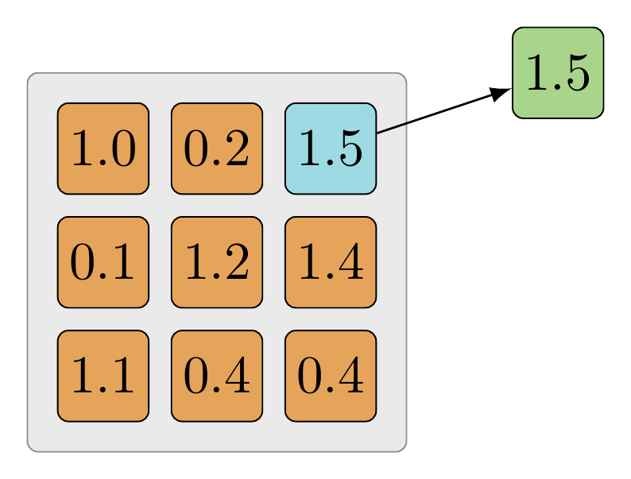
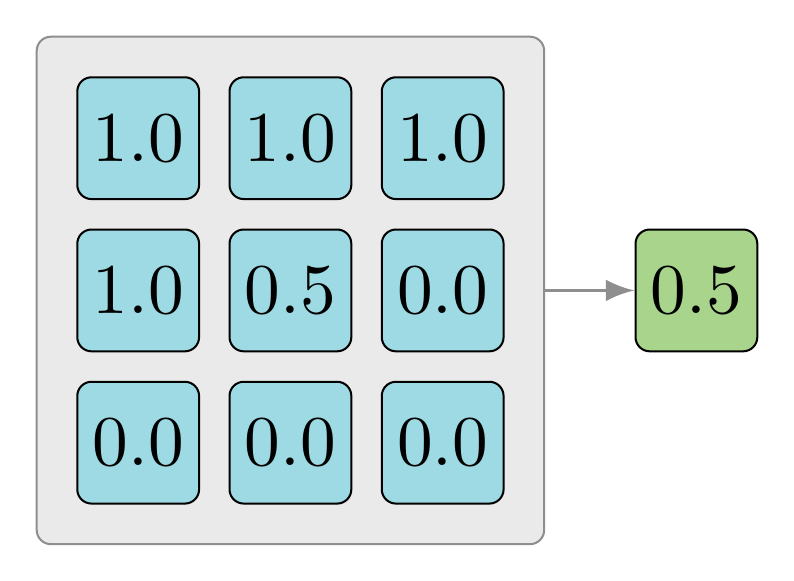

<!-- toc -->
<!-- more -->
# 1. 常见层
        
一个神经网络架构要成为CNN，必须至少包含一个卷积层（tf.nn.conv2d）。单层CNN的一种实际用途是检测边缘。

对于图像识别和分类任务而言，更常见的情形是使用不同的层类型支持某个卷积层。这些层有助于减少过拟合，并可加速训练过程和降低内存占用率。

下面所介绍的层主要集中于那些在CNN架构中经常使用的层上。CNN可使用的层并非只局限于这些层，它们完全可以与为其他网络架构设计的层混合使用。

# 2. 卷积层

卷积与TensorFlow所采用的运算的差异主要体现在性能上。TensorFlow采用了一种可对所有不同类型的卷积层中的**卷积运算进行加速**的技术。

每种类型的卷积层都有一些用例，但tf.nn.conv2d是一个较好的切入点。其他类型的卷积也十分有用，但在构建能够完成目标识别和分类任务的网络时，并不需要它们。下面对这些卷积类型做一简要概括。

## 2.1. tf.nn.depthwise_conv2d

当需要将**一个卷积层的输出连接到另一个卷积层的输入**时，可使用这种卷积。一种高级用例是利用tf.nn.depthwise_conv2d创建一个遵循Inception架构的网络（参见https://arxiv.org/abs/1512.00567）。

## 2.2. tf.nn.separable_conv2d

它与tf.nn.conv2d类似，但并非后者的替代品。**对于规模较大的模型**，它可在不牺牲准确率的前提下实现训练的加速。对于规模较小的模型，它能够快速收敛，但准确率较低。

## 2.3. tf.nn.conv2d_transpose

它将一个卷积核应用于一个新的特征图，后者的每一部分都填充了与卷积核相同的值。当该卷积核遍历新图像时，任何重叠的部分都相加在一起。这就很好地解释了斯坦福大学课程CS231n Winter 2016：Lecture 13中关于如何将tf.nn.conv2d_transpose用于可学习的降采样的问题。

# 3. 激活函数

这些函数与其他层的输出联合使用可生成特征图。它们用于对某些运算的结果进行平滑（或微分）。其目标是为神经网络**引入非线性**。

非线性意味着输入和输出的关系是一条曲线，而非直线。

曲线能够刻画输入中更为复杂的变化。
例如，非线性映射能够描述那些大部分时间值都很小，但在某个单点会周期性地出现极值的输入。为神经网络引入非线性可使其对在数据中发现的复杂模式进行训练。

TensorFlow提供了多种激活函数。在CNN中，人们之所以主要使用tf.nn.relu，是因为它虽然会带来一些信息损失，但性能较为突出。开始设计模型时，推荐使用tf.nn.relu，但高级用户也可创建自己的激活函数。

评价某个激活函数是否有用时，可考虑下列为数不多的几个主要因素。
- 1）该函数应是单调的，这样输出便会随着输入的增长而增长，从而使利用梯度下降法寻找局部极值点成为可能。
- 2）该函数应是可微分的，以保证该函数定义域内的任意一点上导数都存在，从而使得梯度下降法能够正常使用来自这类激活函数的输出。

任何满足这些条件的函数都可用作激活函数。在TensorFlow中，有少量激活函数值得一提，它们在各种CNN架构中都极为常见。下面给出这些激活函数的简要介绍，并通过一些示例代码片段来说明其用法。

## 3.1. tf.nn.relu

在某些文档中，修正线性单元也被称为斜坡函数，因为它的图形与滑板的斜坡非常相似。

ReLU是分段线性的，当输入为非负时，输出将与输入相同；而当输入为负时，输出均为0。它的优点在于不受“梯度消失”的影响，且取值范围为[0,+∞]；其缺点在于当使用了较大的学习速率时，易受达到饱和的神经元的影响。

```python
import tensorflow as tf
import numpy as np
sess = tf.InteractiveSession()
features = tf.range(-2, 3)
# Keep note of the value for negative features
sess.run([features, tf.nn.relu(features)])

```
输出：
```
[array([-2, -1,  0,  1,  2]), array([0, 0, 0, 1, 2])]
```

在这个例子中，输入为一个由[-2，3]内的整数构成的秩1张量（向量）。tf.nn.relu会将那些小于0的分量置为0，而保持其余分量不变。

## 3.2. tf.sigmoid

sigmoid函数的返回值位于区间[0.0，1.0]中。当输入值较大时，tf.sigmoid将返回一个接近于1.0的值，而输入值较小时，返回值将接近于0.0。对于在那些真实输出位于[0.0，1.0]的样本上训练的神经网络，sigmoid函数可将输出保持在[0.0，1.0]内的能力非常有用。当输入接近饱和或变化剧烈时，对输出范围的这种缩减往往会带来一些不利影响。

```python

# tf.sigmoid (tf.nn.sigmoid) 目前仅可接收浮点值
features = tf.to_float(tf.range(-1, 3))
sess.run([features, tf.sigmoid(features)])

```
输出：
```
[array([-1.,  0.,  1.,  2.], dtype=float32),
 array([ 0.26894143,  0.5       ,  0.7310586 ,  0.88079703], dtype=float32)]
```

在本例中，一组整数被转化为浮点类型（1变为1.0），并传入一个sigmoid函数。当输入为0时，sigmoid函数的输出为0.5，即sigmoid函数值域的中间点。

## 3.3. tf.tanh

双曲正切函数（tanh）与tf.sigmoid非常接近，且与后者具有类似的优缺点。tf.sigmoid和tf.tanh的主要区别在于后者的值域为[-1.0，1.0]。在某些特定的网络架构中，**能够输出负值的能力可能会非常有用**。

```python
# Note, tf.tanh (tf.nn.tanh) is currently limited to float values
features = tf.to_float(tf.range(-1, 3))
sess.run([features, tf.tanh(features)])
```
输出：
```
[array([-1.,  0.,  1.,  2.], dtype=float32),
 array([-0.76159418,  0.        ,  0.76159418,  0.96402758], dtype=float32)]
```

在本例中，所有的设置均与上述tf.sigmoid例子相同，但输出却存在重要的差异。tf.tanh值域的中间点为0.0。当网络中的下一层期待输入为负值或0.0时，这可能会引发一些问题。

## 3.4. tf.nn.dropout

依据某个可配置的概率将输出设为0.0。当引入少量随机性有助于训练时，这个层会有很好的表现。一种适合的场景是：当**要学习的一些模式与其近邻特征耦合过强时**。这种层会为所学习到的输出**添加少量噪声**。

> 注意：这种层应当只在训练阶段使用。如果在测试阶段使用该层，它所引入的随机噪声将对结果产生误导。

```python
features = tf.constant([-0.1, 0.0, 0.1, 0.2])
# Note, the output should be different on almost ever execution. Your numbers won't match
# this output.
sess.run([features, tf.nn.dropout(features, keep_prob=0.5)])
```

输出
```
[array([-0.1,  0. ,  0.1,  0.2], dtype=float32),
 array([-0.        ,  0.        ,  0.2       ,  0.40000001], dtype=float32)]
```

在这个例子中，输出有50%的概率能够得到保持。每次执行该层时，都将得到不同的输出（带有一些随机性）。当某个输出被丢弃时，它的值被设为0.0。

# 4. 池化层

池化层能够**减少过拟合**，并通过减小输入的尺寸来提高性能。它们可用于对输入降采样，但会为后续层保留重要的信息。只使用tf.nn.conv2d来减小输入的尺寸也是可以的，但池化层的效率更高。

## 4.1. tf.nn.max_pool

跳跃遍历某个张量，并从被卷积核覆盖的元素中找出最大的数值作为卷积结果。当输入数据的灰度与图像中的重要性相关时，这种池化方式非常有用。



示例代码，目标是找到张量中的最大分量。

```python
# 输入通常为前一层的输出，而非直接为图像
batch_size=1
input_height = 3
input_width = 3
input_channels = 1

layer_input = tf.constant([
        [
            [[1.0], [0.2], [1.5]],
            [[0.1], [1.2], [1.4]],
            [[1.1], [0.4], [0.4]]
        ]
    ])

# strides会使用image_height和image_width遍历整个输入
kernel = [batch_size, input_height, input_width, input_channels]
max_pool = tf.nn.max_pool(layer_input, kernel, [1, 1, 1, 1], "VALID")
sess.run(max_pool)
```
输出：
```
array([[[[ 1.5]]]], dtype=float32)
```

layer_input是一个形状类似于tf.nn.conv2d或某个激活函数的输出的张量。目标是仅保留一个值，即该张量中的最大元素。在本例中，该张量的最大分量为1.5，并以**与输入相同的格式**被返回。

最大池化（max-pooling）通常是利用2×2的接受域（高度和宽度均为2的卷积核）完成的，它通常也被称为“2×2的最大池化运算”。使用2×2的接受域的原因之一在于它是在单个通路上能够实施的**最小数量的降采样**。如果使用1×1的接受域，则输出将与输入相同。

## 4.2. tf.nn.avg_pool

跳跃遍历一个张量，并将被卷积核覆盖的各深度值取平均。当整个卷积核都非常重要时，若需实现值的缩减，平均池化是非常有用的，例如输入张量宽度和高度很大，但深度很小的情况。



用下列代码片段来模拟，目标是求出张量中所有分量的均值。

```python
batch_size=1
input_height = 3
input_width = 3
input_channels = 1

layer_input = tf.constant([
        [
            [[1.0], [1.0], [1.0]],
            [[1.0], [0.5], [0.0]],
            [[0.0], [0.0], [0.0]]
        ]
    ])

# The strides will look at the entire input by using the image_height and image_width
kernel = [batch_size, input_height, input_width, input_channels]
max_pool = tf.nn.avg_pool(layer_input, kernel, [1, 1, 1, 1], "VALID")
sess.run(max_pool)
```
输出：
```
array([[[[ 0.5]]]], dtype=float32)
```

对该张量中的所有分量求和，再除以张量中分量的个数：

$$
(\dfrac{1.0 + 1.0 + 1.0 + 1.0 + 0.5 + 0.0 + 0.0 + 0.0 + 0.0}{9.0})
$$

# 5. 归一化

归一化的目标之一在于将输入保持在一个可接受的范围内。
> 例如，将输入归一化到 `[0.0，1.0]` 区间内将使输入中所有可能的分量归一化为一个大于等于0.0且小于等于1.0的值。

归一化层并非CNN所独有。在使用tf.nn.relu时，考虑输出的归一化是有价值的。由于ReLU是无界函数，利用某些形式的归一化来**识别那些高频特征**通常是十分有用的。

## 5.1. 局部响应归一化

```
tf.nn.local_response_normalization(input, depth_radius=None, bias=None, alpha=None, beta=None, name=None)
```
对应公式：


其中a的上标指该层的第几个feature map，a的下标x，y表示feature map的像素位置，N指feature map的总数量，公式里的其它参数都是超参，需要自己指定的。

局部响应归一化是一个依据求和操作而形成输出的函数，详情请参考TensorFlow官方文档
https://www.tensorflow.org/api_docs/python/tf/nn/local_response_normalization

在某个给定向量中，每个分量都被depth_radius覆盖的输入的加权和所除。

局部响应归一化在对若干值归一化时，还会将每个值的重要性加以考虑。

关于为何在某些CNN架构中使用局部响应归一化非常有用，cuda-convnet的文档提供了更多细节。
https://code.google.com/p/cuda-convnet/wiki/LayerParams

ImageNet 利用该层对来自tf.nn.relu的输出进行了归一化。
https://papers.nips.cc/paper/4824-imagenet-classification-with-deep-convolutional-neural-networks.pdf

这种归一方法是受到神经科学的启发，激活的神经元会抑制其邻近神经元的活动（侧抑制现象），至于为什么使用这种正则手段，以及它为什么有效，查阅了很多文献似乎也没有详细的解释，可能是由于后来提出的batch normalization手段太过火热，渐渐的就把local response normalization掩盖了吧

根据Stanford的CS231所讲，最近LRN用的并不多，http://cs231n.github.io/

## 5.2. 代码举例：
```python
# Create a range of 3 floats.
#  TensorShape([batch, image_height, image_width, image_channels])
layer_input = tf.constant([
        [[[ 1.]], [[ 2.]], [[ 3.]]]
    ])

lrn = tf.nn.local_response_normalization(layer_input)
sess.run([layer_input, lrn])
```

输出：
```
[array([[[[ 1.]], 
         [[ 2.]], 
         [[ 3.]]]], dtype=float32), 
 array([[[[ 0.70710677]], 
         [[ 0.89442718]], 
         [[ 0.94868326]]]], dtype=float32)]
```

在上述示例代码中，归一化会将输出调整到区间[-1.0，1.0]中。归一化层tf.nn.relu会将其无界的输出调整到相同的范围内。

# 6. 高级层

为使标准层的定义在创建时更加简单，TensorFlow引入了一些高级网络层。这些层不是必需的，但它们有助于减少代码冗余，同时遵循最佳的实践。开始时，这些层需要为数据流图添加大量非核心的节点。在使用这些层之前，投入一些精力了解相关基础知识是非常值得的。

## 6.1. tf.contrib.layers.convolution2d

https://www.tensorflow.org/api_docs/python/tf/contrib/layers/conv2d#tfcontriblayersconvolution2d

convolution2d层与tf.nn.conv2d的逻辑相同，但还包括权值初始化、偏置初始化、可训练的变量输出、偏置相加以及添加激活函数的功能。

每个卷积核都是一个可训练的变量（CNN的目标是训练该变量），权值初始化用于在卷积核首次运行时，为其进行值的填充（tf.truncated_normal）。其余参数与之前使用过的类似，只是使用了缩写的版本。无需声明完整的卷积核，它采用简单的元组形式（1，1）表示卷积核的高度和宽度。

代码举例：
```python
image_input = tf.constant([
            [
                [[0.,   0., 0.], [255., 255., 255.], [254., 0., 0.]],
                [[0., 191., 0.], [  3., 108., 233.], [0., 191., 0.]],
                [[254., 0., 0.], [255., 255., 255.], [0.,   0., 0.]]
            ]
        ])

conv2d = tf.contrib.layers.convolution2d(
    image_input,
    num_outputs=4,
    kernel_size=(1,1),  # It's only the filter height and width.
    activation_fn=tf.nn.relu,
    stride=(1, 1), # Skips the stride values for image_batch and input_channels.
    trainable=True)

# It's required to initialize the variables used in convolution2d's setup.
sess.run(tf.global_variables_initializer())
sess.run(conv2d)
```
这段代码执行后的输出为：
```
array([[[[   0.        ,    0.        ,    0.        ,    0.        ],
         [   0.        ,  164.39204407,   49.73239899,   38.88407898],
         [   0.        ,   76.51831055,   13.70227337,  173.87532043]],

        [[   0.        ,   34.14883804,   35.31001282,   11.78910351],
         [   0.        ,   58.57224274,    9.92554474,    0.        ],
         [   0.        ,   34.14883804,   35.31001282,   11.78910351]],

        [[   0.        ,   76.51831055,   13.70227337,  173.87532043],
         [   0.        ,  164.39204407,   49.73239899,   38.88407898],
         [   0.        ,    0.        ,    0.        ,    0.        ]]]], dtype=float32)
```

这个例子设置了一个与由单幅图像构成的批数据的完整卷积，所有的参数都基于本文所介绍的各步骤。主要的差异在于tf.contrib.layers.convolution2d需要完成大量设置，而一旦设置完成，便无需再次编写。对于高级用户而言，该层可帮助他们节省大量时间。

> 注意：当输入为一幅图像时，不应使用`tf.to_float`，而应使用`tf.image.convert_image_dtype`，该方法将以恰当的方式调整各分量以表示颜色值。

在这段示例代码中，使用了浮点值255.0，这并不是TensorFlow用浮点值表示图像所期望的方式。TensorFlow要求用浮点型描述图像颜色时，应当将各颜色分量控制在[0，1]范围内。

## 6.2. tf.contrib.layers.fully_connected

https://www.tensorflow.org/api_docs/python/tf/contrib/layers/fully_connected

在全连接层中，每个输入与每个输出之间都存在连接。在许多架构中，这个层都极为常见。对于CNN，最后一层通常都是全连接层。`tf.contrib.layers.funlly_connected`层提供了大量创建这个最后层的捷径，同时遵循了最佳实践原则。

通常，TensorFlow中的全连接层的格式是`tf.matmul（features，weight）+bias`，其中feature、weight和bias均为张量。该层完成的也是相同的任务，但同时也会对由管理张量weight和bias所引发的复杂性加以考虑。

代码示例：

```python
features = tf.constant([
        [[1.2], [3.4]]
    ])

fc = tf.contrib.layers.fully_connected(features, num_outputs=2)
# It's required to initialize all the variables first or there'll be an error about precondition failures.
sess.run(tf.global_variables_initializer())
sess.run(fc)
```
输出：
```
array([[[ 0.,  0.],
        [ 0.,  0.]]], dtype=float32)
```

这个例子创建了一个全连接层，并将输入张量与输出层中的每个神经元建立了连接。对于不同的全连接层，还有大量其他参数需要调整。

# 7. 输入层

在任何神经网络中，输入层都至关重要。无论是训练还是测试，原始输入都需要传递给输入层。对于目标识别与分类，输入层为`tf.nn.conv2d`，它负责接收图像。接下来的步骤是在训练中使用真实图像，而非tf.constant或tf.range变量形式的样例输入。


# 8. 参考文献：

* [【TensorFlow】tf.nn.local_response_normalization详解，lrn正则法如何计算？ - xf__mao的博客  - CSDN博客](http://blog.csdn.net/mao_xiao_feng/article/details/53488271)

* [ImageNet Classification with deep convolutional neural networks - 家家的专栏   - CSDN博客](http://blog.csdn.net/yihaizhiyan/article/details/26962607)

* [Tensorflow的LRN是怎么做的](http://www.jianshu.com/p/c06aea337d5d)

* [使用TensorFlow编写识别数字的CNN训练程序详解 - ligang_csdn的博客 - CSDN博客](http://blog.csdn.net/ligang_csdn/article/details/53967031)