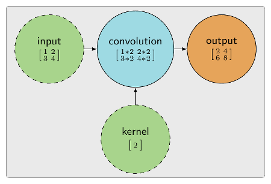
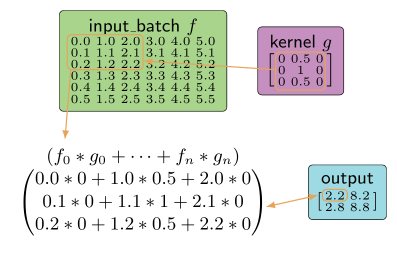
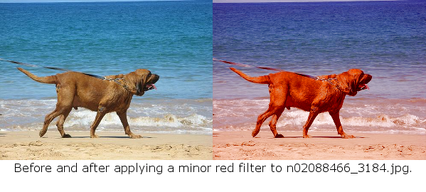
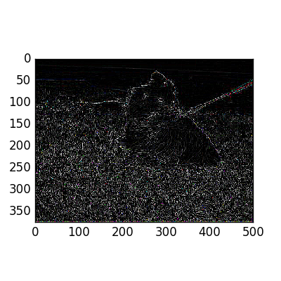
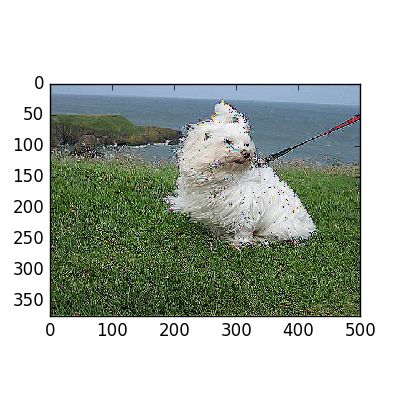

<!-- TOC -->

- [1. 卷积神经网络](#1-卷积神经网络)
    - [1.1. 卷积定义和例子](#11-卷积定义和例子)
    - [1.2. 从生物学中获得的灵感是CNN技术实现的基础](#12-从生物学中获得的灵感是cnn技术实现的基础)
    - [1.3. 匹配水平线的神经网络](#13-匹配水平线的神经网络)
    - [1.4. CNN架构](#14-cnn架构)
- [2. NOTE: the change in the size of the strides parameter.](#2-note-the-change-in-the-size-of-the-strides-parameter)
- [3. 边界填充](#3-边界填充)
- [4. 数据格式](#4-数据格式)
- [5. 深入探讨卷积核](#5-深入探讨卷积核)
    - [5.1. 举例：边缘检测](#51-举例边缘检测)
    - [5.2. 举例：锐化效果](#52-举例锐化效果)
    - [5.3. CNN 训练复杂卷积核](#53-cnn-训练复杂卷积核)
- [6. 常见层](#6-常见层)

<!-- /TOC -->
人们给予卷积神经网络（CNN）的关注一直在持续得到加强。这类网络结构主要用于视觉相关任务，但处理对象并不局限于图像。

CNN可用于能够表示为张量（各个分量与其相关的分量有序排列在一个多维网格中）的任意类型的数据。

微软研究院于2014 年公开了一篇利用CNN 进行语音识别的文章，其中输入张量为一个按录音时间顺序排列的声音频率的单行网格。

对于图像，张量中的分量为依据图像的宽和高的次序排列在一个网格中的像素。

# 1. 卷积神经网络

从技术角度看， 卷积神经网络是一种至少包含一个层（ tf.nn.conv2d）的神经网络，该层的功能是计算其输入f与一组可配置的卷积核g 的卷积，以生成该层的输出。

## 1.1. 卷积定义和例子

可用一种比较简明的定义描述卷积： 卷积的目的是将卷积核（滤波器）应用到某个张量的所有点上， 并通过将卷积核在输入张量上滑动而生成经过滤波处理的张量。

图像处理中的边缘检测便是滤波输出的一个典型例子:
一个特殊的卷积核被应用到图像中的每个像素，而输出为一个刻画了所有边缘的新图像。


该图中的g(t)需要修改为[-1 -2 -1; 0 0 0; 1, 2, 1]，按照图中给出的模板检测到的边缘是不具有方向性的。
[](CNNconv.png)

在这种情形下，输入张量是一幅图像，而张量中的每个点都对应于一个像素所包含的红色值、绿色值和蓝色值。卷积核会遍历图像中的每个像素，任何位于**边缘的像素对应的卷积输出值都会增大**。

## 1.2. 从生物学中获得的灵感是CNN技术实现的基础

在1968年，一篇公开发表的学术论文详细介绍了猴子纹状皮层（这部分大脑负责处理视觉输入）的细胞布局。这篇文章讨论了沿垂直方向延伸的细胞组是如何整合而与视觉特性匹配的。对灵长类大脑的研究看似与机器学习任务无关，但实际上对使用CNN的深度学习发展起到了非常重要的作用。

## 1.3. 匹配水平线的神经网络

CNN遵循了一个简化的信息匹配过程，这非常类似于在猴子纹状皮层的细胞布局中发现的结构。

- 当信号经过猴子的纹状皮层时，如果得到某种视觉模式的刺激，某些层便会释放信号。例如，一个细胞层会在当水平线经过它时被激活（增加输出信号的幅值）。

- CNN也会呈现出相似的行为，即某些神经元构成的簇会依据从训练中学习到的模式而激活。例如，经过训练，当水平线经过一个CNN的某一层时，该层会被激活。

匹配水平线的神经网络是一种有用的架构，但CNN更进一步，它通过对多种简单模式**分层布局**实现复杂模式的匹配。在CNN的语境中，这些模式被称为滤波器或卷积核，而训练的目标是调节这些卷积核的权值，直到它们能够与训练数据精确匹配。要训练这些滤波器，需要将多个不同的层级联，并利用梯度下降法及其变体调节网络权值。

## 1.4. CNN架构

简单的CNN架构通常包含卷积层（tf.nn.conv2d）、非线性变换层（tf.nn.relu）、池化层（tf.nn.max_pool）及全连接层（tf.nn.matmul）。

如果没有这些层，模型便很难与复杂的模式匹配，因为网络将被填充过多的信息。一个设计良好的CNN架构会**突出**那些**重要的信息**，而将**噪声忽略**。稍后的内容将详细介绍这些层如何协同工作。


[](CNNFrame.png)

这个架构的图像输入遵循一种复杂的格式，以支持图像的批量加载。
批量加载图像使得可同时对多幅图像进行处理，但也相应地要求使用更为复杂的数据结构。所使用的数据结构中包含了与一批图像进行卷积运算所需的全部信息。

TensorFlow的输入流水线（用于读取和解码文件）拥有一种为使用一个批数据中的多幅图像而设计的专门格式，它包括了任意一幅图像所需的信息（[image_batch_size，image_height，image_width，image_channels]）。

利用下列示例代码，便有可能在TensorFlow中使用图像时检查样例输入的结构。

```python
import tensorflow as tf
import numpy as np
# setup-only-ignore
sess = tf.InteractiveSession()
image_batch = tf.constant([
        [  # First Image
            [[0, 255, 0], [0, 255, 0], [0, 255, 0]],
            [[0, 255, 0], [0, 255, 0], [0, 255, 0]]
        ],
        [  # Second Image
            [[0, 0, 255], [0, 0, 255], [0, 0, 255]],
            [[0, 0, 255], [0, 0, 255], [0, 0, 255]]
        ]
    ])
image_batch.get_shape()
```

代码运行后的结果：
```
TensorShape([Dimension(2), Dimension(2), Dimension(3), Dimension(3)])
```

这段示例代码创建了一个包含两幅图像的图像批数据。
每幅图像的高为2个像素，宽为3个像素，且颜色空间为RGB。
执行后的输出的
- 第1组维度Dimension（1）表明了图像数量，
- 第2组维度Dimension（2）对应图像的高度，
- 第3组维度Dimension（3）表明了图像的宽度
- 第4组维度Dimension（3）表明了图像颜色通道数量

有一点值得注意，每个像素的索引都会映射到图像的宽和高这两个维度上。若要获取第1幅图像的第1个像素，需要用下列方式访问每一个维度。

```python
sess.run(image_batch)[0][0][0]
```

该语句执行后，可得到输出：

```array([  0, 255,   0])```

变量image_batch并不会从磁盘直接加载图像，而是将自身当成作为输入流水线的一部分。

使用输入流水线从磁盘加载的图像拥有相同的格式和行为。一种常见的做法是创建一些与上述image_batch实例相似的假数据对CNN的输入和输出进行测试。这种简化的输入会使诊断和调试一些简单问题更加容易。简化调试过程非常重要，因为CNN架构极为复杂，训练经常需要耗费数日。

CNN架构的第一个复杂性体现在卷积层的工作机理上。任何图像被加载和处理后，卷积层通常是网络的第一层。这第一个卷积层非常有用，因为它可简化网络的其余部分，并用于调试。


# 卷积

CNN与各种模式精确匹配的能力可归功于卷积运算的使用。

卷积运算对两个输入张量（输入和卷积核）进行卷积，并输出一个代表来自每个输入的信息的张量



## 输入和卷积核

通常，TensorFlow中的卷积运算是通过 `tf.nn.conv2d`完成的。

卷积核（kernel）是一则重要术语，也称为权值、滤波器、卷积矩阵或模板。
在TensorFlow中，这个参数被命名为filter，相应的权值可从训练中习得。
卷积核（filter参数）中不同权值的数量决定了需要学习的卷积核的数量。

通道这个术语来自计算机视觉领域，用于描述输出向量。
例如，一幅RGB图像拥有3个代表了秩1张量[red，green，blue]的通道。

举例：可试验计算两个张量的卷积，并查看结果。

```python

import tensorflow as tf
import numpy as np
sess = tf.InteractiveSession()
input_batch = tf.constant([
        [  # First Input
            [[0.0], [1.0]],
            [[2.0], [3.0]]
        ],
        [  # Second Input
            [[2.0], [4.0]],
            [[6.0], [8.0]]
        ]
    ])

kernel = tf.constant([
        [
            [[1.0, 2.0]]
        ]
    ])
conv2d = tf.nn.conv2d(input_batch, kernel, strides=[1, 1, 1, 1], padding='SAME')
sess.run(conv2d)

```
输出结果：
```python
array([[[[  0.,   0.],
         [  1.,   2.]],

        [[  2.,   4.],
         [  3.,   6.]]],


       [[[  2.,   4.],
         [  4.,   8.]],

        [[  6.,  12.],
         [  8.,  16.]]]], dtype=float32)
```

上述示例代码中
- 包含了一个卷积核（变量kernel的第1维）。该卷积核的作用是返回一个其第1个通道等于原始输入值，第2个通道等于原始输入值两倍的张量。
- 在本例中，通道用于描述一个秩1张量（向量）的元素。
- 该输出是另一个与input_batch同秩的张量，但其维数与卷积核相同。
- 可将卷积运算tf.nn.conv2d视为图像（用input_batch表示）和卷积核张量kernel的组合。这两个张量的卷积会生成一幅特征图（feature map）。特征图是一个比较宽泛的术语，但在计算机视觉中，它与使用图像卷积核的运算的输出相关，而现在，特征图通过为输出添加新层代表了这些张量的卷积。


- 输入图像与输出的特征图之间的关系可结合代码来分析。访问输入批数据和特征图中的元素时使用的是相同的索引。通过访问输入批数据和特征图中位置相同的像素，可了解当输入与kernel进行卷积运算时，它的值是如何改变的。在下面的例子中，图像中右下方的像素经过卷积后的值变为3.0*1.0和3.0*2.0。这些值对应于像素值和kernel中的相应值。

```
lower_right_image_pixel = sess.run(input_batch)[0][1][1]
lower_right_kernel_pixel = sess.run(conv2d)[0][1][1]

lower_right_image_pixel, lower_right_kernel_pixel

```
输出：
```
(array([ 3.], dtype=float32), array([ 3.,  6.], dtype=float32))
```

在这个简化的例子中，每幅图像中的每个像素都与卷积核中的相应值相乘，并累加到特征图的相应层中。在这个语境中，“层”是指输出的新维度。

# 跨度

## 卷积的价值--降维

在计算机视觉中，卷积的价值体现在对输入（本例中为图像）降维的能力上。一幅2D图像的维数包括其宽度、高度和通道数。如果图像具有较高的维数，则意味着神经网络扫描所有图像以判断各像素的重要性所需的时间呈指数级增长。利用卷积运算对图像降维是通过修改卷积核的strides（跨度）参数实现的。

## 参数strides

参数strides使得卷积核可跳过图像中的一些像素，从而在输出中不包含它们。实际上，说这些像素“被跳过”并不十分准确，因为它们仍然会对输出产生影响。

strides参数指定了当图像维数较高，且使用了较为复杂的卷积核时，卷积运算应如何进行。当卷积运算用卷积核遍历输入时，它利**用这个跨度参数来修改遍历输入的方式**。

strides参数使得卷积核**无需遍历输入的每个元素**，而是可以直接跳过某些元素。

## 代码举例：
假设需要计算一幅较大的图像和一个较大的卷积核之间的卷积运算。在这个例子中，图像的高度为6个像素，宽度为6个像素，而深度为1个通道（6×6×1），卷积核尺寸为（3×3×1）。

```python

input_batch = tf.constant([
        [  # First Input (6x6x1)
            [[0.0], [1.0], [2.0], [3.0], [4.0], [5.0]],
            [[0.1], [1.1], [2.1], [3.1], [4.1], [5.1]],
            [[0.2], [1.2], [2.2], [3.2], [4.2], [5.2]],
            [[0.3], [1.3], [2.3], [3.3], [4.3], [5.3]],
            [[0.4], [1.4], [2.4], [3.4], [4.4], [5.4]],
            [[0.5], [1.5], [2.5], [3.5], [4.5], [5.5]],
        ],
    ])

kernel = tf.constant([  # Kernel (3x3x1)
        [[[0.0]], [[0.5]], [[0.0]]],
        [[[0.0]], [[1.0]], [[0.0]]],
        [[[0.0]], [[0.5]], [[0.0]]]
    ])

# 2. NOTE: the change in the size of the strides parameter.
conv2d = tf.nn.conv2d(input_batch, kernel, strides=[1, 3, 3, 1], padding='SAME')
sess.run(conv2d)

```
输出：

```
array([[[[ 2.20000005],
         [ 8.19999981]],

        [[ 2.79999995],
         [ 8.80000019]]]], dtype=float32)

```

通过将kernel在input_batch上滑动，同时跨过（或跳过）某些元素，input_batch与kernel便结合在一起。kernel每次移动时，都将input_batch的一个元素作为中心。

然后，位置重叠的值相乘，再将这些乘积相加得到卷积的结果。卷积就是通过这种逐点相乘的方式将两个输入整合在一起的。利用下图可更容易地将卷积运算可视化。



上图两个张量进行了卷积运算，卷积核会跳过输入中的一些固定数目的元素，代码中设置是3。

strides显著降低了输出的维数，而卷积核允许卷积使用所有的输入值。在输入数据中，没有任何元素在被跳过时被移除，但它仍然变成了一个形状更小的张量。

**设置跨度是一种调整输入张量维数的方法。降维可减少所需的运算量，并可避免创建一些完全重叠的感受域。**

## strides参数的格式

strides参数的格式与输入向量相同，即

```（image_batch_size_stride、image_height_stride、image_width_stride、image_channels_stride）```

第1个和最后一个跨度参数通常很少修改，因为它们会在tf.nn.conv2d运算中跳过一些数据，从而不将这部分数据予以考虑。
如果希望降低输入的维数，可修改`image_height_stride`和`image_width_stride`参数。

在对输入使用跨度参数时，所面临的一个挑战是如何应对那些不是恰好在**输入的边界到达尽头的跨度值**。非均匀的跨越通常在图像尺寸和卷积核尺寸与跨度参数不匹配时出现。如果图像尺寸、卷积核尺寸和strides参数都无法改变，则可采取对图像填充边界的方法来处理那些非均匀区域。

# 3. 边界填充

当卷积核与图像重叠时，它应当落在图像的边界内。有时，两者尺寸可能不匹配，一种较好的补救策略是对图像缺失的区域进行填充，即边界填充。

TensorFlow会用0进行边界填充，或当卷积核与图像尺寸不匹配，但又不允许卷积核跨越图像边界时，会引发一个错误。

tf.nn.conv2d的零填充数量或错误状态是由参数padding控制的，它的取值可以是SAME或VALID。

·SAME：卷积输出与输入的尺寸相同。这里在计算如何跨越图像时，并不考虑滤波器的尺寸。选用该设置时，缺失的像素将用0填充，卷积核**扫过的像素数将超过图像的实际像素数**。

·VALID：在计算卷积核如何在图像上跨越时，需要**考虑滤波器的尺寸**。这会使卷积核尽量不越过图像的边界。在某些情形下，可能边界也会被填充。

在计算卷积时，最好能够考虑图像的尺寸，如果边界填充是必要的，则TensorFlow会有一些内置选项。在大多数比较简单的情形下，SAME都是一个不错的选择。当指定跨度参数后，如果输入和卷积核能够很好地工作，则推荐使用VALID。关于这两个参数的更多介绍，请参考

https://www.tensorflow.org/api_guides/python/nn#convolution

[Neural Network Convolution TensorFlow](https://www.tensorflow.org/api_guides/python/nn#convolution)

# 4. 数据格式

tf.nn.conv2d文档详细解释了如何修改data_format(数据格式)，以使input、kernel和strides遵循某种与到目前为止所使用的格式不同的格式。

如果有某个输入张量未遵循`[batch_size，height，width，channel]`标准，则修改该格式便非常有用。除了修改输入的格式，使之与标准匹配外，也可修改data_format参数以使用一种不同的布局。

data_format：该参数可取为“NHWC”或“NCHW”，默认值为“NHWC”，用于指定输入和输出数据的格式。
- 当取默认格式“NHWC”时，数据的存储顺序为[batch，in_height，in_width，in_channels]。
- 若该参数取为“NCHW”，数据存储顺序为[batch，in_channels，in_height，in_width]。

数据格式定义：
- N  批数据中的张量数目．即batch_size
- H  每个批数据中张量的高度
- W  每个批数据中张量的宽度
- C  每个批数据中张量的通道数

# 5. 深入探讨卷积核

滤波器通常用于摄影中以调整图片的属性，如允许到达摄像机透镜的光通量。在摄影中，摄影者可借助滤波器对所拍摄的图片做出大幅度的修改。
摄影者之所以能够利用滤波器对图片进行修改，是因为滤波器能够识别到达透镜的光线的特定属性。
例如，红色透镜滤波器会吸收（或阻止）不同于红色的每种频率的光，使得只有红色光可通过该滤波器。



在TensorFlow中，滤波器参数用于指定与输入 进行卷积运算的卷积核。
在计算机视觉中，卷积核（滤波器）常用于识别数字图像中的重要属性。当某些滤波器感兴趣的特征在图像中存在时，滤波器会使用特定模式突出这些特征。
若将除红色外的所有颜色值减小，则可得到一个红色滤波器的卷积核。在这种情形下，红色值将保持不变，而其他任何匹配的颜色值将被减小。

## 5.1. 举例：边缘检测

边缘检测卷积核在计算机视觉应用中极为常见，它可用基本的TensorFlow运算和一个tf.nn.conv2d运算实现。

```python
kernel = tf.constant([
        [
            [[ -1., 0., 0.], [ 0., -1., 0.], [ 0., 0., -1.]],
            [[ -1., 0., 0.], [ 0., -1., 0.], [ 0., 0., -1.]],
            [[ -1., 0., 0.], [ 0., -1., 0.], [ 0., 0., -1.]]
        ],
        [
            [[ -1., 0., 0.], [ 0., -1., 0.], [ 0., 0., -1.]],
            [[ 8., 0., 0.], [ 0., 8., 0.], [ 0., 0., 8.]],
            [[ -1., 0., 0.], [ 0., -1., 0.], [ 0., 0., -1.]]
        ],
        [
            [[ -1., 0., 0.], [ 0., -1., 0.], [ 0., 0., -1.]],
            [[ -1., 0., 0.], [ 0., -1., 0.], [ 0., 0., -1.]],
            [[ -1., 0., 0.], [ 0., -1., 0.], [ 0., 0., -1.]]
        ]
    ])


conv2d = tf.nn.conv2d(image_batch, kernel, [1, 1, 1, 1], padding="SAME")
activation_map = sess.run(tf.minimum(tf.nn.relu(conv2d), 255))

```



将一幅图像与一个边缘检测卷积核进行卷积所得到的输出将是所有被检测到边缘的区域。

示例图像来自Stanford Dogs数据集，卷积核拥有3个输入和3个输出通道，这些通道对应于[0，255]区间内的RGB值，其中255为最大灰度值。
调用tf.minimum和tf.nn.relu的目的是将卷积值保持存在RGB颜色值的合法范围[0，255]内。

在这个简单的示例中，也可使用许多其他的常见卷积核。这些卷积核中的每一个都会突出图像中的不同模式，从而得到不同的结果。

## 5.2. 举例：锐化效果

下列卷积核通过增加颜色的变化幅度可产生锐化效果。

```python

kernel = tf.constant([
        [
            [[ 0., 0., 0.], [ 0., 0., 0.], [ 0., 0., 0.]],
            [[ -1., 0., 0.], [ 0., -1., 0.], [ 0., 0., -1.]],
            [[ 0., 0., 0.], [ 0., 0., 0.], [ 0., 0., 0.]]
        ],
        [
            [[ -1., 0., 0.], [ 0., -1., 0.], [ 0., 0., -1.]],
            [[ 5., 0., 0.], [ 0., 5., 0.], [ 0., 0., 5.]],
            [[ -1., 0., 0.], [ 0., -1., 0.], [ 0., 0., -1.]]
        ],
        [
            [[ 0., 0., 0.], [ 0., 0., 0.], [ 0., 0., 0.]],
            [[ -1., 0., 0.], [ 0., -1., 0.], [ 0., 0., -1.]],
            [[ 0, 0., 0.], [ 0., 0., 0.], [ 0., 0., 0.]]
        ]
    ])


conv2d = tf.nn.conv2d(image_batch, kernel, [1, 1, 1, 1], padding="SAME")
activation_map = sess.run(tf.minimum(tf.nn.relu(conv2d), 255))

```



这个卷积核的作用是**增加卷积核中心位置像素的灰度，并降低周围像素的灰度**。这种灰度的调整能够匹配那些具有较强灰度的像素的模式，并提升它们的灰度，从而使输出在视觉上呈现出锐化的效果。
请注意，这里的卷积核四角的元素均为0，并不会对“+”形状的模式产生影响。

这些卷积核在比较初级的层次上能够与图像中的一些模式匹配。

## 5.3. CNN 训练复杂卷积核

卷积神经网络通过使用从训练过程中学习到的复杂卷积核不但可以匹配边缘，还可以匹配更为复杂的模式。在训练过程中，这些卷积核的初值通常随机设定，随着训练迭代的进行，它们的值会由CNN的学习层自动调整。

当CNN训练完成一轮迭代后，它接收一幅图像，并将其与某个卷积核进行卷积，然后依据预测结果与该图像真实标签是否一致，对卷积核中的参数进一步调整。

例如，若一幅牧羊犬的照片被CNN模型预测为斗牛犬，则卷积核参数将适当调整以试图更好地匹配牧羊犬图片。

用CNN学习复杂的模式并非只用一个单层卷积就可完成，即使上述示例代码中包含了一个tf.nn.relu层用于准备输出以便可视化，也是不够的。在CNN中，卷积层可多次出现，但通常也会包含其他类型的层。这些层联合起来构成了成功的CNN架构所必需的要素。

# 6. 常见层

[CNN Layer](CNN Layer.md)
