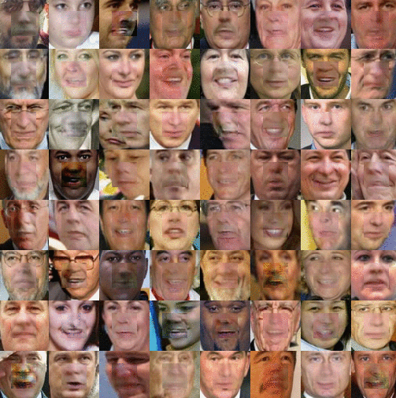
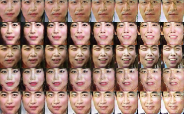
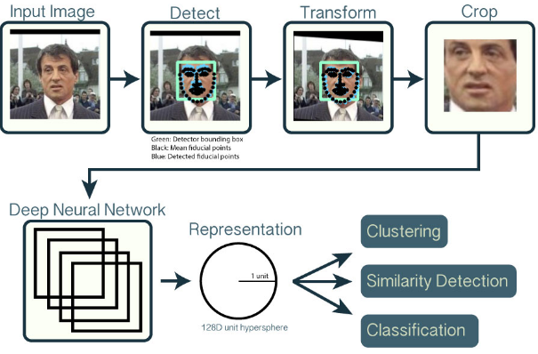
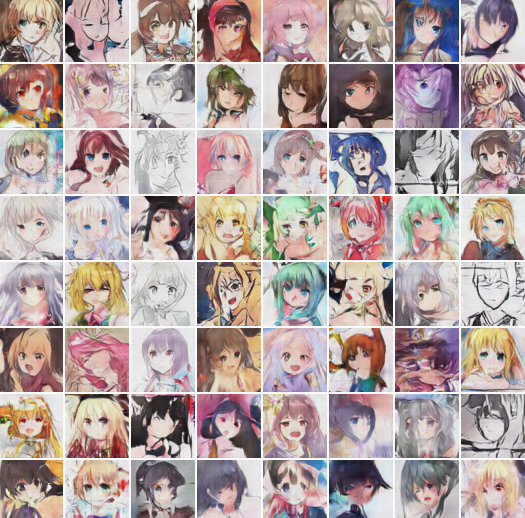
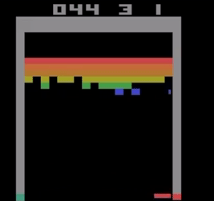
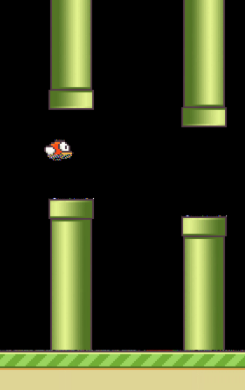

<!-- toc -->
<!-- more -->
# 1. Image Completion with Deep Learning in TensorFlow

[bamos/dcgan-completion.tensorflow https://github.com/bamos/dcgan-completion.tensorflow](https://github.com/bamos/dcgan-completion.tensorflow)

[Image Completion with Deep Learning in TensorFlow 文章 http://bamos.github.io/2016/08/09/deep-completion/](http://bamos.github.io/2016/08/09/deep-completion/)

# 2. NEURAL FACE

Neural Face is an Artificial Intelligence which generates face images and all images in this page are not REAL.

[Neural Face | 프사 뉴럴 http://carpedm20.github.io/faces/ ](http://carpedm20.github.io/faces/)

A torch implementation of http://arxiv.org/abs/1511.06434

# 3. Face recognition with deep neural networks. 

OpenFace介绍网站 http://cmusatyalab.github.io/openface/

[cmusatyalab/openface](https://github.com/cmusatyalab/openface)

# 4. 利用生成对抗网络(generative adversarial networks, GANs)生成二次元妹子

A simple PyTorch Implementation of Generative Adversarial Networks, focusing on anime face drawing.

[jayleicn/animeGAN https://github.com/jayleicn/animeGAN](https://github.com/jayleicn/animeGAN)

# 5. Tensorflow implementation of Human-Level Control through Deep Reinforcement Learning

[devsisters/DQN-tensorflow https://github.com/devsisters/DQN-tensorflow](https://github.com/devsisters/DQN-tensorflow)

# 6. Flappy Bird hack using Deep Reinforcement Learning (Deep Q-learning).
This project follows the description of the Deep Q Learning algorithm described in Playing Atari with Deep Reinforcement Learning [2] and shows that this learning algorithm can be further generalized to the notorious Flappy Bird.

https://github.com/yenchenlin/DeepLearningFlappyBird

整个项目的根基就是这个游戏本身，在增强学习中可以看作是“Environment”，也就是能接收Action并反馈Next State和Reward的。作者使用了别人写好的现成的程序，不过还是在此基础上做了一定的修改，使游戏能够返回这两个信息。对于Next State，则是下一个时刻的图画信息，对于Reward，主要就是能分了，穿过一对管子得一分，死掉得负分。
预测部分：作者采用了E&E的策略，除了以模型进行判定之外，还以一定概率随机操作。
学习部分：当数据集收集到一定数量后开始学习，对于非完结的状态，要根据Bellman Equation进行Return的计算（Return和Reward有一定的差别）。然后将(state,action,return)扔给模型学习。
模型：CNN，具体的参数README讲得很清楚。总体来看这就是一个模仿Atari实现的项目，

# 7. 把一副图像变成铅笔水粉画

http://www.cse.cuhk.edu.hk/~leojia/projects/pencilsketch/pencil_drawing.htm

一个非官方的实现在这里：
https://github.com/fumin/pencil  implementation of http://www.cse.cuhk.edu.hk/~leojia/projects/pencilsketch/npar12_pencil.pdf 

# 8. Character-Aware Neural Language Models

Tensorflow implementation of Character-Aware Neural Language Models. The original code of author can be found here.
[carpedm20/lstm-char-cnn-tensorflow https://github.com/carpedm20/lstm-char-cnn-tensorflow](https://github.com/carpedm20/lstm-char-cnn-tensorflow)

# 9. "End-To-End Memory Networks" in Tensorflow

论文： http://arxiv.org/abs/1503.08895v4

代码： https://github.com/carpedm20/MemN2N-tensorflow

# 10. TensorFlow implementation of Pixel Recurrent Neural Networks

https://github.com/carpedm20/pixel-rnn-tensorflow

# 11. A recurrent neural network for generating little stories about images

你提供一张图，然后计算机根据这张图讲一个小故事。
https://github.com/ryankiros/neural-storyteller

# 12. Efficient Image Captioning code in Torch, runs on GPU

给出一张图片，然后生成一句描述，
Efficient Image Captioning code in Torch, runs on GPU
https://github.com/karpathy/neuraltalk2

# 13. Neural Artistic Style in Python

Implementation of A Neural Algorithm of Artistic Style https://arxiv.org/abs/1508.06576. 
A method to transfer the style of one image to the subject of another image. 
提供一张图片确定一种风格，就可以将输入图片风格化（艺术化）

https://github.com/andersbll/neural_artistic_style

# 14. Variational Auto Encoder

论文 http://arxiv.org/abs/1312.6114
A collection of generative methods implemented with TensorFlow (Deep Convolutional Generative Adversarial Networks (DCGAN), Variational Autoencoder (VAE) and DRAW: A Recurrent Neural Network For Image Generation).

[ikostrikov/TensorFlow-VAE-GAN-DRAW](https://github.com/ikostrikov/TensorFlow-VAE-GAN-DRAW)

# 15. Generative Adversarial Networks 网络

论文https://arxiv.org/abs/1406.2661

这个模型有两个网络，一个“造假者”，一个“判别真假的警察”，互相博弈训练，最后使得“造假者”可以以假乱真。

https://github.com/carpedm20/DCGAN-tensorflow
A tensorflow implementation of "Deep Convolutional Generative Adversarial Networks" http://carpedm20.github.io/faces/

https://github.com/ericjang/draw
TensorFlow Implementation of "DRAW: A Recurrent Neural Network For Image Generation"

https://github.com/mattya/chainer-DCGAN
Chainer implementation of Deep Convolutional Generative Adversarial Network

参考
[A curated list of deep learning resources for computer vision, kjw0612/awesome-deep-vision](https://github.com/kjw0612/awesome-deep-vision)