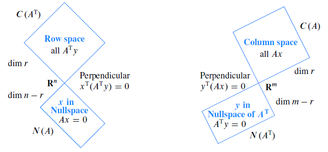

<!-- toc -->
<!-- more -->

# 1. 四个基本子空间

对于m \times n矩阵$A$，rank(A)=r有：

## 1.1. 零空间
n 维向量，是 $Ax=0$ 的解，所以N(A) \in \mathbb{R}^n, dim N(A)=n-r，自由元所在的列即可组成零空间的一组基。

## 1.2. 列空间
列向量是m 维的，所以C(A) \in \mathbb{R}^m, dim C(A)=r，主元所在的列即可组成列空间的一组基。

## 1.3. 行空间
$A$ 的行的所有线性组合，即A 转置的列的线性组合（因为我们不习惯处理行向量），
C(A^T) \in \mathbb{R}^n, dim C(A^T)=r，基见例1。

## 1.4. 左零空间
$A$ 转置的零空间 $N(A^T$) ,$A$的左零空间
N(A^T) \in \mathbb{R}^m, dim N(A^T)=m-r，基见例2。

## 1.5. 画出四个子空间

如下，行空间和零空间在${R}^n$里，他们的维数加起来等于n; 
列空间和左零空间在${R}^m$里，他们的维数加起来等于m。

## 1.6. 维数问题：
- 列空间：A 的主列就是列空间的一组基，dim(C(A))=Rank(A)=r，维数就是秩的大小
- 行空间：有一个重要的性质：行空间和列空间维数相同，都等于秩的大小
- 零空间：一组基就是一组特殊解，r 是主变量的个数，n-r 是自由变量的个数，零空间的维数等于n-r
- 左零空间：维数为m-r。

- n 维空间中存在两个子空间，一个r 维的行空间，一个n-r 维的零空间，维数和为n。和另一个结论相似：r 个主变量，n-r 个是自由变量，加起来是n。
- m 维空间中存在两个子空间，一个r 维的列空间，一个m-r 维的左零空间，维数和为m。

## 1.7. 为什么$r=dim(C(A))=dim(C(A^T))$

**行空间维度** 矩阵秩r为轴列(pivot coloumn)的个数，而当A通过消元转成R时($EA = R$)，轴的个数可以通过非0行的数量得到，也就是前r行。而前r行中，轴列组成了单位矩阵$I_{r \times r}$，所以$C(A^T)$的基是前R行，其维度为r。

**列空间维度** 在计算零空间时，通过消元，可以得到$A\vec{x}=0 \Leftrightarrow R\vec{x}=0$。对于最简行矩阵R，其列空间是轴列，由于消元过程不改变列的位置，所以A的轴列与R一致。根据R的结构，发现R的轴列可以线性的表示R的其他自由列，所以R的轴列支撑$C(R)$，且维度为r。由于使用相同的系数$\vec{x}$，A的轴列同样可以表示$A$的其他列，所以$A$的轴列支撑$C(A)$，维度为r。

## 1.8. 基的问题：

- 列空间：主列组合就是一组基
- 零空间：一组特殊解就是一组基
- 行空间：通过初等行变换变换成行最简式，行空间的一组基即是行最简形R 的前r(秩数)行。（行变换不会对行空间产生影响，但会对列空间产生影响。）

# 2. 行空间举例

矩阵

A=
\begin{bmatrix}
1 & 2 & 3 & 1 \\
1 & 1 & 2 & 1 \\
1 & 2 & 3 & 1 \\
\end{bmatrix}
\underrightarrow{消元、化简}
\begin{bmatrix}
1 & 0 & 1 & 1 \\
0 & 1 & 1 & 0 \\
0 & 0 & 0 & 0 \\
\end{bmatrix}
=R


由于我们做了行变换，所以A的列空间受到影响，C(R) \neq C(A)，而行变换并不影响行空间，所以可以在$R$中看出前两行就是行空间的一组基。
为什么说它们一定在矩阵的行空间里？因为行变换的时候是某行和令一行相加或相减，即是这些行向量的的线性组合。

所以，可以得出无论对于矩阵$A$还是$R$，其行空间的一组基，可以由$R$矩阵的前$r$行向量组成（这里的$R$就是第七讲提到的简化行阶梯形式）。

# 3. 左零空间举例（A 转置的零空间）：

## 3.1. 为什么叫左零空间？

对于左零空间，有A^Ty=0 \rightarrow (A^Ty)^T=0^T\rightarrow y^TA=0^T，因此得名。
但我们一般还是习惯用ATy=0，因为希望y 是列向量

## 3.2. 求矩阵的左零空间

就试着寻找一个产生零行向量的行组合；
求矩阵的零空间，就试着寻找一个产生零列向量的列组合。

采用Gauss-Jordan消元，将增广矩阵\left[\begin{array}{c|c}A_{m \times n} & I_{m \times m}\end{array}\right]中$A$的部分划为简化行阶梯形式\left[\begin{array}{c|c}R_{m \times n} & E_{m \times m}\end{array}\right]，此时矩阵$E$会将所有的行变换记录下来。
性质：$EA=R$，而在前几讲中，有当$A'$是$m$阶可逆方阵时，$R'$即是$I$，所以$E$就是$A^{-1}$。

本例中

\left[\begin{array}{c|c}A_{m \times n} & I_{m \times m}\end{array}\right]=
\left[
\begin{array}
{c c c c|c c c}
1 & 2 & 3 & 1 & 1 & 0 & 0 \\
1 & 1 & 2 & 1 & 0 & 1 & 0 \\
1 & 2 & 3 & 1 & 0 & 0 & 1 \\
\end{array}
\right]
\underrightarrow{消元、化简}
\left[
\begin{array}
{c c c c|c c c}
1 & 0 & 1 & 1 & -1 & 2 & 0 \\
0 & 1 & 1 & 0 & 1 & -1 & 0 \\
0 & 0 & 0 & 0 & -1 & 0 & 1 \\
\end{array}
\right]
=\left[\begin{array}{c|c}R_{m \times n} & E_{m \times m}\end{array}\right]


则


EA=
\begin{bmatrix}
-1 & 2  & 0 \\
1  & -1 & 0 \\
-1 & 0  & 1 \\
\end{bmatrix}
\cdot
\begin{bmatrix}
1 & 2 & 3 & 1 \\
1 & 1 & 2 & 1 \\
1 & 2 & 3 & 1 \\
\end{bmatrix}
=
\begin{bmatrix}
1 & 0 & 1 & 1 \\
0 & 1 & 1 & 0 \\
0 & 0 & 0 & 0 \\
\end{bmatrix}
=R


很明显，式中$E$的最后一行对$A$的行做线性组合后，得到$R$的最后一行，即$0$向量，也就是$y^TA=0^T$。
本例左零空间的一组基为[-1,0,1]

# 4. 例子：计算矩阵的四个线性子空间

设矩阵A如下

A=
\begin{bmatrix}
1&3&0&5 \\ 2&6&1&16 \\ 5&15&0&25 \\
\end{bmatrix}
=\begin{bmatrix}1&0&0 \\ 2&1&0 \\ 5&0&1 \end{bmatrix} \begin{bmatrix} 1&3&0&5 \\ 0&0&1&6 \\ 0&0&0&0 \end{bmatrix} 
= LU = E^{-1}R


四个线性子空间基为

## 4.1. 列空间


s_1=E^{-1}R[,1] =\begin{bmatrix}1&0&0 \\ 2&1&0 \\ 5&0&1 \end{bmatrix} \begin{bmatrix} 1 \\ 0 \\ 0 \end{bmatrix} =\begin{bmatrix} 1 \\ 2 \\ 5 \end{bmatrix}



s_2=E^{-1}R[,3] =\begin{bmatrix}1&0&0 \\ 2&1&0 \\ 5&0&1 \end{bmatrix} \begin{bmatrix} 0 \\ 1 \\ 0 \end{bmatrix} =\begin{bmatrix} 0 \\ 1 \\ 0 \end{bmatrix}


## 4.2. 行空间

s_1=R[1,]=\begin{bmatrix} 1&3&0&5 \end{bmatrix}^T,s_2=R[2,]=\begin{bmatrix} 0&0&1&6 \end{bmatrix}^T

习惯用列向量表示。

## 4.3. 零空间
先交换R的2,3列
\begin{bmatrix} 1&0&3&5 \\ 0&1&0&6 \\ 0&0&0&0 \end{bmatrix}  得到形式\begin{bmatrix}I&F \\ 0&0 \end{bmatrix}

然后根据块公式得到零空间矩阵
形式\begin{bmatrix}-F \\ I\end{bmatrix}的矩阵\begin{bmatrix}-3&-5\\ 0&-6\\ 1&0 \\&0&1 \end{bmatrix}  最后交换2,3行\begin{bmatrix}-3&-5\\ 1&0 \\ 0&-6 \\ 0&1 \end{bmatrix} 

得到最终结果。$s_1=\begin{bmatrix}-3&1&0&0\end{bmatrix}^T,s_2=\begin{bmatrix}-5&0&-6&1\end{bmatrix}^T$

## 4.4. 左零空间
根据左零空间的定义，即是$A^T\vec{y}=\vec{0} \Leftrightarrow \vec{y}^TA=\vec{0}^T$，也就是消元$EA$过程中得到R零行对应的E的行，即$s_1=E[3,]=\begin{bmatrix}5&0&1\end{bmatrix}^T$

通过上面的过程，可以发现只需要通过消元，就可以得到四个线性子空间的重要信息，基与维度。消元的原理虽然简单，但是其意义不简单，它好比剥洋葱，将皮一层层去掉，得到最后不变的内核。

# 5. 最后，引入矩阵空间的概念

矩阵可以同向量一样，可以做求和、数乘。

举例，设所有$3 \times 3$矩阵组成的矩阵空间为$M$。则上三角矩阵、对称矩阵、对角矩阵（前两者的交集）。

观察一下对角矩阵，如果取

\begin{bmatrix}
1 & 0 & 0 \\
0 & 0 & 0 \\
0 & 0 & 0 \\
\end{bmatrix} \quad
\begin{bmatrix}
1 & 0 & 0 \\
0 & 3 & 0 \\
0 & 0 & 0 \\
\end{bmatrix} \quad
\begin{bmatrix}
0 & 0 & 0 \\
0 & 0 & 0 \\
0 & 0 & 7 \\
\end{bmatrix}

可以发现，任何三阶对角矩阵均可用这三个矩阵的线性组合生成，因此，他们生成了三阶对角矩阵空间，即这三个矩阵是三阶对角矩阵空间的一组基。
我们把$R^{n}$的概念延伸至$R^{n\ast n}$，他们仍对加法和乘法封闭

