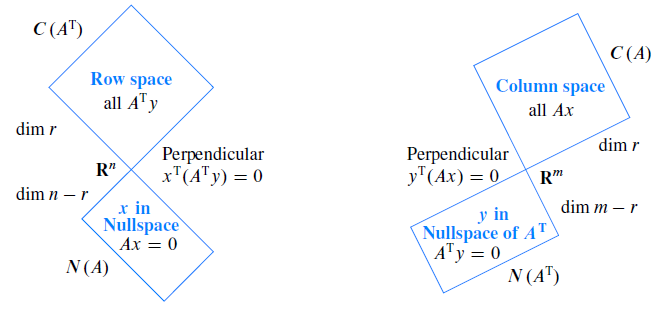

<!-- toc -->
<!-- more -->
本文讲解什么是向量的正交，什么是子空间的正交，什么是基的正交。

记住上图，四个子空间两两正交。

在四个基本子空间中，提到对于秩为r的$m \times n$矩阵，
其行空间（$dim C(A^T)=r$）与零空间（$dim N(A)=n-r$）同属于$\mathbb{R}^n$空间，
其列空间（$dim C(A)=r$）与左零空间（$dim N(A^T)$=m-r）同属于$\mathbb{R}^m$空间。

# 1. 正交向量

对于向量$x, y$，当$x^T \cdot y=0$即$x_1y_1+x_2y_x+\cdots+x_ny_n=0$时，有向量$x, y$正交（vector orthogonal）。

证明：
毕达哥拉斯定理（Pythagorean theorem）中提到，直角三角形的三条边满足：

$$
\begin{aligned}
\left\|\overrightarrow{x}\right\|^2+\left\|\overrightarrow{y}\right\|^2 &= \left\|\overrightarrow{x+y}\right\|^2 \\
x^Tx+y^Ty \\
= (x+y)^T(x+y) x^Tx+y^Ty \\
= x^Tx+y^Ty+x^Ty+y^Tx 0 \\
= x^Ty+y^Tx 
\end{aligned}
$$
对于向量点乘
$$
\begin{aligned}
x^Ty=y^Tx0 \\
= 2x^Ty x^Ty \\
=0\end{aligned}
$$

由此得出，两正交向量的点积为$0$。另外，$x, y$可以为$0$向量，由于$0$向量与任意向量的点积均为零，所以$0$向量与任意向量正交。

# 2. 举个例子：
向量

x=\begin{bmatrix}1\\2\\3\end{bmatrix}, y=\begin{bmatrix}2\\-1\\0\end{bmatrix}, x+y=\begin{bmatrix}3\\1\\3\end{bmatrix}

有$\left\| \overrightarrow{x} \right\|^2=14, \left\| \overrightarrow{y} \right\|^2=5, \left\| \overrightarrow{x+y} \right\|^2=19$，而$x^Ty=1\times2+2\times (-1)+3\times0=0$。

# 3. 正交子空间

1. 如果子空间S 与子空间T 正交，那么S 中的每个向量都和T 中的每个向量正交。
举个例子，无限延伸的墙壁和垂直地面是正交子空间吗？两个平面中有很多个向量是不正交的，特别的，他们相交直线上的向量就很明显不满足。
如果两个子空间正交，那么他们必定不会交与某个非零向量。

1. 一个平面内的某些子空间是正交的：
比如零向量和平面内任意其他子空间正交。平面内两条垂直的直线子空间也是正交子空间。

1. 现在观察行空间与零空间，零空间是$Ax=0$的解，即$x$若在零空间，则$Ax$为零向量；
而对于行空间，有

\begin{bmatrix}row_1\\row_2\\ \vdots \\row_m\end{bmatrix}
\Bigg[x\Bigg]=
\begin{bmatrix}0\\0\\ \vdots\\ 0\end{bmatrix}

可以看出：

\begin{bmatrix}row_1\end{bmatrix}\Bigg[x\Bigg]=0 \\
\begin{bmatrix}row_2\end{bmatrix}\Bigg[x\Bigg]=0 \\
\vdots \\
\begin{bmatrix}row_m\end{bmatrix}\Bigg[x\Bigg]=0 \\

所以这个等式告诉我们，$x$同$A$中的所有行正交；

1. 接下来还验证$x$是否与$A$中各行的线性组合正交，

\begin{cases}
c_1(row_1)^Tx=0 \\
c_2(row_2)^Tx=0 \\
\vdots \\
c_n(row_m)^Tx=0 \\
\end{cases}

各式相加得$(c_1row_1+c_2row_2+\cdots+c_nrow_m)^Tx=0$，得证。

# 4. n维空间里面的正交补

行空间与零空间将$\mathbb{R}^n$分割为两个正交的子空间，两个子空间的维数和为n，称为n维空间里面的正交补（orthogonal complement），即零空间包含了所有与行空间正交的向量；同理列空间与左零空间为$m$维空间里的正交补，即左零空间包含了所有与列空间正交的向量。

举例:
矩阵 A=\begin{bmatrix}1&2&5\\2&4&10\end{bmatrix}
则可知$m=2, n=3, rank(A)=1, dim N(A)=2$。

有
Ax=\begin{bmatrix}1&2&5\\2&4&10\end{bmatrix}\begin{bmatrix}x_1\\x_2\\x_3\end{bmatrix}=\begin{bmatrix}0\\0\end{bmatrix}
解得零空间的一组基
x_1=\begin{bmatrix}-2\\1\\0\end{bmatrix}\quad x_2=\begin{bmatrix}-5\\0\\1\end{bmatrix}

而行空间的一组基为r=\begin{bmatrix}1\\2\\5\end{bmatrix}
零空间与行空间正交，在本例中行空间也是零空间的法向量。（即零空间就是垂直于这条直线的一个平面，向量(1 2 5)是这个平面的法向量。）

可以把线性代数的内容分为几个部分：
1）第一部分是线性代数的基本定理，表明四个基本子空间之间的关系，重点是研究维数；
2）第二部分的重点是在已知维数的情况下研究它们的正交性；
3）第三部分是关于它们的基，即正交基。

# 5. 长方矩阵

## 5.1. 如何求 $Ax=b$ 一个无解的方程组的解
即当$Ax=b$ 无解时（b 不在A 的列空间），如何去解这个方程组。

长方矩阵，$m>n$。对于这种矩阵，$Ax=b$中经常混入一些包含“坏数据”的方程，虽然可以通过筛选的方法去掉一些我们不希望看到的方程，但是这并不是一个稳妥的方法。

## 5.2. $A^TA$矩阵
于是，我们引入一个重要的矩阵：$A^TA$。这是一个$n \times m$矩阵点乘$m \times n$矩阵，其结果是一个$n \times n$矩阵，应该注意的是，这也是一个对称矩阵，证明如下：

$$
(A^TA)^T=A^T(A^T)^T=A^TA
$$
这一章节的核心就是$A^TAx=A^Tb$，这个变换可以将“坏方程组”变为“好方程组”。

## 5.3. 举例，有矩阵

\begin{bmatrix}1&1\\1&2\\1&5\end{bmatrix}\begin{bmatrix}x_1\\x_2\end{bmatrix}=\begin{bmatrix}b_1\\b_2\\b_3\end{bmatrix}
只有当
\begin{bmatrix}b_1\\b_2\\b_3\end{bmatrix}
在矩阵的列空间时，方程才有解。

现在来看
\begin{bmatrix}1&1&1\\1&2&5\end{bmatrix}\begin{bmatrix}1&1\\1&2\\1&5\end{bmatrix}=\begin{bmatrix}3&8\\8&30\end{bmatrix}
可以看出此例中$A^TA$是可逆的。然而并非所有$A^TA$都是可逆的，如
\begin{bmatrix}1&1&1\\3&3&3\end{bmatrix}\begin{bmatrix}1&3\\1&3\\1&3\end{bmatrix}=\begin{bmatrix}3&9\\9&27\end{bmatrix}
（注意到这是两个秩一矩阵相乘，其结果秩不会大于一）

# 6. $A^TA$可逆
对于$A^TA$，它不一定是可逆的，$A^TA$的秩等于A 的秩，因此$A^TA$的零空间等于A 的零空间。
先给出结论：。（下讲证明）
$$N(A^TA)=N(A)  rank(A^TA)=rank(A)$$
当且仅当A的零空间里面只有零向量（A 的各列线性无关）时，$A^TA$可逆。即A的列线性无关
下一讲涉及投影，很重要。
