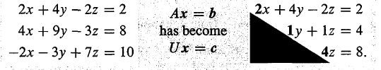

<!-- toc -->
<!-- more -->

# 1. 矩阵消元

消元法思路：将主对角线上的主元固定（0不能做主元），把主元下面的元素消为0。
消元过程：先完成左侧矩阵的消元（变成上三角矩阵），再回代运算右侧向量，最后即可求出解完成整个消元过程。

左侧矩阵的消元过程：U矩阵是A矩阵的最终消元结果
右侧向量回代过程：A中加入b列向量变成增广矩阵，增广就是增加的意思，增加了新列，左侧矩阵消元时，右侧向量也会跟着变化。
c向量是b向量的最终结果
求解：将U和c代入原式子可得解

这个方法最早由高斯提出，我们以前解方程组的时候都会使用，现在来看如何使用矩阵实现消元法。

# 2. 消元法

有三元方程组

\begin{cases}x&+2y&+z&=2\\3x&+8y&+z&=12\\&4y&+z&=2\end{cases}

对应的矩阵形式Ax=b为

\begin{bmatrix}1&2&1\\3&8&1\\0&4&1\end{bmatrix}\begin{bmatrix}x\\y\\z\end{bmatrix}=\begin{bmatrix}2\\12\\2\end{bmatrix}。

按照我们以前做消元法的思路：

## 2.1. 第一步，我们希望在第二个方程中消去 $x$ 项，来操作系数矩阵

A=\begin{bmatrix}\underline{1}&2&1\\3&8&1\\0&4&1\end{bmatrix}
下划线的元素为第一步的主元（pivot）

\begin{bmatrix}\underline{1}&2&1\\3&8&1\\0&4&1\end{bmatrix}\xrightarrow{row_2-3row_1}\begin{bmatrix}\underline{1}&2&1\\0&2&-2\\0&4&1\end{bmatrix}

这里我们先不管 $b$ 向量，等做完 $A$ 的消元可以再做 $b$ 的消元。（这是MATLAB等工具经常使用的算法。）

## 2.2. 第二步，我们希望在第三个方程中消去 $y$ 项，现在第二行第一个非零元素成为了第二个主元

\begin{bmatrix}\underline{1}&2&1\\0&\underline{2}&-2\\0&4&1\end{bmatrix}\xrightarrow{row_3-2row_2}\begin{bmatrix}\underline{1}&2&1\\0&\underline{2}&-2\\0&0&\underline{5}\end{bmatrix}
    
注意到第三行消元过后仅剩一个非零元素，所以它就成为第三个主元。做到这里就算消元完成了。

# 3. 再来讨论一下消元失效的情形：

- 首先，主元不能为零；
- 其次，如果在消元时遇到主元位置为零，则需要交换行，使主元不为零；
- 最后提一下，如果我们把第三个方程 $z$ 前的系数设置成-4，会导致第二步消元时最后一行全部为零，则第三个主元就不存在了，至此消元不能继续进行了，这就是下一讲中涉及的不可逆情况。

# 4. 接下来就该回代（back substitution）

这时我们在 $A$ 矩阵后面加上 $b$ 向量写成增广矩阵（augmented matrix）的形式：

\left[\begin{array}{c|c}A&b\end{array}\right]=\left[\begin{array}{ccc|c}1&2&1&2\\3&8&1&12\\0&4&1&2\end{array}\right]\to\left[\begin{array}{ccc|c}1&2&1&2\\0&2&-2&6\\0&4&1&2\end{array}\right]\to\left[\begin{array}{ccc|c}1&2&1&2\\0&2&-2&6\\0&0&5&-10\end{array}\right]

不难看出，$z$ 的解已经出现了，此时方程组变为

\begin{cases}x&+2y&+z&=2\\&2y&-2z&=6\\&&5z&=-10\end{cases}

从第三个方程求出 z=-2 ，代入第二个方程求出 y=1 ，在代入第一个方程求出x=2。

# 5. 消元矩阵

有三个列向量的**矩阵乘以**另一个**向量**，按列的线性组合可以写作

\Bigg[v_1\ v_2\ v_3\Bigg]\begin{bmatrix}3\\4\\5\end{bmatrix}=3v_1+4v_2+5v_3。

但现在我们希望**用矩阵乘法表示行操作**，则有

\begin{bmatrix}1&2&7\end{bmatrix}\begin{bmatrix}&row_1&\\&row_2&\\&row_3&\end{bmatrix}=1row_1+2row_2+7row_3

易看出这里是一个行向量从左边乘以矩阵，这个行向量是按行操作矩阵的行向量，并将其合成为一个矩阵行向量的线性组合。介绍到这里，我们就可以将消元法所做的行操作写成向量乘以矩阵的形式了。

# 6. 将消元法所做的行操作写成向量乘以矩阵的形式

* 消元法第一步操作为将第二行改成 row_2-3row_1 ，下面第一个消元矩阵就是单位矩阵按照同样的方式row_2-3row_1 操作，其余两行不变，则有

\begin{bmatrix}1&0&0\\-3&1&0\\0&0&1\end{bmatrix}\begin{bmatrix}1&2&1\\3&8&1\\0&4&1\end{bmatrix}=\begin{bmatrix}1&2&1\\0&2&-2\\0&4&1\end{bmatrix}

另外，如果三行都不变，消元矩阵就是单位矩阵
I=\begin{bmatrix}1&0&0\\0&1&0\\0&0&1\end{bmatrix}
$I$ 之于矩阵运算相当于1之于四则运算。
这个消元矩阵我们记作E_{21}，即将第二行第一个元素变为零。

* 接下来就是求E_{32}消元矩阵了，即将第三行第二个元素变为零，则
\begin{bmatrix}1&0&0\\0&1&0\\0&-2&1\end{bmatrix}\begin{bmatrix}1&2&1\\0&2&-2\\0&4&1\end{bmatrix}=\begin{bmatrix}1&2&1\\0&2&-2\\0&0&5\end{bmatrix}
这就是消元所用的两个初等矩阵（elementary matrix）。

* 最后，我们将这两步综合起来，即 E_{32}(E_{21}A)=U
也就是说如果我们想从$A$矩阵直接得到$U$矩阵的话，只需要(E_{32}E_{21})A即可。
注意，矩阵乘法虽然不能随意变动相乘次序，但是可以变动括号位置，也就是满足结合律（associative law），而结合律在矩阵运算中非常重要，很多定理的证明都需要巧妙的使用结合律。

# 7. 置换矩阵（permutation matrix）

既然提到了消元用的初等矩阵，那我们再介绍一种用于置换两行的矩阵：置换矩阵（permutation matrix）
例如下面的置换矩阵将原矩阵的**两行做了互换**，左乘

\begin{bmatrix}0&1\\1&0\end{bmatrix}\begin{bmatrix}a&b\\c&d\end{bmatrix}=\begin{bmatrix}c&d\\a&b\end{bmatrix}

如果我们希望**交换两列**，则有右乘

\begin{bmatrix}a&b\\c&d\end{bmatrix}\begin{bmatrix}0&1\\1&0\end{bmatrix}=\begin{bmatrix}b&a\\d&c\end{bmatrix}

我们现在能够将$A$通过行变换写成$U$，那么如何从$U$再变回$A$，也就是求消元的逆运算。对某些“坏”矩阵，并没有逆，而本讲的例子都是“好”矩阵。

# 8. 逆

现在，我们以E_{21}为例

\Bigg[\quad ?\quad \Bigg]\begin{bmatrix}1&0&0\\-3&1&0\\0&0&1\end{bmatrix}=\begin{bmatrix}1&0&0\\0&1&0\\0&0&1\end{bmatrix}

什么矩阵可以取消这次行变换？
这次变换是从第二行中减去三倍的第一行，那么其逆变换就是给第二行加上三倍的第一行，所以逆矩阵就是
\begin{bmatrix}1&0&0\\3&1&0\\0&0&1\end{bmatrix}

我们把矩阵$E$的逆记作E^{-1}，所以有E^{-1}E=I。
