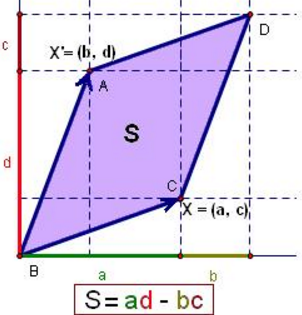

<!-- toc -->
<!-- more -->
本讲主要介绍逆矩阵的应用。

# 1. 求逆矩阵
我们记得以前矩阵的逆是如何求的，通常把矩阵变为增广矩阵，然后将左边变为单位矩阵，右边就变为了逆矩阵.现在使用行列式的方式求。
1. 对于二阶矩阵的逆矩阵有
\begin{bmatrix}a&b\\c&d\end{bmatrix}^{-1}=\frac{1}{ad-bc}\begin{bmatrix}d&-b\\-c&a\end{bmatrix}
观察易得，系数项就是行列式的倒数，而矩阵则是由一系列代数余子式组成的。先给出公式：
$$
A^{-1}=\frac{1}{\det A}C^T
\tag{1}
$$
$C^T$ 是原矩阵 $A$ 的伴随矩阵，伴随矩阵行1列1元素就是原矩阵(1,1)元素的代数余子式，由于转置的缘故，伴随矩阵1,2 的元素是原矩阵2,1 元素的代数余子式。
公式的证明：只需检验A 乘以它的上述公式的逆是否等于单位阵

1. 观察这个公式是如何运作的，化简公式得$AC^T=(\det A)I$，写成矩阵形式有
\begin{bmatrix}a_{11}&a_{12}&\cdots&a_{1n}\\\vdots&\vdots&\ddots&\vdots\\a_{n1}&a_{n2}&\cdots&a_{nn}\end{bmatrix}\begin{bmatrix}C_{11}&\cdots&C_{n1}\\C_{12}&\cdots&C_{n2}\\\vdots&\ddots&\vdots\\C_{1n}&\cdots&C_{nn}\end{bmatrix}=Res

1. 对于这两个矩阵的乘积，观察其结果的元素 Res_{11}=a_{11}C_{11}+a_{12}C_{12}+\cdots+a_{1n}C_{1n}这正是上一讲提到的将行列式按第一行展开的结果。
同理，对Res_{22}, \cdots, Res_{nn}都有Res_{ii}=\det A即**对角线元素均为$\det A$**（因为元素和代数余子式都来自同一行，根据行列式的代数余子式公式可得）

1. 再来看非对角线元素：回顾二阶的情况，如果用第一行乘以第二行的代数余子式a_{11}C_{21}+a_{12}C_{22}得到$a(-b)+ab=0$。换一种角度看问题，$a(-b)+ab=0$也是一个矩阵的行列式值，即A_{s}=\begin{bmatrix}a&b\\a&b\end{bmatrix}将\det A_{s}按第二行展开，也会得到\det A_{s}=a(-b)+ab，因为行列式有两行相等所以行列式值为零。

1. 推广到$n$阶，我们来看元素Res_{1n}=a_{11}C_{n1}+a_{12}C_{n2}+\cdots+a_{1n}C_{nn}，该元素是第一行与最后一行的代数余子式相乘之积。这个式子也可以写成一个特殊矩阵的行列式，即矩阵
A_{s}=\begin{bmatrix}a_{11}&a_{12}&\cdots&a_{1n}\\a_{21}&a_{22}&\cdots&a_{2n}\\\vdots&\vdots&\ddots&\vdots\\a_{n-a1}&a_{n-12}&\cdots&a_{n-1n}\\a_{11}&a_{12}&\cdots&a_{1n}\end{bmatrix}
计算此矩阵的行列式，将\det A_{s}按最后一行展开，也得到\det A_{s}=a_{11}C_{n1}+a_{12}C_{n2}+\cdots+a_{1n}C_{nn}。同理，行列式$A_{s}$有两行相等，其值为零。

1. 结合对角线元素与非对角线元素的结果，我们得到
Res=\begin{bmatrix}\det A&0&\cdots&0\\0&\det A&\cdots&0\\\vdots&\vdots&\ddots&\vdots\\0&0&\cdots&\det A\end{bmatrix}
也就是$(1)$等式右边的$(\det A)I$，得证。

# 2. 求解$Ax=b$，克莱姆法则

因为我们现在有了逆矩阵的计算公式，所以对$Ax=b$有
$x=A^{-1}b=\frac{1}{\det A}C^Tb$
这就是计算$x$的公式，即克莱默法则（Cramer's rule）。

现在来观察$x=\frac{1}{\det A}C^Tb$，我们将得到的解拆分开来，对$x$的第一个分量有$x_1=\frac{y_1}{\det A}$，这里$y_1$是一个数字，其值为y_1=b_1C_{11}+b_2C_{21}+\cdots+b_nC_{n1}，每当我们看到数字与代数余子式乘之积求和时，都应该联想到求行列式，也就是说y1可以看做是一个矩阵的行列式，我们设这个矩阵为B1。所以有
x_i=\frac{\det B_1}{\det A}$，同理有$x_2=\frac{\det B_2}{\det A}$，$x_2=\frac{\det B_2}{\det A}

而$B_1$是一个型为\Bigg[b a_2 a_3 \cdots a_n\Bigg]的矩阵，即将矩阵$A$的第一列变为$b$向量而得到的新矩阵。其实很容易看出，$\det B_1$可以沿第一列展开得到y_1=b_1C_{11}+b_2C_{21}+\cdots+b_nC_{n1}

一般的，有B_j=\Bigg[a_1 a_2 \cdots a_{j-1} b a_{j+1} \cdots a_n\Bigg]即将矩阵$A$的第$j$列变为$b$向量而得到的新矩阵。所以，对于解的分量有x_j=\frac{\det B_j}{\det A}

克莱姆法则的作用主要是提供一种代数表达式，而不是一种算法，不建议使用它来计算。

# 3. 通过行列式求体积

行列式的值等于某几何体的体积，
## 3.1. 待证明命题：行列式的绝对值等于一个箱子（平行N 面体）的体积。

1. 来看三维空间中的情形，对于$3$阶方阵$A$，取第一行$(a_1,a_2,a_3)$，令其为三维空间中点$A_1$的坐标，同理有点$A_2, A_3$。连接这三个点与原点可以得到三条边，使用这三条边展开得到一个平行六面体，$\left\|\det A\right\|$就是该平行六面体的体积。

1. 对于三阶单位矩阵，其体积为$\det I=1$，此时这个箱子是一个单位立方体。这其实也证明了前面学过的行列式性质1。于是我们想，如果能接着证明性质2、3即可证明体积与行列式的关系。

1. 对于行列式性质2，我们交换两行并不会改变箱子的大小，同时行列式的绝对值也没有改变，得证。

1. 现在我们取矩阵$A=Q$，而$Q$是一个标准正交矩阵，此时这个箱子是一个立方体，可以看出其实这个箱子就是刚才的单位立方体经过旋转得到的。对于标准正交矩阵，有$Q^TQ=I$，等式两边取行列式得$\det(Q^TQ)=1=\left|Q^T\right|\left|Q\right|$，而根据行列式性质10有$\left|Q^T\right|=\left|Q\right|$，所以$原式=\left|Q\right|^2=1, \left|Q\right|=\pm 1$。

1. 接下来在考虑不再是“单位”的立方体，即长方体。 假设$Q$矩阵的第一行翻倍得到新矩阵$Q_2$，此时箱子变为在第一行方向上增加一倍的长方体箱子，也就是两个“标准正交箱子”在第一行方向上的堆叠。易知这个长方体箱子是原来体积的两倍，而根据行列式性质3.a有$\det Q_2=\det Q$，于是体积也符合行列式的数乘性质。

## 3.2. 我们来看二阶方阵的情形，
对于2 维平面，行列式是向量形成的平行四边形的面积，三角形的面积就为它的一半。\det(X,X')={\begin{vmatrix}a&b\\c&d\end{vmatrix}}=ad-bc

\begin{vmatrix}a+a'&b+b'\\c&d\end{vmatrix}=\begin{vmatrix}a&b\\c&d\end{vmatrix}+\begin{vmatrix}a'&b'\\c&d\end{vmatrix}
在二阶情况中，行列式就是一个求平行四边形面积的公式，原来我们求由四个点$(0,0), (a,b), (c,d), (a+c,b+d)$围成的四边形的面积，需要先求四边形的底边长，再做高求解，现在只需要计算$\det A=ad-bc$即可（更加常用的是求由$(0,0), (a,b), (c,d)$围成的三角形的面积，即$\frac{1}{2}ad-bc$）。
也就是说，如果知道了歪箱子的顶点坐标，求面积（二阶情形）或体积（三阶情形）时，我们不再需要开方、求角度，只需要计算行列式的值就行了。

在一般情形下，由点$(x_1,y_1), (x_2,y_2), (x_3,y_3)$围成的三角形面积等于
\frac{1}{2}\begin{vmatrix}x_1&y_1&1\\x_2&y_2&1\\x_3&y_3&1\end{vmatrix}
计算时分别用第二行、第三行减去第一行化简到第三列只有一个$1$（这个操作实际作用是将三角形移动到原点），得到
\frac{1}{2}\begin{vmatrix}x_1&y_1&1\\x_2-x_1&y_2-y_1&0\\x_3-x_1&y_3-y_1&0\end{vmatrix}
再按照第三列展开，得到三角形面积等于$\frac{(x_2-x_1)(y_3-y_1)-(x_3-x_1)(y_2-y_1)}{2}$。
