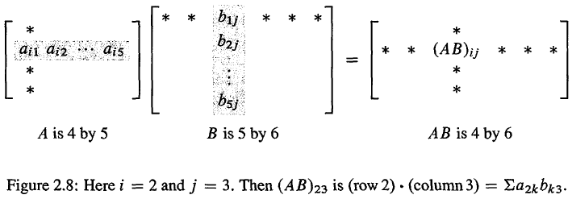

<!-- toc -->
<!-- more -->

# 1. 矩阵乘法

## 1.1. 行列内积：

行列点乘法

有m\times n矩阵$A$和n\times p矩阵$B$（$A$的总行数必须与$B$的总列数相等），两矩阵相乘有AB=C，$C$是一个m\times p矩阵。

对于$C$矩阵中的第$i$行第$j$列元素c_{ij}，有：
    c_{ij}=row_i\cdot column_j=\sum_{k=i}^na_{ik}b_{kj}

其中a_{ik}是$A$矩阵的第$i$行第$k$列元素，b_{kj}是$B$矩阵的第$k$行第$j$列元素。

可以看出c_{ij}其实是$A$矩阵第$i$行点乘$B$矩阵第$j$列 
\begin{bmatrix}&\vdots&\\&row_i&\\&\vdots&\end{bmatrix}\begin{bmatrix}&&\\\cdots&column_j&\cdots\\&&\end{bmatrix}=\begin{bmatrix}&\vdots&\\\cdots&c_{ij}&\cdots\\&\vdots&\end{bmatrix}

展开表示为

## 1.2. 整列相乘：

整列考虑，列的线性组合方式

\begin{bmatrix}&&\\A_{col1}&A_{col2}&\cdots&A_{coln}\\&&\end{bmatrix}\begin{bmatrix}\cdots&b_{1j}&\cdots\\\cdots&b_{2j}&\cdots\\\cdots&\vdots&\cdots\\\cdots&b_{nj}&\cdots\\\end{bmatrix}=\begin{bmatrix}&&\\\cdots&\left(b_{1j}A_{col1}+b_{2j}A_{col2}+\cdots+b_{nj}A_{coln}\right)&\cdots\\&&\end{bmatrix}

上面的运算为$B$的第$j$个列向量右乘矩阵$A$，求得的结果就是$C$矩阵的第$j$列，即$C$的第$j$列是$A$的列向量以$B$的第$j$列作为系数所求得的线性组合
C_j=b_{1j}A_{col1}+b_{2j}A_{col2}+\cdots+b_{nj}A_{coln}

## 1.3. 整行相乘：

整行考虑，行的线性组合方式

\begin{bmatrix}\vdots&\vdots&\vdots&\vdots\\a_{i1}&a_{i2}&\cdots&a_{in}\\\vdots&\vdots&\vdots&\vdots\end{bmatrix}\begin{bmatrix}&B_{row1}&\\&B_{row2}&\\&\vdots&\\&B_{rown}&\end{bmatrix}=\begin{bmatrix}\vdots\\\left(a_{i1}B_{row1}+a_{i2}B_{row2}+\cdots+a_{in}B_{rown}\right)\\\vdots\end{bmatrix}

上面的运算为$A$的第$i$个行向量左乘矩阵$B$，求得的结果就是$C$矩阵的第$i$行，即$C$的第$i$行是$B$的行向量以$A$的第$i$行作为系数所求的的线性组合，C_i=a_{i1}B_{row1}+a_{i2}B_{row2}+\cdots+a_{in}B_{rown}。

## 1.4. 列乘以行：

AB等于A各列与B各行乘积之和。
用$A$矩阵的列乘以$B$矩阵的行，得到的矩阵相加即可：

\begin{bmatrix}&&\\A_{col1}&A_{col2}&\cdots&A_{coln}\\&&\end{bmatrix}\begin{bmatrix}&B_{row1}&\\&B_{row2}&\\&\vdots&\\&B_{rown}&\end{bmatrix}=A_{col1}B_{row1}+A_{col2}B_{row2}+\cdots+A_{coln}B_{rown}

注意，A_{coli}B_{rowi}是一个m\times 1向量乘以一个1\times p向量，其结果是一个m\times p矩阵，而所有的m\times p矩阵之和就是计算结果。

## 1.5. 分块乘法：

将矩阵A，B分成能够相互匹配的块，然后对应进行分块行点乘分块列。

\left[\begin{array}{c|c}A_1&A_2\\\hline A_3&A_4\end{array}\right]\left[\begin{array}{c|c}B_1&B_2\\\hline B_3&B_4\end{array}\right]=\left[\begin{array}{c|c}A_1B_1+A_2B_3&A_1B_2+A_2B_4\\\hline A_3B_1+A_4B_3&A_3B_2+A_4B_4\end{array}\right]

在分块合适的情况下，可以简化运算。

# 2. 逆（方阵）

首先，并不是所有的方阵都有逆；而如果逆存在，则有
A^{-1}A=I=AA^{-1}
对于方阵，左逆和右逆是相等的，但是对于非方阵（长方形矩阵），其左逆不等于右逆。
对于这些有逆的矩阵，我们称其为可逆的或非奇异的。

## 2.1. 我们先来看看奇异矩阵（不可逆的）

### 2.1.1. 第一种判定方式

A=\begin{bmatrix}1&2\\3&6\end{bmatrix}
在后面将要学习的行列式中，会发现这个矩阵的行列式为$0$。
观察这个方阵，我们如果用另一个矩阵乘$A$，则得到的结果矩阵中的每一列应该都是\begin{bmatrix}1\\2\end{bmatrix}的倍数，所以我们不可能从AB的乘积中得到单位矩阵$I$。

### 2.1.2. 另一种判定方法

如果$A$乘以**任意非零向量**能够得到$0$向量，则矩阵$A$不可逆，即使用Ax=0判定。我们来用上面的矩阵为例：
\begin{bmatrix}1&2\\3&6\end{bmatrix}\begin{bmatrix}3\\-1\end{bmatrix}=\begin{bmatrix}0\\0\end{bmatrix}

证明：如果对于非零的$x$仍有Ax=0，而$A$有逆A^{-1}，则A^{-1}Ax=0，即x=0，与题设矛盾，得证。

## 2.2. 现在来看看什么矩阵有逆

假设
A=\begin{bmatrix}1&3\\2&7\end{bmatrix}

我们来求A^{-1} ，利用列的线性组合思想，矩阵A乘以该求的逆矩阵得到单位矩阵，这样，求逆和求方程组是一个意思

\begin{bmatrix}1&3\\2&7\end{bmatrix}\begin{bmatrix}a&b\\c&d\end{bmatrix}=\begin{bmatrix}1&0\\0&1\end{bmatrix}
使用列向量线性组合的思想，我们可以说$A$乘以A^{-1}的第$j$列，能够得到$I$的第$j$列，这时我会得到一个关于列的方程组。

## 2.3. 接下来介绍高斯-若尔当（Gauss-Jordan）方法

该方法可以一次处理所有的方程：

这个方程组为
\begin{cases}\begin{bmatrix}1&3\\2&7\end{bmatrix}\begin{bmatrix}a\\b\end{bmatrix}=\begin{bmatrix}1\\0\end{bmatrix}\\\begin{bmatrix}1&3\\2&7\end{bmatrix}\begin{bmatrix}c\\d\end{bmatrix}=\begin{bmatrix}0\\1\end{bmatrix}\end{cases}
我们想要同时解这两个方程；

构造这样一个矩阵
\left[\begin{array}{cc|cc}1&3&1&0\\2&7&0&1\end{array}\right]

接下来用消元法将左侧变为单位矩阵；
\left[\begin{array}{cc|cc}1&3&1&0\\2&7&0&1\end{array}\right]\xrightarrow{row_2-2row_1}\left[\begin{array}{cc|cc}1&3&1&0\\0&1&-2&1\end{array}\right]\xrightarrow{row_1-3row_2}\left[\begin{array}{cc|cc}1&0&7&-3\\0&1&-2&1\end{array}\right]

于是，我们就将矩阵从
\left[\begin{array}{c|c}A&I\end{array}\right]
变为
\left[\begin{array}{c|c}I&A^{-1}\end{array}\right]

而高斯-若尔当法的本质是使用消元矩阵$E$，对$A$进行操作：
E\left[\begin{array}{c|c}A&I\end{array}\right]

利用一步步消元有EA=I，进而得到
\left[\begin{array}{c|c}I&E\end{array}\right]

其实这个消元矩阵$E$就是A^{-1}，而高斯-若尔当法中的$I$只是负责记录消元的每一步操作，待消元完成，逆矩阵就自然出现了。

[麻省理工公开课：线性代数  乘法和逆矩阵](http://open.163.com/movie/2010/11/H/O/M6V0BQC4M_M6V29FCHO.html)