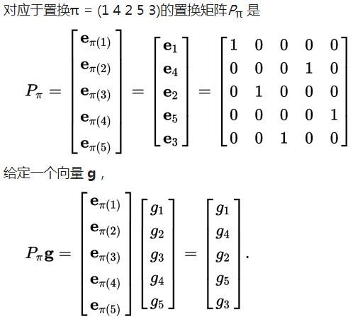

<!-- toc -->
<!-- more -->

# 1. 置换矩阵（Permutation Matrix）

置换矩阵是一种系数只由0和1组成的方块矩阵。置换矩阵的每一行和每一列都恰好有一个1，其余的系数都是0。
在线性代数中，每个n阶的置换矩阵都代表了一个对n个元素（n维空间的基）的置换。当一个矩阵乘上一个置换矩阵时，所得到的是原来矩阵的横行（置换矩阵在左）或纵列（置换矩阵在右）经过置换后得到的矩阵。

将方阵的情况推广到一般矩阵的情况：
一个m×n的0-1矩阵 $P$ 是置换矩阵当且仅当 P\cdot P^{T}=I_{m}
这时一个0-1矩阵是置换矩阵当且仅当它的每一行恰有一个1，每一列至多有一个1。

$P$为置换矩阵，对任意可逆矩阵$A$有：
PA=LU

$n$阶方阵的置换矩阵$P$有 \binom{n}{1}=n! 个

置换矩阵$P$，有P^TP = I  即P^T = P^{-1}

例子

# 2. 转置矩阵（Transpose Matrix）

把A的横行写为$A^T$的纵列,把A的纵列写为$A^T$的横行

(A^T)_{ij} = (A)_{ji}

例子
\left[ \begin{matrix} 1& 2\\ 3& 4\\ 5& 6\end{matrix} \right] ^{T}=\left[ \begin{matrix} 1& 3& 5\\ 2& 4& 6\end{matrix} \right] 

# 3. 对称矩阵（Symmetric Matrix）

在线性代数中，对称矩阵是一个方形矩阵，其转置矩阵和自身相等。

A^T= A

对称矩阵中的右上至左下方向元素以主对角线（左上至右下）为轴进行对称。
若将其写作  A=(a_{ij})，则：  a_{ij}=a_{ji}

例子

\begin{pmatrix} 
a & b & c \\
b & d & e \\
c & e & f 
\end{pmatrix}
,
\begin{pmatrix} 
1 & 3 & 0 \\
3 & 1 & 6 \\
0 & 6 & 1 
\end{pmatrix}
,
\begin{pmatrix} 
1 & 5 \\
5 & 7
\end{pmatrix}
,
\begin{pmatrix} 
2
\end{pmatrix}

对任意矩阵$R$有R^TR为对称矩阵：

$$
(R^TR)^T = (R)^T(R^T)^T = R^TR\\
\textrm{即}(R^TR)^T = R^TR
$$

对角矩阵都是对称矩阵。对角矩阵（diagonal matrix）是一个主对角线之外的元素皆为0的矩阵.

# 4. 向量空间（Vector Space）

向量空间是可以缩放和相加的（叫做向量的）对象的集合。

所有向量空间都必须包含原点（Origin）

向量空间中任意向量的数乘、求和运算得到的向量也在该空间中。
即向量空间要满足加法封闭和数乘封闭。
