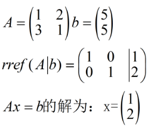

<!-- toc -->
<!-- more -->
# 1. 举例

和上一讲一样的：3 \times 4矩阵

A=
\begin{bmatrix}
1 & 2 & 2 & 2\\
2 & 4 & 6 & 8\\
3 & 6 & 8 & 10\\
\end{bmatrix}

求$Ax=b$的特解

## 1.1. 写出其增广矩阵（augmented matrix）
\left[\begin{array}{c|c}A & b\end{array}\right]：


\left[
\begin{array}{c c c c|c}
1 & 2 & 2 & 2 & b_1 \\
2 & 4 & 6 & 8 & b_2 \\
3 & 6 & 8 & 10 & b_3 \\
\end{array}
\right]
\underrightarrow{消元}
\left[
\begin{array}{c c c c|c}
1 & 2 & 2 & 2 & b_1 \\
0 & 0 & 2 & 4 & b_2-2b_1 \\
0 & 0 & 0 & 0 & b_3-b_2-b_1 \\
\end{array}
\right]


## 1.2. 讨论$b$满足什么条件才能让方程$Ax=b$有解:
- 当且仅当$b$属于$A$的列空间时。即，b 必须是A 的各列的线性组合，
- 另一种描述：如果$A$的各行线性组合得到$0$行，则$b$端分量做同样的线性组合，结果也为$0$时，方程才有解。
显然，第二阶段消元，可以看到最后一个方程,有解的必要条件为b_3-b_2-b_1=0。

## 1.3. 解法：令所有自由变量取$0$
则有

\Big\lbrace
\begin{eqnarray*}
x_1 & + & 2x_3 & = & 1 \\
    &   & 2x_3 & = & 3 \\
\end{eqnarray*}


解得

\Big\lbrace
\begin{eqnarray*}
x_1 & = & -2 \\
x_3 & = & \frac{3}{2} \\
\end{eqnarray*}


## 1.4. 代入$Ax=b$求得特解


x_p=
\begin{bmatrix}
-2 \\ 0 \\ \frac{3}{2} \\ 0
\end{bmatrix}


## 1.5. 令$Ax=b$成立的所有解


\Big\lbrace
\begin{eqnarray*}
A & x_p & = & b \\
A & x_n & = & 0 \\
\end{eqnarray*}


两式相加

A(x_p+x_n)=b


即$Ax=b$的解集为其特解加上零空间，对本例有：

x_{complete}=
\begin{bmatrix}
-2 \\ 0 \\ \frac{3}{2} \\ 0
\end{bmatrix}
+
c_1\begin{bmatrix}-2\\1\\0\\0\\\end{bmatrix}
+
c_2\begin{bmatrix}2\\0\\-2\\1\\\end{bmatrix}


把所有这些解在四维空间中都画出来，想象一下，Xp 是一个非原点的点，Xn 是一个穿过原点的平面，
那么Xp+Xn 是两者的组合，是一个不经过原点的经过Xp 的二维平面，注意它不是子空间。

# 2. 秩r 与Ax=b 的解的关系

对于m \times n矩阵$A$，有矩阵$A$的秩r \leq min(m, n)

## 列满秩$r=n$,各列线性无关情况：

有$0$ 解（无解）或唯一解,  $b$ 如果恰好是$A$ 的列的线性组合则有唯一解

每一列都有主元，0 个自由变量，此时零空间 $N(A)$只有零向量，因为没有自由变量能够赋值，列的线性组合无法产生 $0$ 列
Ax=b 的全部解：0 个或一个解，如果有解，即是唯一解特解Xp
令自由元等于0,带入方程组中求出主元的值，这组解我们叫做特解(particular solution)下边记做：Xp


A=
\begin{bmatrix}
1 & 3 \\
2 & 1 \\
6 & 1 \\
5 & 1 \\
\end{bmatrix}

rank(A)=2，要使Ax=b, b \neq 0有非零解，
$b$必须取$A$中各列的线性组合，此时A的零空间中只有$0$向量。

例子：

## 行满秩$r=m$ 各行线性无关情况
有无穷个解, 特解+零空间

此时消元会得到每一行都有一个主元，自由变量n-r（n-m）个，此时对任意的b，Ax=b 都有解。


A=
\begin{bmatrix}
1 & 2 & 6 & 5 \\
3 & 1 & 1 & 1 \\
\end{bmatrix}


rank(A)=2，$\forall b \in R^m都有x \neq 0的解$，因为此时$A$的列空间为$R^m$，b \in R^m恒成立，组成$A$的零空间的自由变量有n-r个。

例子：

## 行列满秩情况r=m=n 行，列线性无关:

有唯一解, $b$ 是$A$ 列向量的线性组合

零空间只包含 $0$ 向量，此时对于任意的$b$，$Ax=b$ 都有解。由$r=n$ 知道有唯一解。


A=
\begin{bmatrix}
1 & 2 \\
3 & 4 \\
\end{bmatrix}

则$A$最终可以化简为$R=I$，其零空间只包含$0$向量。

例子

 

这种满秩的方阵还有另一个名字就是可逆矩阵

## 行列秩都不满的矩阵 r<m, r<n

 有 $0$ 解或无穷解,  如果 $b$ 的行和$A$ 的行向量之间有相同的组合关系，那有无穷解，否则有 $0$ 解

例子

## 秩的总结（很重要）：

\begin{array}{c|c|c|c}r=m=n&r=n\lt m&r=m\lt n&r\lt m,r\lt n\\R=I&R=\begin{bmatrix}I\\0\end{bmatrix}&R=\begin{bmatrix}I&F\end{bmatrix}&R=\begin{bmatrix}I&F\\0&0\end{bmatrix}\\1\ solution&0\ or\ 1\ solution&\infty\ solution&0\ or\ \infty\ solution\end{array}$

[线性代数(十二) : 线性方程组Ax=b可解性与解的结构 - 方橙
        - CSDN博客](http://blog.csdn.net/mathmetics/article/details/9312639)