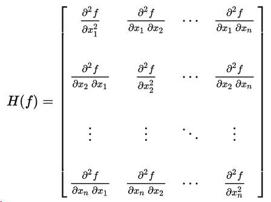
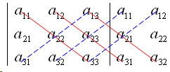

<!-- toc -->
<!-- more -->
# 1. 方块矩阵

简称方阵,是行数及列数皆相同的矩阵.M(n, R)，即实方块矩阵环

# 2. 单位矩阵 I

对角线全是1而其他位置全是0，

# 3. 转置矩阵

把矩阵A的行换成相应的列，得到的新矩阵称为A的转置矩阵，记作AT或A。通常矩阵的第一列作为转置矩阵的第一行，第一行作为转置矩阵的第一列。

# 4. 逆矩阵

一个n阶方阵，若存在另一个n阶矩阵B，使得： AB=BA=E。 则我们称B是A的逆矩阵，而A则被称为可逆矩阵。E 为n阶单位矩阵

# 5. 正交矩阵

（orthogonal matrix）是一个方块矩阵Q，其元素为实数，而且行与列皆为正交的单位向量，使得该矩阵的转置矩阵为其逆矩阵：

# 6. 对角矩阵

（英语：diagonal matrix）是一个主对角线之外的元素皆为0的矩阵。对角线上的元素可以为0或其他值

# 7. 可对角化矩阵

 如果一个方块矩阵 A 相似于对角矩阵，也就是说，如果存在一个可逆矩阵 P 使得 （P −1）AP 是对角矩阵，则它就被称为可对角化的

# 8. 海森矩阵

(Hessian matrix或Hessian)是一个自变量为向量的实值函数的二阶偏导数组成的方块矩阵
其中x=(x1,x2…,xn)x=(x1,x2…,xn), 即H(f)H(f)为:

(也有人把海森定义为以上矩阵的行列式)海森矩阵被应用于牛顿法解决的大规模优化问题.

# 9. 正交:

若内积空间中两向量的内积为0，则称它们是正交的。如果能够定义向量间的夹角，则正交可以直观的理解为垂直。

# 10. 行列式（Determinant）将一个 n的矩阵 A映射到一个标量

三阶矩阵的行列式为每条红线上的元素的乘积之和，减去蓝线上元素乘积之和。

矩阵的行列式的几何意义是矩阵对应的线性变换前后的面积比

# 11. 非奇异矩阵

若n阶方阵A的行列式不为零，即 |A|≠0，则称A为非奇异矩阵或满秩矩阵，否则称A为奇异矩阵或降秩矩阵。

# 12. 矩阵分解

矩阵分解（decomposition,factorization）是多半将矩阵拆解为数个三角形矩阵（triangular matrix）
矩阵分解常常用来实现一些矩阵运算的快速算法。
LU分解
奇异值分解
QR分解
极分解

LU分解是矩阵分解的一种，可以将一个矩阵分解为一个下三角矩阵和一个上三角矩阵的乘积（有时是它们和一个置换矩阵的乘积）。LU分解主要应用在数值分析中，用来解线性方程、求反矩阵或计算行列式。

QR分解法  把矩阵分解成一个半正交矩阵与一个上三角矩阵的积。QR分解经常用来解线性最小二乘法问题

# 13. PCA 主成分分析

（Principal Component Analysis）是一种常用的数据分析方法。PCA通过线性变换将原始数据变换为一组各维度线性无关的表示，可用于提取数据的主要特征分量，

[PCA的数学原理(非常值得阅读)](http://blog.csdn.net/xiaojidan2011/article/details/11595869)

PCA的实现一般有两种，一种是用特征值分解去实现的，一种是用奇异值分解去实现的。

提取这个矩阵最重要的特征
特征值分解可以得到特征值与特征向量，特征值表示的是这个特征到底有多重要，而特征向量表示这个特征是什么，可以将每一个特征向量理解为一个线性的子空间，我们可以利用这些线性的子空间干很多的事情。不过，特征值分解也有很多的局限，比如说变换的矩阵必须是方阵。

# 14. 奇异值分解(SVD)

奇异值分解是可以将一个比较复杂的矩阵用更小更简单的几个子矩阵的相乘来表示，这些小矩阵描述的是矩阵的重要的特性。
就像是描述一个人一样，给别人描述说这个人长得浓眉大眼，方脸，络腮胡，而且带个黑框的眼镜，这样寥寥的几个特征，就让别人脑海里面就有一个较为清楚的认识，实际上，人脸上的特征是有着无数种的，之所以能这么描述，是因为人天生就有着非常好的抽取重要特征的能力.
让机器学会抽取重要的特征，SVD是一个重要的方法。

应用在feature reduction的PCA，做数据压缩（以图像压缩为代表）的算法，还有做搜索引擎语义层次检索的LSI（Latent Semantic Indexing）

# 15. 向量内积

[【线性代数的几何意义】向量的基本几何意义 - AndyJee - 博客园](http://www.cnblogs.com/AndyJee/p/3491458.html)
向量a和b的长度之积再乘以它们之间的夹角的余弦；

向量内积的几何和物理意义： 向量内积的几何解释就是一个向量在另一个向量上的投影的积，也就是同方向的积

# 16. 参考文献：

[机器学习中的数学(5)-强大的矩阵奇异值分解(SVD)及其应用 - LeftNotEasy - 博客园](https://www.cnblogs.com/LeftNotEasy/archive/2011/01/19/svd-and-applications.html)

[机器学习中的数学(1)-回归(regression)、梯度下降(gradient descent) - LeftNotEasy - 博客园](http://www.cnblogs.com/LeftNotEasy/archive/2010/12/05/mathmatic_in_machine_learning_1_regression_and_gradient_descent.html)

[机器学习中的数学(2)-线性回归，偏差、方差权衡 - LeftNotEasy - 博客园](http://www.cnblogs.com/LeftNotEasy/archive/2010/12/19/mathmatic_in_machine_learning_2_regression_and_bias_variance_trade_off.html)

[奇异值分解](https://zh.wikipedia.org/wiki/%E5%A5%87%E5%BC%82%E5%80%BC%E5%88%86%E8%A7%A3)
