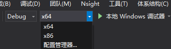
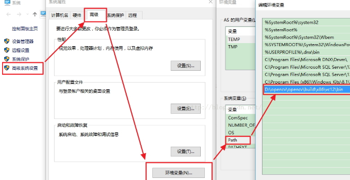
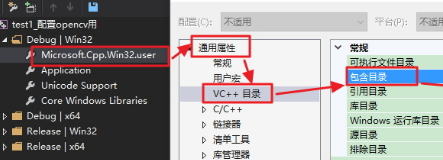

配置只需要四步，把bin目录添加到系统环境变量；项目属性配置中包含三个include目录；添加对应库lib目录；连接器添加lib文件。
<!-- toc -->
<!-- more -->

# 1. opencv 准备
## 1.1. 下载

在官网找到对应版本下载，地址 http://opencv.org/releases.html，
下载完成后双击会提示解压到某个地方，比如D:\opencv，

## 1.2. 解压后目录如下
可以通过命令查看如下目录“tree>txtname.txt”

```
├─build
│  ├─doc
│  ├─include
│  │  ├─opencv
│  │  └─opencv2
│  ├─x64
│  │  ├─vc11
│  │  │  ├─bin
│  │  │  ├─lib
│  │  │  └─staticlib
│  │  └─vc12
│  │      ├─bin
│  │      ├─lib
│  │      └─staticlib
│  └─x86
│      ├─vc11
│      │  ├─bin
│      │  ├─lib
│      │  └─staticlib
│      └─vc12
│          ├─bin
│          ├─lib
│          └─staticlib
```

## 1.3. opencv选择x86还是x64

使用多少位编译指的是VS中的编译方式，而**不是你的电脑操作系统是64位还是32位**。后面再选择x86还是x64时，也是同样的道理！！！


如果你最终选择的是64位编译，那么路径选择x64，例如：D:\opencv\opencv\build\x64\vc12\bin
如果你最终选择的是32位编译，那么路径选择x86。

## 1.4. opencv选择vc10？vc11？vc12？

vc8 = Visual Studio 2005
vc9 = Visual Studio 2008
vc10 = Visual Studio 2010
vc11 = Visual Studio 2012
vc12 = Visual Studio 2013
vs2015目前也选择vc12，

# 2. 设置环境变量

方法:
在电脑桌面的【计算机】->【（右键）属性】->【高级系统设置】->【高级（标签）】->【环境变量】->“双击”系统变量中的PATH->在变量值里面添加相应的bin路径
例如：`D:\opencv\opencv\build\x64\vc10\bin;D:\opencv\opencv\build\x86\vc10\bin`



小技巧：推荐使用 `Rapid Environment Editor` 这个小工具管理系统环境变量，可视化编辑。

# 3. 项目配置

首先新建或者随便打开想要使用opencv的项目
点击【视图】-->【其他窗口】->【属性管理器】中点击对应的属性页：

## 3.1. 在包含目录中添加



```
D:\opencv\opencv\build\include\opencv2
D:\opencv\opencv\build\include\opencv
D:\opencv\opencv\build\include
```
这种方法配置的是“通用属性”，一次配置，一直使用

## 3.2. 库目录的配置

在包含目录的下方，编辑库目录，添加：

```
D:\opencv\opencv\build\x86\vc12\lib
```
x86和vc12的选择原因同环境变量，32位编译，那么路径选择x86，64位编译，那么路径选择x64，

## 3.3. 链接库的配置

对于链接库的配置，建议不要配置成通用属性，而是每个项目配一次，避免opencv报出奇奇怪怪不好处理的错误。
在解决方案中选择一个项目，右键点击，选择“属性”项，会出现与先前通用属性页一样的属性页，只不过你做的操作只针对当前项目。

【链接器】->【输入】->【附加的依赖项】

对于选择Release编译时，添加：
```
opencv_calib3d2411.lib;opencv_contrib2411.lib;opencv_core2411.lib;opencv_features2d2411.lib;opencv_flann2411.lib;opencv_gpu2411.lib;opencv_highgui2411.lib;opencv_imgproc2411.lib;opencv_legacy2411.lib;opencv_ml2411.lib;opencv_nonfree2411.lib;opencv_objdetect2411.lib;opencv_ocl2411.lib;opencv_photo2411.lib;opencv_stitching2411.lib;opencv_superres2411.lib;opencv_ts2411.lib;opencv_video2411.lib;opencv_videostab2411.lib;
```

对于选择Debug编译时，添加：
```
opencv_calib3d2411d.lib;opencv_contrib2411d.lib;opencv_core2411d.lib;opencv_features2d2411d.lib;opencv_flann2411d.lib;opencv_gpu2411d.lib;opencv_highgui2411d.lib;opencv_imgproc2411d.lib;opencv_legacy2411d.lib;opencv_ml2411d.lib;opencv_nonfree2411d.lib;opencv_objdetect2411d.lib;opencv_ocl2411d.lib;opencv_photo2411d.lib;opencv_stitching2411d.lib;opencv_superres2411d.lib;opencv_ts2411d.lib;opencv_video2411d.lib;opencv_videostab2411d.lib;
```

因为是模块化的，所以可以选择添加对应功能的lib库就可以，比如 “CvSVM::CvSVM”  需要包含opencv_ml2411.lib
我们也可以全部添加，这些lib库其实就是opencv\build\x64\vc11\lib下面的对应文件。

对于OpenCV 3.0，新版的lib非常简单。
想用debug  版本的库，添加 `opencv_ts300d.lib，opencv_world300d.lib` 这两个库即可。
想用release版本的库，添加  `opencv_ts300.lib，opencv_world300.lib`即可。


参考文献：

[毛星云（浅墨）的专栏   - CSDN博客](http://blog.csdn.net/poem_qianmo/article/details/19809337/)
[【OpenCV】VS2015与OpenCV2.4.11配置 - Taily老段的专栏 博客频道 - CSDN.NET](http://blog.csdn.net/taily_duan/article/details/52128024)

[OpenCV 2.4.11 VS2010 Configuration - Grandyang - 博客园](http://www.cnblogs.com/grandyang/p/4331408.html)

[VS2015上配置opencv2.4.11 - 随煜而安的专栏   博客频道 - CSDN.NET](http://blog.csdn.net/u011583927/article/details/52434673)

[【OpenCV】VS2015与OpenCV2.4.11配置 - Taily老段的专栏 博客频道 - CSDN.NET](http://blog.csdn.net/taily_duan/article/details/52128024)

[win10下vs2015配置Opencv3.1.0过程详解 - 博客频道 - CSDN.NET](http://blog.csdn.net/u011635764/article/details/50564259)


[VS2013中如何解决error C4996: &#39;fopen&#39;问题_百度经验](http://jingyan.baidu.com/article/ce436649fd61543773afd32e.html)


# 4. 主要的目录和文件

F:\opencv\opencv2413\opencv\build\x64\vc12\lib

F:\opencv\opencv2413\opencv\build\include
F:\opencv\opencv2413\opencv\build\include\opencv
F:\opencv\opencv2413\opencv\build\include\opencv2

目录下面的所有lib文件

opencv_calib3d2411.lib
opencv_calib3d2411d.lib
opencv_contrib2411.lib
opencv_contrib2411d.lib
opencv_core2411.lib
opencv_core2411d.lib
opencv_features2d2411.lib
opencv_features2d2411d.lib
opencv_flann2411.lib
opencv_flann2411d.lib
opencv_gpu2411.lib
opencv_gpu2411d.lib
opencv_highgui2411.lib
opencv_highgui2411d.lib
opencv_imgproc2411.lib
opencv_imgproc2411d.lib
opencv_legacy2411.lib
opencv_legacy2411d.lib
opencv_ml2411.lib
opencv_ml2411d.lib
opencv_nonfree2411.lib
opencv_nonfree2411d.lib
opencv_objdetect2411.lib
opencv_objdetect2411d.lib
opencv_ocl2411.lib
opencv_ocl2411d.lib
opencv_photo2411.lib
opencv_photo2411d.lib
opencv_stitching2411.lib
opencv_stitching2411d.lib
opencv_superres2411.lib
opencv_superres2411d.lib
opencv_ts2411.lib
opencv_ts2411d.lib
opencv_video2411.lib
opencv_video2411d.lib
opencv_videostab2411.lib
opencv_videostab2411d.lib

重点参考内容：
http://blog.csdn.net/u011583927/article/details/52434673

_CRT_SECURE_NO_WARNINGS


# 5. 可以建立属性表，方便配置

[VS2010+Opencv-2.4.0的配置攻略 - FreedomShe - 博客园](http://www.cnblogs.com/freedomshe/archive/2012/04/25/2470540.html)

[Opencv 完美配置攻略 2014 (Win8.1 + Opencv 2.4.8 + VS 2013) | Yuanbo She](http://my.phirobot.com/blog/2014-02-opencv_configuration_in_vs.html)


E:\Android\opencv\opencv2411\build\include;E:\Android\opencv\opencv2411\build\include\opencv;E:\Android\opencv\opencv2411\build\include\opencv2;

E:\Android\opencv\opencv2411\build\x86\vc12\lib;

[VS2012 opencv 无法删除“继承的值”问题解决方案](http://www.360doc.com/content/15/0103/14/110467_437739376.shtml)

独立配置表， 使用下面的文件 `opencv2411.props`

新建项目后，在 视图 --> 其它 窗口 -> 配置管理器--> 添加现有配置表

这个程序就可以运行了。

```xml

<?xml version="1.0" encoding="utf-8"?>
<Project ToolsVersion="4.0" xmlns="http://schemas.microsoft.com/developer/msbuild/2003">
  <ImportGroup Label="PropertySheets" />
  <PropertyGroup Label="UserMacros" />
  <PropertyGroup>
    <IncludePath>$(OPENCV2411)\include;$(OPENCV2411)\include\opencv;$(OPENCV2411)\include\opencv2;$(IncludePath)</IncludePath>
    <LibraryPath Condition="'$(Platform)'=='Win32'">$(OPENCV2411)\x86\vc12\lib;$(LibraryPath)</LibraryPath>
    <LibraryPath Condition="'$(Platform)'=='X64'">$(OPENCV2411)\x64\vc12\lib;$(LibraryPath)</LibraryPath>
  </PropertyGroup>
  <ItemDefinitionGroup>
    <Link Condition="'$(Configuration)'=='Debug'">
      <AdditionalDependencies>opencv_calib3d2411d.lib;opencv_contrib2411d.lib;opencv_core2411d.lib;opencv_features2d2411d.lib;opencv_flann2411d.lib;opencv_gpu2411d.lib;opencv_highgui2411d.lib;opencv_imgproc2411d.lib;opencv_legacy2411d.lib;opencv_ml2411d.lib;opencv_nonfree2411d.lib;opencv_objdetect2411d.lib;opencv_ocl2411d.lib;opencv_photo2411d.lib;opencv_stitching2411d.lib;opencv_superres2411d.lib;opencv_ts2411d.lib;opencv_video2411d.lib;opencv_videostab2411d.lib;%(AdditionalDependencies)</AdditionalDependencies>
    </Link>
    <Link Condition="'$(Configuration)'=='Release'">
      <AdditionalDependencies>opencv_calib3d2411.lib;opencv_contrib2411.lib;opencv_core2411.lib;opencv_features2d2411.lib;opencv_flann2411.lib;opencv_gpu2411.lib;opencv_highgui2411.lib;opencv_imgproc2411.lib;opencv_legacy2411.lib;opencv_ml2411.lib;opencv_nonfree2411.lib;opencv_objdetect2411.lib;opencv_ocl2411.lib;opencv_photo2411.lib;opencv_stitching2411.lib;opencv_superres2411.lib;opencv_ts2411.lib;opencv_video2411.lib;opencv_videostab2411.lib;%(AdditionalDependencies)</AdditionalDependencies>
    </Link>
  </ItemDefinitionGroup>
  <ItemGroup />
</Project>

```

测试代码：

```c++
#include<iostream>  
#include <opencv2/core/core.hpp>  
#include <opencv2/highgui/highgui.hpp>  
using namespace cv;
int main(int argc, char* argv[])
{
	Mat img = imread("F:\\test.jpg");// 读入一张图片（游戏原画）
	namedWindow("游戏原画");// 创建一个名为 "游戏原画"窗口
	imshow("游戏原画", img);// 在窗口中显示游戏原画 
	waitKey(6000);// 等待6000 ms后窗口自动关闭 
	return 0;
}

```