<!-- toc -->
<!-- more -->

# 1. 基于SVM 和神经网络的车牌识别

将介绍创建自动车牌识别（ Auton1atic Number Plate Recognition, ANPR ）所需的步骤。主要目标是介绍图像分割、特征提取、模式识别基础以及两个重要的模式识别算法：支持向量机（ Support Vector Machine , SVM ） 和人工神经网络（ Artificial NeuralNetwork , ANN ）。

自动车牌识别是一种使用光学字符识别（ Optical Character Recognition, OCR ）和其他方法（如，用图像分割与检测）来获取车辆牌照的监控方法。

对于一个ANPR系统，最好结果可用一个红外（ IR）摄像机来获得数据。因为在分割这一步中，对检测和OCR 分割很简单、干净，并且误差最小。本文并不会使用IR 图像，而是使用普通图像。

每个国家都有不同的车牌尺寸和规格，了解这些规格对得到最好结果并减少错误很有用。本文将使用西班牙车牌。在西班牙，有不同大小和形状的车牌。本章采用最普通（大）的车牌，它的大小为520mm x 110mm 。两组字符由41mm 的空间分离，每个字符间的距离为14mm 。第一组字符为四个数字，第二组有三个字母，但不包括元音字母A 、E 、l 、O 、U,也不包括字母N或Q ，所有字符的大小为45mm x 77mm。

这些数据对字符分割很重要，因为可用这些数据来检查字符和空格，以验证得到的是一个字符而不是其他自图像分割得到的对象。

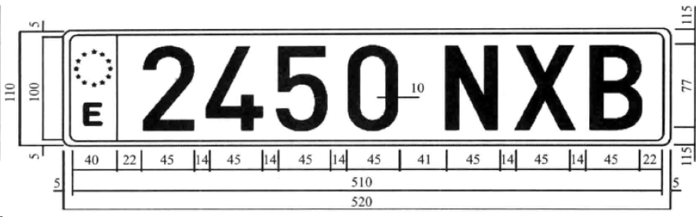

# 2. ANPR 算法

在解释ANPR代码之前． 需要明白主要步骤和使用ANPR 算法的任务。ANPR 有两个主要步骤： 车牌检测和车牌识别。车牌检测的目的是在整个视频帧中检测到车牌位置。当在图像中检测到车牌时，分割的车牌被传到第二个步骤，即车牌识别，它用OCR 算法来识别车牌上的字母和数字。

下面还将定义模式识别算法常用的三个额外步骤。
l ）分割： 这一步会检测并裁剪图像中每个感兴趣的块／区域；
2 ）特征提取：这一步对字符图像集的每个部分进行提取；
3 ）分类： 这一步会从车牌识别那一步的结果中得到每个字符，或从车牌检测（ plate-detection）那一步中将所得图像块分为“是车牌”或“不是车牌
下图展示了整个算法应用中模式识别的步骤。

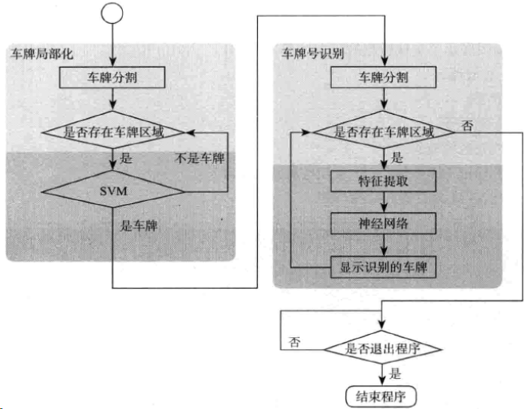

模式识别算法的主要目的是检测和识别汽车车牌，下面简单介绍一下两个任务：

- 如何训练模式识别系统
- 如何评估模式识别系统

# 3. 车牌检测

这一步要检测当前帧中所有的车牌。为了实现此功能， 该步骤又分为两个主要步骤： 图像分割和对分割的图像进行分类。这一步的功能不会解释因为将图像块作为一个向量特征。

在第一步（图像分割）中．将使用各种滤波器、形态学算子，以及轮廓算法来验证所**获取图像中有车牌的部分**。

在第二步（分类）中．对每个图像块（特征）将采用支持向量机SVM作为分类器进行分类。在创建主要的应用之前． 需训练两个不同的类：车牌和非车牌号。这步所使用图像是在汽车前面2-4米拍摄平行的正面视角彩色图像，这些图像有800像素宽。 这些要求对确保正确的图像分割很重要，可创建一个多尺度图像算法来进行检测。

## 3.1. 车牌检测的所有过程

- Sobel 滤波器；
- 阀值算子；
- 闭形态学算子；
- 一个填充区域掩码；
- 用红色标记（特征图像中）可能检测到的车牌
- 在执行SVM 分类器后检测车牌。

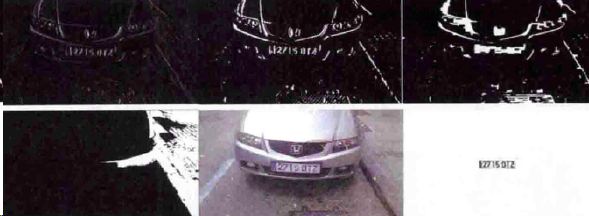

# 4. 图像分割

[《Mastering Opencv ...读书笔记系列》车牌识别（I）](http://blog.csdn.net/jinshengtao/article/details/17883075)
上面有每个步骤的效果图，具体每个步骤的介绍见下表。

图像分割是将图像分成多个区域的过程。该过程是为了分析而简化图像，同时也使特征提取更容易
车牌分割有一个重要特征：假定从汽车前面拍摄图像，会在车牌上有大量**竖直边**( vertical dge)并且车牌不会被旋转．也没有透视扭曲。这一性质在分割图像时可用来删除没有任何竖直边的那些区域。

## 4.1. 灰度图像 高斯模糊
在找到竖直边之前，需将彩色图像转换为灰度图像（因为彩色对任务没用），删除可能由摄像机产生的噪声或其他环境噪声。利用5 × 5的**高斯模糊来去噪**。如果不用去噪方法，可能会得到很多竖直边，从而造成检测失败。

```c
    //convert image to gray
    Mat img_gray;
    cvtColor(input, img_gray, CV_BGR2GRAY);
    blur(img_gray, img_gray, Size(5,5)); 
```

## 4.2. Sobel滤波器 查找竖直边
为了找到竖直边，将采用Sobel滤波器来找到第一个水平导数。导数是数学函数，它可用来在图像中查找竖直边。Sobel 函数在OpenCV 中的定义为：

```c
CV_EXPORTS_W void Sobel( InputArray src, OutputArray dst, int ddepth,
                         int dx, int dy, int ksize = 3,
                         double scale = 1, double delta = 0,
                         int borderType = BORDER_DEFAULT );
```

ddepth为目标图像的颜色深度.
dx 为对x 求导数的阶数， dy 为对y求导数的阶数。
ksize 是核（ kernel ）的大小，其取值为1 、3 、5 、7 当中的一个。
scale 用于计算导数值的可选因子。
delta 是增加到结果的可选择值
borderType 是像索内插方法。
根据本项目的情况，将使用dx=I dy=O 和ksize=3

```c
//Finde vertical lines. Car plates have high density of vertical lines
Mat img_sobel;
Sobel(img_gray, img_sobel, CV_8U, 1, 0, 3, 1, 0, BORDER_DEFAULT);
if(showSteps)
    imshow("Sobel", img_sobel);

```

## 4.3. 阔值滤波器来得到二值图像

在执行完Sobel 滤波器后，将采用阔值滤波器来得到二值图像，所采用的阔值由Otsu算法得到。Otsu 算法的输入是一个8 位图像，它将自动得到优化的阔值：

```c
//threshold image
Mat img_threshold;
threshold(img_sobel, img_threshold, 0, 255, CV_THRESH_OTSU+CV_THRESH_BINARY);
if(showSteps)
    imshow("Threshold", img_threshold);
```

为了在threshold 函数中使用Otsu 算法，可将阁值的类型参数与CV_THRESH_OTSU结合，因为这样做就会忽略阈值参数（threshold函数的第三个参数。

## 4.4. 闭形态学算子 删除在每个竖直边缘线之间的空白区域

通过采用一个闭形态学算子，可删除在每个竖直边缘线之间的空白区域．并连接有大量边的所有区域的。在这一步中，有可能包含车牌区域。

首先，需要定义在闭形态学算子中所使用的结构元素。可使用getStructuringElement函数来定义一个结构矩阵元素．它的维度大小为17 × 3 ，这可能与其他图像尺寸有所不同：
在闭形态学算子中使用morphologyEx 函数就会用到结构元素：

```c
//Morphplogic operation close
Mat element = getStructuringElement(MORPH_RECT, Size(17, 3) );
morphologyEx(img_threshold, img_threshold, CV_MOP_CLOSE, element);
if(showSteps)
    imshow("Close", img_threshold);
```

## 4.5. 统计区域数量，多数区域都不包含车牌号

在使用这些函数后，就会得到包含车牌的区域，但多数区域都不包含车牌号。这些区域可用连通分量分析或用findContours函数将其分开。
下面findContours函数用来获取二进制图像的轮廓，若在该函数中采用的方法不同，则得到的结果轮廓就不一样。本项目只需用任意层次关系和任何多边形来逼近外部轮廓即可：

```c
//Find contours of possibles plates
vector< vector< Point> > contours;
findContours(img_threshold,
        contours, // a vector of contours
        CV_RETR_EXTERNAL, // retrieve the external contours
        CV_CHAIN_APPROX_NONE); // all pixels of each contours
```

## 4.6. 对每个轮廓检测

对每个轮廓检测和**提取最小区域的有界矩形区域**，可用OpenCV 自带的minAreaRect函数来实现。该函数返回一个名为RotatedRect 的旋转矩形类，然后在每个轮廓上使用一个向量迭代器来得到被旋转的矩形，并在对每个区域做分类之前，做一些初步验证：

```c
//Start to iterate to each contour founded
vector<vector<Point> >::iterator itc= contours.begin();
vector<RotatedRect> rects;

//Remove patch that are no inside limits of aspect ratio and area.    
while (itc!=contours.end()) {
    //Create bounding rect of object
    RotatedRect mr= minAreaRect(Mat(*itc));
    if( !verifySizes(mr)){
        itc= contours.erase(itc);
    }else{
        ++itc;
        rects.push_back(mr);
    }
}
```

## 4.7. 对检测到的区域做和真实车牌宽高比的验证

可对检测到的区域做一些基本验证．这些验证基于面积和宽高比。只有这样的区域才被认为是一个车牌： 有40%的误差范围内的区域，其宽高比为520/110=4.727272 （车牌的宽除以车牌的高），区域面积最小为15个像素，并且车牌的高度最多为125个像素。这些值的计算依靠图像大小和摄像机位置：

```c
bool DetectRegions::verifySizes(RotatedRect mr){

    float error=0.4;
    //Spain car plate size: 52x11 aspect 4,7272
    float aspect=4.7272;
    //Set a min and max area. All other patchs are discarded
    int min= 15*aspect*15; // minimum area
    int max= 125*aspect*125; // maximum area
    //Get only patchs that match to a respect ratio.
    float rmin= aspect-aspect*error;
    float rmax= aspect+aspect*error;

    int area= mr.size.height * mr.size.width;
    float r= (float)mr.size.width / (float)mr.size.height;
    if(r<1)
        r= (float)mr.size.height / (float)mr.size.width;

    if(( area < min || area > max ) || ( r < rmin || r > rmax )){
        return false;
    }else{
        return true;
    }

}
```

## 4.8. 车牌背景为白色，可使用漫水填充算法floodFill来获取最接近的裁剪区域

- 可利用车牌背景为白色这一性质做出更多的改进，所有车牌都有一样的背景颜色，为了得到精确的裁剪，可使用漫水填充算法来获取旋转矩形。

- 裁剪车牌的第一步是要得到几个种子（seed ），它们位于最后被旋转矩形的中心附近，然后用宽和高得到车牌的最小尺寸，并使用它在块中心附近产生随机种子。

- 要选择白色区域，并需要这几个种子至少接触到一个白色像素。然后对于每个像素使用floodFill 函数绘制一个新的掩码图像以存储最接近的裁剪区域：

```c
// Draw blue contours on a white image
cv::Mat result;
input.copyTo(result);
cv::drawContours(result,contours,
        -1, // draw all contours
        cv::Scalar(255,0,0), // in blue
        1); // with a thickness of 1

for(int i=0; i< rects.size(); i++){

    //For better rect cropping for each posible box
    //Make floodfill algorithm because the plate has white background
    //And then we can retrieve more clearly the contour box
    circle(result, rects[i].center, 3, Scalar(0,255,0), -1);
    //get the min size between width and height
    float minSize=(rects[i].size.width < rects[i].size.height)?rects[i].size.width:rects[i].size.height;
    minSize=minSize-minSize*0.5;
    //initialize rand and get 5 points around center for floodfill algorithm
    srand ( time(NULL) );
    //Initialize floodfill parameters and variables
    Mat mask;
    mask.create(input.rows + 2, input.cols + 2, CV_8UC1);
    mask= Scalar::all(0);
    int loDiff = 30;
    int upDiff = 30;
    int connectivity = 4;
    int newMaskVal = 255;
    int NumSeeds = 10;
    Rect ccomp;
    int flags = connectivity + (newMaskVal << 8 ) + CV_FLOODFILL_FIXED_RANGE + CV_FLOODFILL_MASK_ONLY;
    for(int j=0; j<NumSeeds; j++){
        Point seed;
        seed.x=rects[i].center.x+rand()%(int)minSize-(minSize/2);
        seed.y=rects[i].center.y+rand()%(int)minSize-(minSize/2);
        circle(result, seed, 1, Scalar(0,255,255), -1);
        int area = floodFill(input, mask, seed, Scalar(255,0,0), &ccomp, Scalar(loDiff, loDiff, loDiff), Scalar(upDiff, upDiff, upDiff), flags);
    }
    .....
```

## 4.9. floodFill 函数

floodFill 函数将一个彩色连通分量填充到图像掩码中．这个填充过程从一个种子点开始，并对要填充的像索与邻近像素或种子像素之间设置亮度／色彩的最大上界和下界之差。

```c
CV_EXPORTS_W int floodFill( InputOutputArray image, InputOutputArray mask,
                            Point seedPoint, Scalar newVal, CV_OUT Rect* rect=0,
                            Scalar loDiff = Scalar(), Scalar upDiff = Scalar(),
                            int flags = 4 );
```

参数newVal 是填充时要放到图像的新颜色。参数 loDiff 和 upDiff 分别是最大下界差和最大上界差，这些值来源于要填充的像素与邻近像素或种子像素之间的亮度／色影之差。

flag 的参数的组合为：
- 较低位（ lower bit ）这些位包含用在函数中的连通性值：4（默认值）或8 ，连通性决定考虑像素的哪种近邻。
- 较高位（ upper bit ）这些位是0 或下列值的组合： CV_FLOODFILL_FIXED_RANGE 和CV_FLOODFTLL_MASK_ONLY

CV_FLOODFILL_FIXED_RANGE 设置当前像素与种子像素之间的差别。和CV_FLOODFTLL_MASK_ONLY只会填充图像掩码而不会改变图像本身。

## 4.10. 通过图像掩码来得到一个最小面积的矩形

一旦得到裁剪掩码，便可通过图像掩码来得到一个最小面积的矩形，并再次检查它的有效尺寸。对于每个掩码的白色像素，先得到其位置，再用minAreaRect 函数获取最接近的裁剪区域：

```c
//Check new floodfill mask match for a correct patch.
    //Get all points detected for get Minimal rotated Rect
    vector<Point> pointsInterest;
    Mat_<uchar>::iterator itMask= mask.begin<uchar>();
    Mat_<uchar>::iterator end= mask.end<uchar>();
    for( ; itMask!=end; ++itMask)
        if(*itMask==255)
            pointsInterest.push_back(itMask.pos());

    RotatedRect minRect = minAreaRect(pointsInterest);
    if(verifySizes(minRect)){
        .....
```

## 4.11. 裁剪每个检测到的区域

现在分割处理已经完成并验证了有效区域，然后可裁剪每个检测到的区域，消除任意可能的旋转，裁剪图像区域，调整图像大小， 均衡裁剪图像区域的亮度。

```c
//Get rotation matrix
        float r= (float)minRect.size.width / (float)minRect.size.height;
        float angle=minRect.angle;
        if(r<1)
            angle=90+angle;
        Mat rotmat= getRotationMatrix2D(minRect.center, angle,1);
```

## 4.12. 仿射变换 warpAffine，让平行线变换后仍是平行线的变换

现在可通过仿射变换（几何学中的仿射变换是指让平行线变换后仍是平行线的变换）旋转输入的图像，具体用 warpAffine 函数实现，需要用户设置该函数的输入图像和输出图像、变换矩阵、输出图像大小（在本应用中，它与输入图像一样大），以及所使用的插值方法。如果需要．可定义边界方法和边界值。

```c
//Create and rotate image
Mat img_rotated;
warpAffine(input, img_rotated, rotmat, input.size(), CV_INTER_CUBIC);

```

## 4.13. getRectSubPix 以一个点为中心裁剪图像

在旋转图像后，可用getRectSubPix 裁剪图像，使用该函数裁剪会以一个点为中心，复制给定宽度和高度的图像。如果图像被旋转,需要用C++ 的swap 函数来改变宽度和高度大小。

```c
//Crop image
Size rect_size=minRect.size;
if(r < 1)
    swap(rect_size.width, rect_size.height);
Mat img_crop;
getRectSubPix(img_rotated, rect_size, minRect.center, img_crop);
```

## 4.14. 光照直方图均衡来有相同宽度和高度

通过裁剪得到的图像并不适用于训练和分类，因为它们的大小不同。另外，每个图像包含不同的亮度，这也增大了它们的相对差异性。为了解决这个问题，可用光照直方图均衡来调整所有图像，使它们具有相同宽度和高度。

最后，针对每个检测的区域，用一个向量来存储裁剪的图像和它的位置。

```c
Mat resultResized;
resultResized.create(33,144, CV_8UC3);
resize(img_crop, resultResized, resultResized.size(), 0, 0, INTER_CUBIC);
//Equalize croped image
Mat grayResult;
cvtColor(resultResized, grayResult, CV_BGR2GRAY); 
blur(grayResult, grayResult, Size(3,3));
grayResult=histeq(grayResult);
if(saveRegions){ 
    stringstream ss(stringstream::in | stringstream::out);
    ss << "tmp/" << filename << "_" << i << ".jpg";
    imwrite(ss.str(), grayResult);
}
output.push_back(Plate(grayResult,minRect.boundingRect()));
```


# 5. 分类

在预处理和分割完图像的所有部分后，需要决定每部分是否为车牌号。可用支持向量机SVM完成该功能。

## 5.1. 支持向量机

支持向量机是一种模式识别算法，它源于二分类的监督学习算法。监督学习是通过标签数据进行学习的机器学习算法。用户需要用一些标签数据来训练算法，标签数据是指每个样本都应属于某个具体的类。

SVM会创建一个或多个超平面，这些超平面可用来判断数据属于哪个类。一个经典的SVM 示例是，对一个只有两类的二维平面的点集， SVM 搜索的最优直线可以将不同类的点分开。

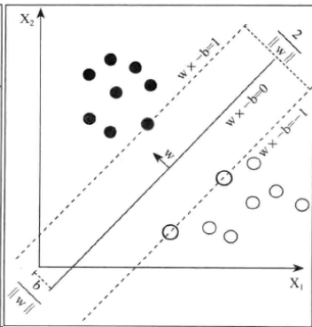

在开始分类之前，需要训练分类器，该工作要在主应用开始之前完成，这称为离钱训练。离线训练并不是一件容易的事，因为它需要充足的数据来训练系统，但不是数据集越大就能得到最好的结果。本项目并没有充足的数据，因为并没有公开的车牌数据库。因此，需要拍摄数百张汽车照片，然后预处理并分割它们。

我们使用75张车牌图像和35张不是车牌但大小为144 x 33 像素的图像训练系统，从下图可看到这样的样本数据。这并不是一个大数据集，但对本项目而言，可得到足够好的结果。在真正的应用中，需要更多的数据。

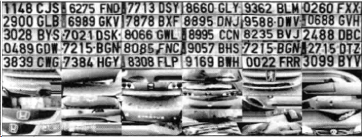

为了简单理解机器学习是如何工作的，可对分类器算法使用图像像素特征（注意： 有更好的方法和特征用于训练SVM. 比如，主成分分析（Principal Components Analysis, PCA ）、傅里叶变换、纹理分析等。

需要用 DetectRegions 类来创建用于训练的图像，为了保存图像，需将 savingRegions 变量设置为true。用脚本文件segmentALLFiles.sb 来重复处理文件夹下所有图像文件。

## 5.2. 图像数据保存到XML文件

为了使处理过程变得更容易，可将用于训练和测试的所有图像数据保存到XML文件中，然后让SVM 函数直接使用该XML 文件。
文件trainSVM.cpp 可通过指定的文件夹和图像文件编号来创建这个XML 文件。

用于OpenCV 的机器学习算法的训练数据存储在一个 NxM 的矩阵中，其中N为样本数， M 为特征数，每个样本是该训练矩阵的一行。每个样本的类别信息存储在另一个大小为 N × l 的矩阵中，每个样本的类别用一个浮点数表示。

```c++
Mat(trainingImages).copyTo(trainingData);
//trainingData = trainingData.reshape(1,trainingData.rows);
trainingData.convertTo(trainingData, CV_32FC1);

Mat(trainingLabels).copyTo(classes);

FileStorage fs("SVM.xml", FileStorage::WRITE);
fs << "TrainingData" << trainingData;
fs << "classes" << classes;
fs.release();
```

## 5.3. FileStorage 类管理XML

通过OpenCV 的FileStorage 类可以很容易地管理一个XML 或JSON 格式的数据文件。该类可存取OpenCV 的变量、结构或自定义变量。用该类的函数可读取训练数据矩阵和类标签，并可将这些信息存储到SVM_TrainingData 和 SVM_Classes 中。

```c
//SVM for each plate region to get valid car plates
//Read file storage.
FileStorage fs;
fs.open("SVM.xml", FileStorage::READ);
Mat SVM_TrainingData;
Mat SVM_Classes;
fs["TrainingData"] >> SVM_TrainingData;
fs["classes"] >> SVM_Classes;
```

## 5.4. 设置SVM 参数

现在需要设置SVM 参数，这些参数是使用SVM 算法的基本参数，可用CvSVMParams结构来定义这些参数。通常**为了提高训练样本的线性可分性，需要采用映射**。该映射可通过核函数来高效地实现，这样做后可增加训练样本的维度。本项目选择 CvSVM::LINEAR 类型，这意味着不做映射：

```c
//Set SVM params
CvSVMParams SVM_params;
SVM_params.svm_type = CvSVM::C_SVC;
SVM_params.kernel_type = CvSVM::LINEAR; //CvSVM::LINEAR;
```

## 5.5. 创建并训练分类器

然后来创建并训练分类器。OpenCV 的 CvSVM 类就是对支持向量机算法的实现，需要用训练数据、类标签和参数数据来初始化它：

```c
 //Train SVM
CvSVM svmClassifier(SVM_TrainingData, SVM_Classes, Mat(), Mat(), SVM_params);
```

## 5.6. 预测裁剪图像

在训练好分类器后，可用SVM 类的predict 函数来预测裁剪图像。在本项目中，用 1 表示车牌，用 0 表示非车牌。对每一个可能被检测出是车牌的区域,用SVM 进行分类并判断这个区域是否为车牌，如果是车牌就保存。下面的代码是主要应用部分，也称为在线处理

```c
//For each possible plate, classify with svm if it's a plate or no
vector<Plate> plates;
for(int i=0; i< posible_regions.size(); i++)
{
    Mat img=posible_regions[i].plateImg;
    Mat p= img.reshape(1, 1);
    p.convertTo(p, CV_32FC1);

    int response = (int)svmClassifier.predict( p );
    if(response==1)
        plates.push_back(posible_regions[i]);
}
```

# 6. 车牌号识别

车牌识别的第二步是要用光学字符识别获取车牌上的字符。对每个检测到的车牌．可着手按每个字符来分割车牌，用人工神经网络（Artificial Neual Network, ANN ）这种机器学习算法来识别字符。下面将介绍如何评估一个分类算法。

## 6.1. OCR 分割

[《Mastering Opencv ...读书笔记系列》车牌识别（II）字符分割【OCR Segment】 CSDN.NET](http://blog.csdn.net/jinshengtao/article/details/17954427)

## 6.2. 阈值滤波器，反转阈值化，轮廓算法查找白色像素

首先，对获取的车牌图像用直方图均衡进行处理，将其作为OCR 函数的输入，然后采用阈值滤波器对图像进行处理，并将处理后的图像作为查找轮廓（ Find Contour）算法的输入。这个过程如下图

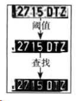

这个分割过程的代码如下：

```c
//Threshold input image
Mat img_threshold;
threshold(input, img_threshold, 60, 255, CV_THRESH_BINARY_INV);
if(DEBUG)
    imshow("Threshold plate", img_threshold);
Mat img_contours;
img_threshold.copyTo(img_contours);
//Find contours of possibles characters
vector< vector< Point> > contours;
findContours(img_contours,
        contours, // a vector of contours
        CV_RETR_EXTERNAL, // retrieve the external contours
        CV_CHAIN_APPROX_NONE); // all pixels of each contours
```

使用CV_THRESH_BINARY_INV 可将白色输入值变成黑色，将黑色输入值变为白色，从而反转阈值化的输出结果。为了得到每个字符的轮廓，这是有必要的，因为轮廓算法会查找白色像素。

## 6.3. 验证轮廓大小宽高比

对每个检测到的轮廓，需要验证其大小并删除所有尺寸较小或宽高比不正确的区域。在本项目中，正确的车牌字符的宽高比为45/77 ，但由于字符会有旋转或扭曲，允许车牌字
符的宽高比有35% 的误差。如果一块区域的这个比率超过标准比率的80% ，可认为这个区
域为黑色块，而不是一个字符。可用 countNonZero 函数来计算像索值大于0 的像素个数：

```c
bool OCR::verifySizes(Mat r){
    //Char sizes 45x77
    float aspect=45.0f/77.0f;
    float charAspect= (float)r.cols/(float)r.rows;
    float error=0.35;
    float minHeight=15;
    float maxHeight=28;
    //We have a different aspect ratio for number 1, and it can be ~0.2
    float minAspect=0.2;
    float maxAspect=aspect+aspect*error;
    //area of pixels
    float area=countNonZero(r);
    //bb area
    float bbArea=r.cols*r.rows;
    //% of pixel in area
    float percPixels=area/bbArea;

    if(DEBUG)
        cout << "Aspect: "<< aspect << " ["<< minAspect << "," << maxAspect << "] "  << "Area "<< percPixels <<" Char aspect " << charAspect  << " Height char "<< r.rows << "\n";
    if(percPixels < 0.8 && charAspect > minAspect && charAspect < maxAspect && r.rows >= minHeight && r.rows < maxHeight)
        return true;
    else
        return false;
}
```

## 6.4. CharSegment保存分割后的字符图像和用于调整字符所需的位置

如果一个分割的区域是字符，则必须要对其预处理，使它与所有字符有一样的大小和位置，然后用辅助类 CharSegment 将其保存到一个向量中。该类保存分割后的字符图像和用于调整字符所需的位置，因为查找轮廓算法不会按所需顺序返回轮廓。

## 6.5. 特征提取

## 6.6. 累积直方图

为了用人工神经网络进行训练和分类，下面将对每个分割出来的字符进行特征提取。与用SVM 进行车牌检测时的特征提取不同，这里不会使用所有图像像素作为特征，而是采用光学字符识别中更常用的特征．这些特征包含了水平和坚直累职直方图，以及低分辨的图像样本，从下图中可看出这种图形化的特征，每个图像只有5x5 的低分辨率，且是累积直方图（ accumulation histogram ）。

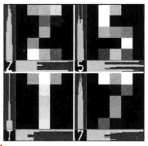

对每个字符．通过使用 `countNonZero` 函数来按列或按行统计非零像素值个数，并将其保存到新的数据矩阵 `mhist` 中。

## 6.7. `mhist` 进行归一化

对 `mhist` 进行归一化处理，其过程为：通过`minMaxLoc` 函数找到该矩阵的最大值，将它的每个元素都除以这个最大值，并通过convertTo 函数来最终实现。创建名为`ProjectedHistogram` 的函数，用它来实现累积直方图，这个函数将二值图像和直方图类型（水平或竖直）作为输入：

```c
Mat OCR::ProjectedHistogram(Mat img, int t)
{
    int sz=(t)?img.rows:img.cols;
    Mat mhist=Mat::zeros(1,sz,CV_32F);

    for(int j=0; j<sz; j++){
        Mat data=(t)?img.row(j):img.col(j);
        mhist.at<float>(j)=countNonZero(data);
    }

    //Normalize histogram
    double min, max;
    minMaxLoc(mhist, &min, &max);
    if(max>0)
        mhist.convertTo(mhist,-1 , 1.0f/max, 0);

    return mhist;
}
```

## 6.8. 用 5x5 字符图像得到特征

将低分辨率图像作为另一种特征。不使用整幅图像，而是使用低分辨率字符图像，例如,5 x 5 , 用 5x5 、10 x 10 、15 x 15 和 20 × 20 字符图像来训练，评估哪个字符图像能得到最好结果， 然后本项目就用这个字符图像。在得到特征之后，便可创建一个矩阵，该矩阵每行有 M 个特征：

```c
Mat OCR::features(Mat in, int sizeData){
    //Histogram features
    Mat vhist=ProjectedHistogram(in,VERTICAL);
    Mat hhist=ProjectedHistogram(in,HORIZONTAL);

    //Low data feature
    Mat lowData;
    resize(in, lowData, Size(sizeData, sizeData) );

    //Last 10 is the number of moments components
    int numCols=vhist.cols+hhist.cols+lowData.cols*lowData.cols;

    Mat out=Mat::zeros(1,numCols,CV_32F);
    //Asign values to feature
    int j=0;
    for(int i=0; i<vhist.cols; i++)
    {
        out.at<float>(j)=vhist.at<float>(i);
        j++;
    }
    for(int i=0; i<hhist.cols; i++)
    {
        out.at<float>(j)=hhist.at<float>(i);
        j++;
    }
    for(int x=0; x<lowData.cols; x++)
    {
        for(int y=0; y<lowData.rows; y++){
            out.at<float>(j)=(float)lowData.at<unsigned char>(x,y);
            j++;
        }
    }
    return out;
}
```

## 6.9. OCR 分类

在分类这一步．将使用机器学习算法中的人工神经网络。更具体点,使用多层感知器( Multi-Layer Perceptron , MLP)，它是最常见的ANN 算法。

## 6.10. 多层感知器

MLP 由包含一个输入层、包含一个输出层和一个或多个隐藏层的神经网络组成。每一层由一个或多个神经元同前一层和后一层相连。

下图表示一个3 层的神经元感知器(它是一个二值分类器，即将一个实值向量作为输入．输出则是0 或l) 。该神经元感知器有3 个输入和2 个输出，以及包含5 个神经元的隐藏层。

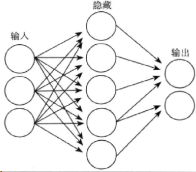

在MLP 中的所有神经元都差不多．每个神经元都有几个输入（连接前一层）神经元和输出（连接后一层）神经元，该神经元会将相同值传递给与之相连的多个输出神经元。每个神经元通过输入权重加上一个偏移项来计算输出值，并由所选择的激励函敏（ activation
function）进行转换。

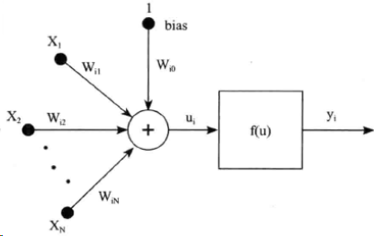

有三种广泛使用的激励函数： 恒等函数、Sigmoid 函数和高斯函数，最常用的默认激励函数为 Sigmoid 函数。下图是Sigmoid 函数的alpha 参数和beta 参数为1 时的情形。

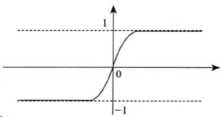

一个ANN 训练网将一个特征向量作为输入，将该向量传递到隐藏层，然后通过权重和激励函数来计算结果， 并将结果传递给下一层，直到最后传递给输出层才结束，输出层是指其神经元类别编号为神经网络的层数。

## 6.11. 创建两个数据矩阵

通过训练 ANN 算法来计算和学习每一层的权重、突触以及神经元。为了训练分类器，需创建两个数据矩阵，就像SVM 训练时一样，但训练的标签不再是N x 1 的矩阵，其中N 表示训练数据的行数，1为列数，而是用数字标识符作为标签。创建一个N × M 矩阵，其中， N 表示训练样本数， M 是类标签（在本项目中，它由10 个数字加上 20 个字母组成） 。如果第1 行的样本属于第j 类，则该矩阵的（ i,j ）位置为1

## 6.12. 训练一个识别系统

函数 OCR::train用来创建所有需要的矩阵并用训练数据、类标签矩阵、在隐藏层的神经元数量来训练一个识别系统。训练数据从XML 文件中加载，这与SVM 训练时一样。

### 6.12.1. 每层定义神经元数
为了初始化ANN类，必须在每层定义神经元数。例如，在本项目中，仅使用一个隐藏层，则需定义一个1行3 列的矩阵。第一列为特征数， 第二列为隐藏层的隐藏神经元数，第三列为样本的类数。

### 6.12.2. CvANN_MLP 类初始化
OpenCV 为 ANN 定义了一个 CvANN_MLP 类。通过 create 函数来初始化该类，初始化时需要指定以下参数的值：神经网络的层数、神经元数、激励函数、alpha 和beta。

```c
void OCR::train(Mat TrainData, Mat classes, int nlayers){
    Mat layers(1,3,CV_32SC1);
    layers.at<int>(0)= TrainData.cols;
    layers.at<int>(1)= nlayers;
    layers.at<int>(2)= numCharacters;
    ann.create(layers, CvANN_MLP::SIGMOID_SYM, 1, 1);

    //Prepare trainClases
    //Create a mat with n trained data by m classes
    Mat trainClasses;
    trainClasses.create( TrainData.rows, numCharacters, CV_32FC1 );
    for( int i = 0; i <  trainClasses.rows; i++ )
    {
        for( int k = 0; k < trainClasses.cols; k++ )
        {
            //If class of data i is same than a k class
            if( k == classes.at<int>(i) )
                trainClasses.at<float>(i,k) = 1;
            else
                trainClasses.at<float>(i,k) = 0;
        }
    }
    Mat weights( 1, TrainData.rows, CV_32FC1, Scalar::all(1) );

    //Learn classifier
    ann.train( TrainData, trainClasses, weights );
    trained=true;
}
```

## 6.13. classify 对得到的各种车牌特征进行分类

在训练完成后，可用 OCR::classify 函数来对得到的各种车牌特征进行分类：

```c
int OCR::classify(Mat f){
    int result=-1;
    Mat output(1, numCharacters, CV_32FC1);
    ann.predict(f, output);
    Point maxLoc;
    double maxVal;
    minMaxLoc(output, 0, &maxVal, 0, &maxLoc);

    //We need know where in output is the max val, the x (cols) is the class.
    return maxLoc.x;
}
```

CvANN_MLP 类使用predict 函数来对特征向量分类。不像SVM 的classify 函数，ANN 的predict 返回一行，其大小为类的数量，该向量的每个元素反映了输入样本属于每个类的概率。

为了得到最好的结果，可使用 `minMaxLoc` 函数来得到最大和最小响应以及它们在矩阵中的位置。字符的类别为变量 `maxLoe` 的x的最大值来确定。

## 6.14. OCR.xml训练数据

本项目所创建的 `evalOCR.cpp` 文件会用到由 `trainOCR.cpp` 程序所生成的 XML 训练数据。OCR.xml 文件对分辨率为5x5, 10x10、15x15 和 20x20 下的采样（ downsampled )图像特征分别保存着相应的训练数据矩阵。

```c++
Mat classes;
Mat trainingData;

//Read file storage.
FileStorage fs;
fs.open("OCR.xml", FileStorage::READ);

fs[data] >> trainingData;
fs["classes"] >> classes;
```

评价程序会获取每个下采样特征矩阵，然后取100行用作训练，而其他行用作测试ANN 算法，然后给出其误差。在训练前，要测试每个随机样本并检测其输出是否正确。如果输出不正确，将增加错误计算变量的值． 然后通过将错误计算的值除以样本数来进行评价。这意味着用随机数据训练，其错误率会在0 和 1 之间。
```c++
float test(Mat samples, Mat classes){
    float errors=0;
    for(int i=0; i<samples.rows; i++){
        int result= ocr.classify(samples.row(i));

        if(result!= classes.at<int>(i))
            errors++;
    }
    return errors/samples.rows;
}
```

## 6.15. Plate 类的str() 函数，原图像上显示识别的车牌

为了完成每个车牌的最终检测，需整理车牌上的字符，然后通过Plate 类的str() 函数返回一个字符串，并在原图像上显示出来：

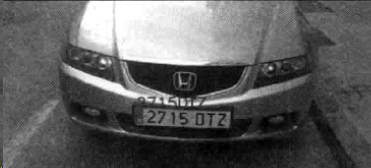

```c
string licensePlate=plate.str();
rectangle(input_image, plate.position, Scalar(0,0,200));
putText(input_image, licensePlate, Point(plate.position.x,  plate.position.y), CV_FONT_HERSHEY_SIMPLEX, 1, Scalar(0,0,200),2);
```

本文主要介绍了自动车牌识别应用的工作原理以及实现这个应用的两个重要步骤： 定位车牌和车牌字符识别。

第一步介绍了如何分割一幅图像，用简单的启发式方法和支持向量机从这些分割好的图像中进行二值分类，以得到车牌和非车牌。

第二步介绍如何用 `FindContours` 算法把找到的车牌分割，提取每个字符的特征向量，并使用人工神经网络对其分类。

还介绍了如何通过训练随机样本来评价机器学习算法．并得出使用不同参数和特征对训练的影响。

# 7. 参考文章：

* [OpenCV进阶之路：神经网络识别车牌字符 - 文章 - 伯乐在线](http://blog.jobbole.com/84234/)

* [【模式识别】OpenCV中使用神经网络 CvANN_MLP CSDN.NET](http://blog.csdn.net/xiaowei_cqu/article/details/9027617)

* [CvANN_MLP（OpenCV 的神经网络-多层感知器） 进行路牌判别](http://www.jianshu.com/p/7fee200b3cc7)

* [用 CvANN_MLP 进行路牌判别](http://tangzx.qiniudn.com/post-0072-cvann-mlp.html)

* [使用MLP解决OCR问题（OpenCV）（上）](http://m.blog.csdn.net/article/details?id=43053629)

* [使用MLP解决OCR有关问题（OpenCV）（下） - 编程](http://www.myexception.cn/program/1830738.html)

* [请问opencv 3.0  中神经网络的ANN_MLP在哪个头文件中？_opencv吧_百度贴吧](http://tieba.baidu.com/p/3417162021)

* [准确率更高的一个github 中国车牌识别库 EasyPR--一个开源的中文车牌识别系统 - 计算机的潜意识 - 博客园](http://www.cnblogs.com/subconscious/p/3979988.html)

* [liuruoze/EasyPR](https://github.com/liuruoze/EasyPR)
