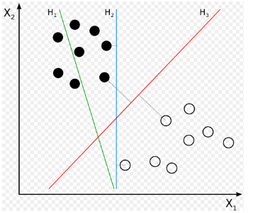
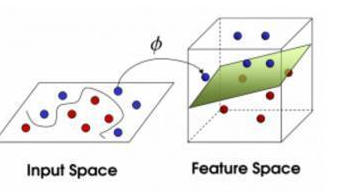

<!-- toc -->
<!-- more -->

SVM维基百科解释

在机器学习中，支持向量机（英语：Support Vector Machine，常简称为SVM，又名支持向量网络）是在分类与回归分析中分析数据的监督式学习模型与相关的学习算法。给定一组训练实例，每个训练实例被标记为属于两个类别中的一个或另一个，SVM训练算法创建一个将新的实例分配给两个类别之一的模型，使其成为非概率二元线性分类器。SVM模型是将实例表示为空间中的点，这样映射就使得单独类别的实例被尽可能宽的明显的间隔分开。然后，将新的实例映射到同一空间，并基于它们落在间隔的哪一侧来预测所属类别。
除了进行线性分类之外，SVM还可以使用所谓的核技巧有效地进行非线性分类，将其输入隐式映射到高维特征空间中。

如下图，H1 不能把类别分开。H2 可以，但只有很小的间隔。H3 以最大间隔将它们分开。

简单故事说明

把这些球叫做 「data」，把棍子 叫做 「classifier」, 最大间隙trick 叫做「optimization」， 拍桌子让球飞起来到多维空间叫做「kernelling」, 那张纸叫做「hyperplane」。

支持向量机学习方法包括构建由简至繁的模型：线性可分支持向量机、线性支持向量机及非线性支持向量机。
当训练数据线性可分时，通过硬间隔最大化，学习一个线性的分类器，即线性可分支持向量机，又称为硬间隔支持向量机；
当训练数据近似线性可分时，通过软间隔最大化，也学习一个线性的分类器，即线性支持向量机，又称为软间隔支持向量机；
当训练数据线性不可分时，通过使用核技巧及软间隔最大化，学习非线性支持向量机。

参考：
* [支持向量机(SVM)是什么意思？ - 知乎](https://www.zhihu.com/question/21094489)

* [Support Vector Machines explained well |  Byte Size Biology](http://bytesizebio.net/2014/02/05/support-vector-machines-explained-well/)

* [SVM-支持向量机原理详解与实践之一 - jcjx0315的博客   - CSDN博客](http://blog.csdn.net/jcjx0315/article/details/61929439)

* [机器学习之深入理解SVM - HuangQinJian博客频道 - CSDN.NET](http://blog.csdn.net/sinat_35512245/article/details/54984251)

* [零基础学Support Vector Machine(SVM) - 知乎专栏](https://zhuanlan.zhihu.com/p/24638007)

* [OpenCV机器学习——支持向量机SVM - 知乎专栏](https://zhuanlan.zhihu.com/p/25413377)

* [+++【OpenCV】opencv3.0中的SVM训练 mnist 手写字体识别 - CheerM - 博客园](http://www.cnblogs.com/cheermyang/p/5624333.html)