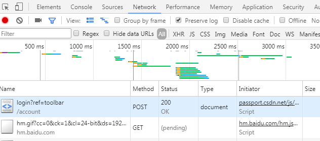
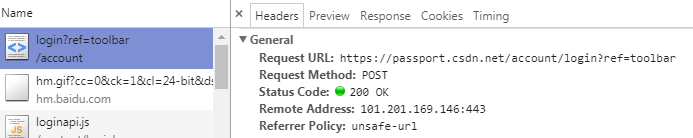

<!-- toc -->
<!-- more -->

# 1. 模拟登录主要掌握几点：

1. 要抓住真正要登录的URL；
1. 要拿到要post的表单数据Form data，一般是以字典形式；
1. 填写好header，有的网站可能会认证User-Agent,Host,Referer等等请求头。

# 2. 举例：模拟登录csdn博客

## 2.1. 首先打开csdn的登录页面

[帐号登录 https://passport.csdn.net/account/login?ref=toolbar ](https://passport.csdn.net/account/login?ref=toolbar ) 
这个链接中参数referer表示你从哪里跳过来的，toolbar表示点击顶部导航栏，然后跳转到登录页面的。

## 2.2. 登录过程分析

### 2.2.1. chrome浏览器按下F12打开开发者工具
点击Network，找到过滤器，筛选XHR，等会登录的时候，Method那一列会显示POST GET。
点击Headers旁边的叉，关闭后就是下面的效果

注意，分析工具要设置保存log (设置中Preferences标签下面Network的 “Preserve log”打开，页面中也可以看到这个开关），因为有些网站是登录后跳转，会把post那个log删除，当然，你也可以输入错误的密码就不会跳转，方便抓取。

### 2.2.2. 点击POST一栏可以看到url数据，Request Head数据，，post数据

- 获取url链接数据




- Head数据，比如

```
User-Agent:Mozilla/5.0 (Windows NT 6.1; Win64; x64) AppleWebKit/537.36 (KHTML, like Gecko) Chrome/60.0.3112.113 Safari/537.36
```

如果我们不指定 user agent，使用默认的，他不是一个正常的用户，所以可能会被网站拒绝了出现403错误。我们加上上面的Head数据就可以了。

- Form Data表单数据

```
username:你的用户名
password:你的密码
lt:LT-736919-1mfGXdeQovq5gfbI9luJfgFMXYaPHg
execution:e8s1
_eventId:submit
```


Form Data表单数据分析
username和password是用户名和密码，lt数据每次打开这个登录网站都不一样，所以要去网站中获取。

## 2.3. 简单登录代码

开始需要获取网页中的'lt'数据，后面把表单数据post就可以了。

```python
import requests
from bs4 import BeautifulSoup as bs

def get_lt_value(str):
    '''
    提取lt流水号，将数据化为一个字典
    '''
    soup = bs(str)
    mydict = {}
    for inp in soup.form.find_all('input'):
        if inp.get('name') != None:
            mydict[inp.get('name')] =inp.get('value')
    return mydict

s = requests.Session()
r = s.get("http://passport.csdn.net/account/login")
dictvalue = get_lt_value(r.text)

header = {
    'User-Agent':'Mozilla/5.0 (X11; Ubuntu; Linux x86_64; rv:38.0) Gecko/20100101 Firefox/38.0'}
payload ={
        'username':'**',
        'password':'**',
        'lt':dictvalue["lt"],
        'execution':'e1s1',
        '_eventId':'submit'}
print(payload)

r = s.post("http://passport.csdn.net/account/login",data=payload,headers=header)
print(r.text)

```

## 2.4. 优化,保存cookie，这样下次就不需要重新发送登录请求了

```python
import requests
import time
import os
from bs4 import BeautifulSoup as bs
from http.cookiejar import LWPCookieJar

def get_lt_value(str):
    '''
    提取lt流水号，将数据化为一个字典
    '''
    soup = bs(str)
    mydict = {}
    for inp in soup.form.find_all('input'):
        if inp.get('name') != None:
            mydict[inp.get('name')] =inp.get('value')
    return mydict

# cookie setting
s = requests.Session()
s.cookies = LWPCookieJar('cookiejar')
header = {'User-Agent':'Mozilla/5.0 (X11; Ubuntu; Linux x86_64; rv:38.0) Gecko/20100101 Firefox/38.0'}
if not os.path.exists('cookiejar'):
    print("there is no cookie,setting")
    r = s.get("http://passport.csdn.net/account/login")
    dictvalue = get_lt_value(r.text)

    payload ={
        'username':'***',
        'password':'***',
        'lt':dictvalue["lt"],
        'execution':'e1s1',
        '_eventId':'submit'}
    print(payload)

    r = s.post("http://passport.csdn.net/account/login",data=payload,headers=header)
    s.cookies.save(ignore_discard=True)
    print(r.text)
else:
    print("cookie exists,restore")
    s.cookies.load(ignore_discard=True)

r = s.get("http://write.blog.csdn.net/postlist",headers=header)
print(r.text)

```

# 3. 参考文献：

* [基于python的requests库，模拟登录csdn博客](http://ju.outofmemory.cn/entry/168764)
* [如何用 Python 爬取需要登录的网站？/](http://python.jobbole.com/83588/)
* [爬虫模拟登录 - Python - 伯乐在线](http://python.jobbole.com/87283/)
* [Scrapy 模拟登陆知乎--抓取热点话题 - Python - 伯乐在线](http://python.jobbole.com/88490/?utm_source=blog.jobbole.com&utm_medium=relatedPosts)
* [人生苦短，我用Python--爬虫模拟登陆教务处并且保存数据到本地](http://www.jianshu.com/p/2ec57f129fed)